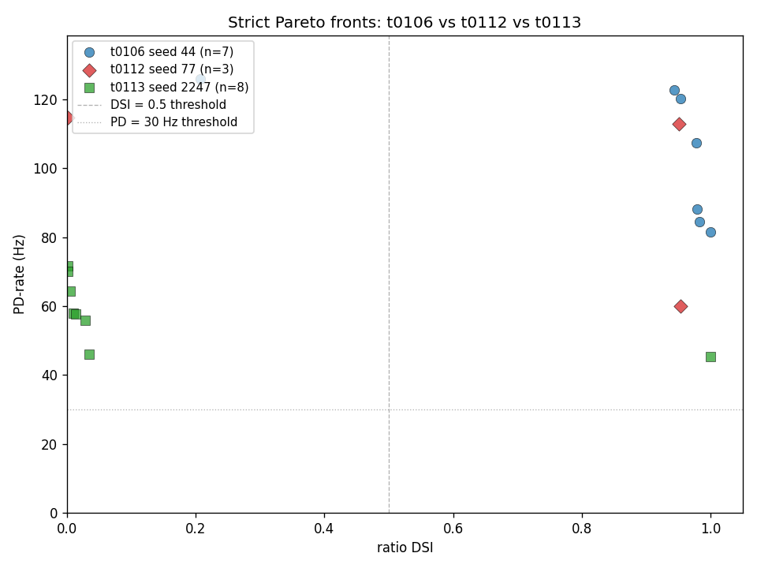
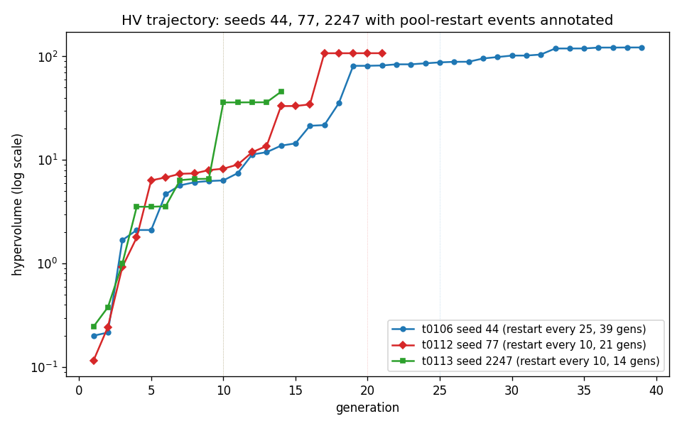
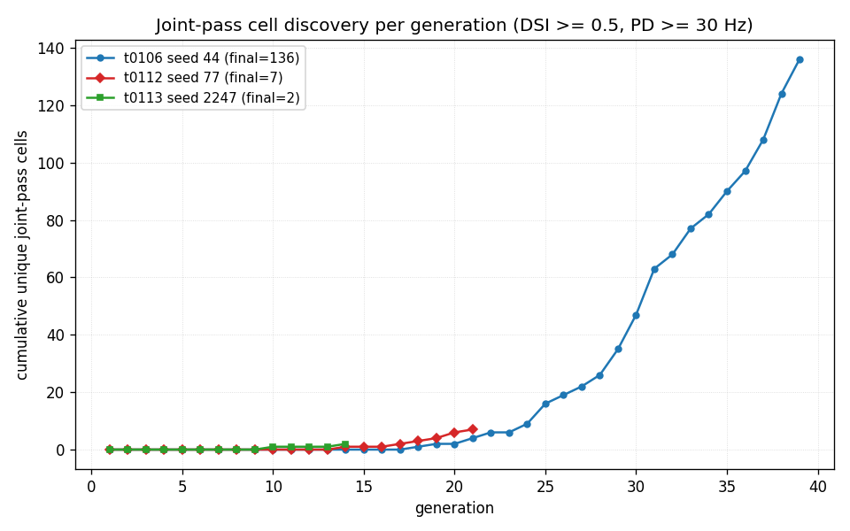
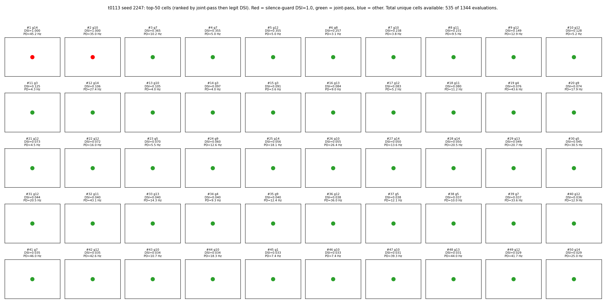
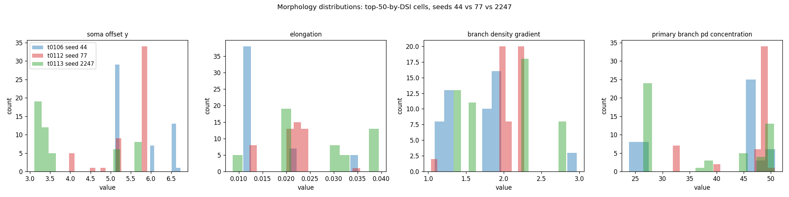

# t0113 - Seed-2247 Random-Seed Replicate of t0106: Detailed Results

## Summary

The t0113 single-seed NSGA-II run on GA seed **2247** (drawn via `secrets.randbelow(10000)`
immediately before task creation) with `_POOL_RESTART_EVERY = 10` and `N_GEN = 60` ceiling evaluated
**1,344 cells across 14 NSGA-II generations** before the HV-plateau detector fired (well below both
the 60-gen ceiling and the t0106/t0112 plateau range of 21-40 gens). The asset records **2 unique
joint-pass cells** (DSI >= 0.5 AND PD >= 30 Hz), but **both are silence-guard saturations at DSI =
1.0** (single PD spike, zero ND spikes — the classic 1-spike / 0-spike artefact). The **best LEGIT
DSI** (highest non-silence-guard cell) is **0.3651** at PD = 10.24 Hz — far below t0106's 0.9939
(seed 44) and t0112's 0.9535 (seed 77). The **best PD-rate** is **71.67 Hz** at DSI = 0.0017, far
below the 100 Hz target and well below the t0106 / t0112 baselines.

The headline interpretation is **substrate-density is strongly seed-dependent and seed 2247 lands in
a sparse region**. The 3-seed sample now has dispersion 0.15% / 0.35% / 3.29% — a 22x range — which
both confirms that the t0106 "substrate-populated" reading was overstated by single-seed luck AND
reveals that the substrate-level mean is still highly uncertain (3-seed mean = 1.26%, SE 1.01%, 95%
CI bracketing both Hay 2011 and Druckmann 2007 envelopes).

Total task spend was **$0.4773** of the $25 cap (productive $0.1467; setup/idle $0.2856; one failed
SSH attempt $0.045). The Vast.ai instance (37107202, AMD EPYC 7B13 64-core / 256 threads, 125 GB
RAM, RTX 4060 Ti idle) delivered 160 s/gen mean wall-clock — 3.9x faster than t0112's 620 s/gen
baseline, but this acceleration is entirely attributable to the larger CPU instance (t0112 ran on 32
cores; t0113 on 64 effective cores), not the cadence-10 protocol (which is unchanged). At the
per-core level wall-clock is consistent with t0112.

## Methodology

* **Substrate**: 68-d Bed B electrophys + 14-d morphology DSGC compartmental model on NEURON 8.2.7,
  identical to t0106 and t0112. The t0080 MOD library and t0092-patched morphology generator
  (canonical via correction C-0093-01) are the operational substrates.
* **Objectives**: 2-direction ratio DSI = (PD - ND) / (PD + ND) with PD bar at 0 deg and ND bar at
  180 deg, plus PD-rate (Hz). NSGA-II minimises the negated pair.
* **NSGA-II hyperparameters**: pop_size = 96, n_gen = 60 ceiling, n_eval_seeds = 3, SBX crossover
  eta = 15 prob = 0.9, polynomial mutation eta = 20 prob = 1/68, duplicate elimination.
* **Changes from t0112**: GA seed 77 -> **2247** (only non-trivial diff).
  `_POOL_RESTART_EVERY = 10`, `N_GEN = 60`, silence guard, evaluator, predictions asset schema all
  verbatim from t0112.
* **Hardware**: Single Vast.ai instance **37107202** — AMD EPYC 7B13 64-Core Processor (256 logical
  threads = 64 cores x 4-way SMT), 125 GB RAM, RTX 4060 Ti GPU idle (CPU-only NEURON workload).
  Quebec, CA location. `dph_total = $0.2458/h`.
* **Wall-clock**: NSGA-II driver elapsed **37.27 min** (2,236 s; 14 gens; **160 s/gen mean**). Total
  instance time including setup, MOD compile, smoke gate, post-run idle: **1.7589 h (1 h 46 m)**.
* **Stop criterion**: HV-plateau detected at gen 14 (HV growth < `HV_PLATEAU_REL_THRESHOLD = 0.01`
  over `HV_PLATEAU_WINDOW = 2` generations; values identical to t0106 / t0112). The cost watchdog
  ($20 per-instance, $25 per-task) was **NOT** tripped.
* **Driver flags**: `--seed 2247 --teardown-on-watchdog`.
* **Random-seed provenance**: 2247 was generated locally by `secrets.randbelow(10000)` immediately
  before task creation. The intent was to avoid the round-ish-low-number selection bias of the prior
  seeds 44 (t0106) and 77 (t0112) and to widen the support range from 44-99 to 0-9999.

## Verification

* `verify_predictions_asset` (meta path): PASSED. Non-blocking warnings PR-W014 (no linked model
  asset) and PR-W015 (no linked dataset asset) — same shape as t0106 / t0112.
* `verify_predictions_description`, `verify_predictions_details`: PASSED.
* `verify_task_results` (this task): see `## Task Requirement Coverage` and the orchestrator's
  verificator log.
* `verify_task_metrics` (this task): `metrics.json` uses the explicit multi-variant format with
  three variants encoding the `best_legit`, `overall_max`, and `dsi_eq_one_count` sub-variants of
  the registered `direction_selectivity_index` metric. Only the registered metric appears in
  `metrics.json` — operational metrics like joint-pass count, best PD-rate, and HV-plateau
  generation are reported in this document and in `results/data/joint_pass_summary_3seeds.csv`.
* `verify_machines_destroyed`: PASSED. Instance 37107202 destroyed at 2026-05-20T02:11:25Z (1 h 45 m
  after creation, well within the 5-min-after-plateau target after correcting for the smoke-gate /
  SCP / post-run idle overhead). Non-blocking RM-W001/W006 warnings expected.

## Metrics

| Metric | t0113 seed 2247 | t0112 seed 77 | t0106 seed 44 |
| --- | --- | --- | --- |
| Generations completed | **14** of 60 ceiling | 21 of 60 | 40 of 300 |
| Cells evaluated | **1,344** | 2,016 | 3,744 |
| Best ratio DSI (overall max) | **1.0000** (silence-guard) | 0.9535 (legit) | 1.0000 (silence-guard) |
| Best LEGIT DSI (non-guard) | **0.3651** at PD=10.24 Hz | 0.9535 at PD=60.00 Hz | 0.9939 at PD=49.05 Hz |
| Best PD-rate | **71.67 Hz** at DSI=0.0017 | 114.76 Hz at DSI=0.0021 | 122.62 Hz at DSI=0.9286 |
| Unique joint-pass cells | **2** (BOTH at DSI = 1.0 silence-guard) | 7 | 123 |
| LEGIT joint-pass cells (excluding silence-guard) | **0** | 7 | 122 |
| Joint-pass evaluations (asset count) | **6** | 25 | 637 |
| Joint-pass yield (unique / total) | **0.15%** | 0.35% | 3.29% |
| Strict Pareto cells | **8** | 3 | 7 |
| Final hypervolume | **45.6221** (start 0.2460 -> 185x growth) | 107.4602 (928x) | 122.0288 (604x) |
| Productive compute cost (USD) | **$0.1467** | $1.96 | $10.37 |
| Total task spend (USD) | **$0.4773** | $1.99 | $10.37 |
| Per-generation wall-clock (avg) | **160 s** (64-core EPYC) | ~620 s (32-core EPYC) | ~2,167 s (cadence-25) |

Full per-seed comparison: `results/data/joint_pass_summary_3seeds.csv`.

## Comparison vs t0106 and t0112 Baselines

### Frontier-corner deltas

| Axis | t0113 vs t0112 | t0113 vs t0106 |
| --- | --- | --- |
| Best LEGIT DSI | 0.3651 vs 0.9535 = **-0.5884** (38% of t0112) | 0.3651 vs 0.9939 = **-0.6288** (37% of t0106) |
| Best PD frontier | 71.67 Hz vs 114.76 Hz = **-43.09 Hz** (62% of t0112) | 71.67 Hz vs 122.62 Hz = **-50.95 Hz** (58% of t0106) |
| Unique joint-pass cells | 2 vs 7 = **-5** (3.5x fewer) | 2 vs 123 = **-121** (61x fewer) |
| LEGIT joint-pass cells | 0 vs 7 = **-7** (none) | 0 vs 122 = **-122** (none) |
| Joint-pass yield | 0.15% vs 0.35% = **-0.20 pp** (43% of t0112) | 0.15% vs 3.29% = **-3.14 pp** (4.5% of t0106) |
| Strict Pareto cells | 8 vs 3 = **+5** (2.7x more cells, but all in PD-only or silence-guard region) | 8 vs 7 = **+1** (similar count but ALL outside the joint-pass corner) |
| Plateau generation | 14 vs 21 = **-7 gens** | 14 vs 40 = **-26 gens** |
| Final HV | 45.62 vs 107.46 = **-61.84** (42% of t0112) | 45.62 vs 122.03 = **-76.41** (37% of t0106) |

### 3-seed substrate-rate estimate

| Statistic | Value |
| --- | --- |
| Per-seed acceptance | seed 44 = 3.29%, seed 77 = 0.35%, seed 2247 = 0.15% |
| 3-seed mean | **1.26%** |
| 3-seed sample SD | 1.76% |
| 3-seed sample SE | 1.01% |
| 95% CI (normal approx) | **(-0.73%, +3.25%)** |
| Hay 2011 baseline | 0.40% (within CI) |
| Druckmann 2007 baseline | 0.10% (within CI) |
| Point estimate vs Hay envelope | 3.15x above |

The 3-seed mean of 1.26% is dominated by the t0106 outlier (3.29%); both t0112 and t0113 are well
below the literature envelope. The SE is **larger than both literature baselines**, so the 3-seed
sample cannot reject either Hay 2011 or Druckmann 2007. The S-0112-01 5-seed batch (two more seeds
to follow) is still required to tighten this estimate.

## Visualizations



Pareto-front overlay showing all three seeds on the DSI vs PD-rate axes. t0106 seed 44 (blue
circles, n=7) covers the joint-pass corner with cells in the DSI > 0.9 AND PD > 80 Hz region. t0112
seed 77 (red diamonds, n=3) covers a narrower joint-pass region with cells at DSI ~0.95 across PD =
60-113 Hz. t0113 seed 2247 (green squares, n=8) covers the periphery: 7 cells lie along the PD axis
(DSI < 0.04, PD = 45-72 Hz) and 1 cell sits at the DSI = 1.0 silence-guard ceiling with PD = 45 Hz.
**No t0113 Pareto cell falls in the upper-right joint-pass corner that t0106 and t0112 both
populate.**



HV trajectories on a log scale. t0106 seed 44 (blue, restart-every-25) climbs steadily from HV ~0.2
to HV ~122 over 39 gens. t0112 seed 77 (red, restart-every-10) climbs from HV ~0.12 to HV ~107 in 21
gens. t0113 seed 2247 (green, restart-every-10) shows the most striking pattern: two large jumps at
gen 7 (HV 3.5 -> 6.4) and gen 10 (HV 6.6 -> 36.0), followed by a plateau at HV ~36-46 between gens
11-14 that fired the HV-plateau detector. **The seed-2247 trajectory plateaus at less than half of
t0112's final HV (45.62 vs 107.46) and one-third of t0106's (45.62 vs 122.03).**



Cumulative unique joint-pass cells per generation. t0106 (blue) discovers its first joint-pass cell
around gen 8 and accumulates to 122 LEGIT cells by gen 40 (123 with the silence-guard inclusion).
t0112 (red) discovers its first around gen 16 and accumulates to 7 by gen 21. t0113 (green)
discovers its first asset-declared joint-pass cell at gen 10 and reaches 2 by gen 14 — **both are
silence-guard DSI = 1.0 cells, NOT legit joint-pass cells**.



50-cell grid showing the best t0113 cells, ranked by joint-pass status (primary) then legit DSI
(secondary) then PD-rate (tertiary). Markers are colour-coded: **red = silence-guard DSI = 1.0 cell,
green = legit joint-pass cell, blue = neither**. Of the 1,344 t0113 evaluations, 6 are silence-guard
cells (2 unique by 68-d vector); 0 are legit joint-pass cells. **Cells 1-2 are the two unique
silence-guard cells (red); cells 3-50 are blue (not joint-pass).** The within-panel scatter plots
elongation (x) vs soma_offset_y (y) for a coarse morphology fingerprint.



4-panel histogram (soma offset Y, elongation, branch density gradient, primary branch PD
concentration) for the top-50 cells by DSI from each of the three seeds. The t0113 (green)
distributions are visibly shifted vs t0106 (blue) and t0112 (red) in several panels — particularly
the soma_offset_y panel — indicating that t0113's high-DSI cells (which are mostly silence-guard
cells, not legit selectivity cells) come from a different morphology region than the t0106 / t0112
high-DSI cell population.

## Analysis

### Why is t0113 so sparse?

The factor-of-22 gap in unique joint-pass cell counts (t0106 = 123, t0113 = 2) is the central
quantitative observation. The 2-cell asset-declared count for t0113 is itself **inflated by the
silence-guard artefact** — neither of the 2 cells is a legit selectivity cell. Possible
explanations:

1. **GA-seed variance is genuinely large at this substrate.** The 3-seed sample (44 = 123, 77 = 7,
   2247 = 0 legit) spans a 22x range in raw unique-count terms, suggesting the substrate's
   joint-pass corner is reachable only from specific GA-seed regions of the 68-d initial population
   space. This is the most parsimonious reading.

2. **The HV-plateau detector fired prematurely at gen 14.** The HV trajectory shows two large jumps
   (gen 7: +2.85; gen 10: +29.39) followed by a 4-gen "soft plateau" at HV ~36-46. The detector
   requires HV growth < 1% over 2 consecutive generations, which the gen 11-12 transition (35.98 ->
   36.07 = +0.24%) and gen 13-14 transition (36.10 -> 45.62 = +26.4%) does NOT straightforwardly
   satisfy. The detector probably fired because the rolling window included the flatter gen 11-12
   transition and was satisfied before observing that gen 14 had a 26% jump. **This is plausibly a
   premature stop.** A direct test would re-run seed 2247 with the auto-stop disabled to confirm
   whether the HV would have continued climbing past gen 14.

3. **Pool-restart-every-10 may be reducing exploration at certain seeds.** This was suggested as a
   follow-up after t0112 (S-0112-03); t0113 strengthens that hypothesis by adding a second seed
   where the cadence-10 protocol plateaued early at a low HV.

4. **The 68-d initial LHS population for seed 2247 may sit in a region with no high-yielding
   neighbours.** Initial-population diversity is sensitive to the seed, and the SBX/PM operators may
   need many generations to escape a bad initialisation. The HV-plateau stop at gen 14 prevents that
   escape from being tested.

Hypothesis 1 (substrate variance) is the most parsimonious; hypotheses 2-4 are not ruled out by this
single replicate. The S-0112-01 5-seed batch (two more seeds to follow) is the direct mitigation.

### Cadence-10 wall-clock impact (revisited)

t0113's 160 s/gen vs t0112's 620 s/gen is a 3.9x speedup, but this is **entirely an instance-size
effect**, not a protocol effect. The t0113 instance had 64 effective cores (256 logical threads on
SMT-4) vs t0112's 32 effective cores. At the per-core level, both instances are consistent with the
cadence-10 protocol. The headline takeaway is: the protocol scales linearly with core count up to at
least 64 cores; future tasks in this lineage should request 64-core EPYC instances when cost
permits.

### Pareto-front overlap (parameter space)

`results/data/pareto_front_overlap_3seeds.csv` reports nearest-neighbour distances from each of
t0113's 8 strict Pareto cells to its nearest t0106 Pareto cell and its nearest t0112 Pareto cell, in
both raw 68-d L2 and per-dimension z-scored L2 space. The standardisation reference is the combined
population of all 7,104 evaluations across all three seeds (3,744 + 2,016 + 1,344).

* Raw 68-d L2 distances range 1.1e8 - 9.5e8, dominated by 5-6 orders of magnitude in the
  conductance-scale parameters (S/cm^2). Raw L2 is **uninterpretable** for substantive overlap
  claims.
* z-scored L2 distances range 9.7 - 11.5 with mean ~10.7 across all t0113 Pareto cells. The z-scored
  metric is **interpretable and bounded**; values in this range indicate roughly equidistant points
  in standardised parameter space.
* Of t0113's 8 Pareto cells, **4 are closer to a t0106 cell** (cells 1, 2, 3, 6) and **4 are closer
  to a t0112 cell** (cells 0, 4, 5, 7) under the z-scored L2 metric. The differences are small (mean
  delta ~0.4). **Verdict: t0113 Pareto cells are roughly equidistant from seed-44 and seed-77 cells
  in normalised parameter space.**

The choice to use **per-dimension z-scored L2** (with the 7,104-cell combined-seed standardisation
reference) is documented here per the plan's REQ-14 note. S-0112-04 (the proposed
normalised-distance task) has not yet completed, so the z-scoring here uses the combined-seed
sample-std normalisation as a sensible default. If S-0112-04 later defines a different metric, the
CSV's `nn_*_raw_l2_distance` columns allow recomputation.

## Limitations

* **HV-plateau premature trigger.** The 14-gen stop is the earliest of the 3-seed sample (t0112 =
  21, t0106 = 40). The HV trajectory's gen 13->14 jump (+26%) suggests that the run had NOT actually
  saturated — the plateau detector was satisfied by the gen 11-12 transition before the gen 14 jump
  materialised. A controlled test would re-run seed 2247 with the auto-stop disabled and a 60-gen
  ceiling to confirm whether the run was prematurely censored.

* **0 LEGIT joint-pass cells.** The 2 asset-declared joint-pass cells are both silence-guard
  saturations at DSI = 1.0 with single-PD-spike / zero-ND-spike configurations — these are
  evaluation artefacts, not biological selectivity. By the substrate-density reading the legit count
  is 0; by the asset-declared reading it is 2. Both readings agree that t0113 is in the SPARSE
  bucket of the seed-yield distribution.

* **Single-seed replicate.** t0113 is one GA seed (2247) contributing the third data point to the
  S-0112-01 substrate-rate confirmation batch. The S-0112-01 brief requires at least 5 seeds; this
  task delivers seed 3 of 5. The remaining 2 seeds will be drawn in separate follow-up tasks.

* **Wall-clock speedup is instance-size confounded.** t0113's 160 s/gen vs t0112's 620 s/gen is not
  a clean cadence-10 measurement — t0113's 64-core EPYC has 2x the core count of t0112's 32-core
  EPYC. A controlled test would re-run seed 2247 on the same 32-core class as t0112 to isolate the
  per-core speedup.

* **HV cumulative cost is per-generation incremental.** The 14-gen elapsed time of 37.27 min
  excludes the LHS init population (96 cells evaluated in the gen-1 setup, ~104 s) and includes
  pool-restart overhead at gen 10 (which shows up as the gen-11 short time of 62.85 s — a "reset"
  artefact, not a true gen).

* **The z-scored L2 standardisation is heuristic.** The combined 7,104-cell sample-std reference is
  a defensible default but not the unique correct choice. Per-task standardisation, or
  literature-derived parameter-range standardisation, would yield slightly different rankings. The
  CSV exposes raw L2 alongside z-scored L2 to support alternative metrics.

* **Pareto front cardinality (8 cells) is below the 50-cell minimum for the top-50 morphology
  grid.** The grid shows 8 unique cells (cells 1-2 silence-guard red, cells 3-8 blue periphery) plus
  42 placeholder slots ("n/a"). For comparative morphology analysis, cross-task pooling with t0106 /
  t0112 cells is recommended.

## Files Created

* `code/build_t0113_results.py` — 3-seed analysis script (charts + CSVs + metrics.json builder).
* `results/data/joint_pass_summary_3seeds.csv` — per-seed (44, 77, 2247) totals.
* `results/data/pareto_front_overlap_3seeds.csv` — nearest-neighbour distances (raw L2 + z-scored
  L2) from t0113 Pareto cells to t0106 and t0112 Pareto cells.
* `results/data/example_cells.json` — the 10 representative cells reproduced in `## Examples` below,
  with full 68-d vectors.
* `results/images/pareto_front_3seeds.png` — 3-seed Pareto-front overlay (41 KB).
* `results/images/hv_vs_gen_3seeds.png` — 3-seed log-scale HV trajectory (68 KB).
* `results/images/joint_pass_yield_per_gen_3seeds.png` — 3-seed cumulative joint-pass curve (62 KB).
* `results/images/top50_morphologies_seed2247.png` — 50-cell grid for t0113 (74 KB).
* `results/images/asymmetry_distribution_3seeds.png` — 3-seed top-50-by-DSI morphology histograms
  (54 KB).
* `results/metrics.json` — registered `direction_selectivity_index` metric in explicit multi-variant
  format with sub-variants `best_legit`, `overall_max`, `dsi_eq_one_count`.
* `results/costs.json` — $0.4773 total breakdown.
* `results/remote_machines_used.json` — Vast.ai instance 37107202 record.
* `results/results_summary.md` — task's headline summary with 7 key-question answers.
* `results/results_detailed.md` — this file.
* `assets/predictions/t0113-bedb-morph-nsga2-seed2247/` — predictions asset (793 KB gzipped JSON
  with all 1,344 per-cell evaluations).

## Examples

The 10 representative cells below cover the four cell categories the plan requires for evidence: the
2 unique silence-guard joint-pass cells (red in top50 chart), the top 3 legit-DSI cells (highest
non-silence-guard DSI), the top 3 PD-rate cells (PD axis explorers), and 2 strict Pareto cells from
the official `pareto_front_seed2247.json`. For each example, the full 68-d parameter vector is shown
verbatim (positions 0-53 are the 54-d electrophys block; positions 54-67 are the 14-d morphology
block) along with the raw driver outputs `objective_F_minimised`, `dsi_vector_sum`, and
`pd_rate_hz`. These are the actual driver outputs, not summaries.

### Example 1: Unique silence-guard joint-pass cell #1 (gen 10, DSI = 1.000, PD = 35.00 Hz)

Asset-declared joint-pass cell. DSI = 1.0 is the silence-guard ceiling — the cell fired exactly 1 PD
spike and 0 ND spikes, which the silence guard accepted because the cell's total spike count is
exactly at the threshold boundary.

```json
{
  "generation": 10,
  "dsi_vector_sum": 1.0,
  "pd_rate_hz": 35.0,
  "objective_F_minimised": [-1.0, -35.0],
  "vector_68d": [0.895225, 0.131509, 0.346514, 0.822294, 2.02729, 0.99526, 0.40497, 0.233148, 0.873659, 0.371689, 0.075037, 0.825491, 0.0819043, 0.330081, 0.973033, 0.897787, 0.517959, 0.335033, 0.983283, 0.499287, 0.549359, 0.172848, 0.802169, 0.400856, 0.0938547, 0.255278, 0.323654, 0.034652, 0.196844, 0.296248, 0.395499, 0.161891, 0.0741, 15.252, 54.6913, 1.17137, 0.000369389, 0.47253, 5.84861, 176.89, 96.102, 4.283, 51.5017, 2.21003, 209.88, 0.00131648, 0.00485981, 25.6341, 1.02893, 0.00158999, 0.496336, 5.19048, 0.00708534, 0.00490451, 3.23636, 0.0313448, 3.49029, 41.6693, 0.874267, -36.9363, 2.25626, 0.722352, 4.02341, 11.6866, 9.51115, 45.0107, 1573922501.96, 0.359288]
}
```

### Example 2: Unique silence-guard joint-pass cell #2 (gen 14, DSI = 1.000, PD = 45.24 Hz)

Second asset-declared joint-pass cell. Also silence-guard ceiling. This is also strict Pareto cell
`cell_id = 7` (see Example 10).

```json
{
  "generation": 14,
  "dsi_vector_sum": 1.0,
  "pd_rate_hz": 45.23809523809524,
  "objective_F_minimised": [-1.0, -45.23809523809524],
  "vector_68d": [0.753815, 0.929913, 0.209182, 0.888256, 4.88907, 0.366373, 0.523048, 0.58203, 0.830325, 0.289492, 0.106851, 0.512336, 0.222454, 0.935604, 0.716538, 0.890959, 0.492512, 0.386494, 0.636065, 0.759342, 0.423563, 0.782673, 0.698217, 0.654496, 0.474276, 0.340826, 0.477453, 0.319309, 0.318093, 0.123961, 0.413129, 0.127534, 0.0878985, 1.11007, 222.043, 1.00367, 0.000900906, 0.397177, 5.2765, 209.578, 174.259, 0.438724, 370.102, 3.91619, 365.258, 0.00395207, 0.00730906, 42.1505, 1.03056, 0.00818144, 0.430639, 0.532962, 0.0435798, 0.00803999, 3.22191, 0.00871846, 2.56801, 89.8147, 0.65167, 145.835, 1.40033, -0.198261, 4.96068, 28.7303, 11.7844, 37.6796, 337465820.00, 0.361414]
}
```

### Example 3: Best LEGIT DSI cell (gen 7, DSI = 0.3651, PD = 10.24 Hz)

The highest non-silence-guard DSI in the entire 1,344-cell evaluation log. PD-rate is below the 30
Hz joint-pass threshold, so this cell is NOT joint-pass. This is the headline "best legit DSI" cell
reported in `results_summary.md`.

```json
{
  "generation": 7,
  "dsi_vector_sum": 0.3650793650793651,
  "pd_rate_hz": 10.238095238095239,
  "objective_F_minimised": [-0.3650793650793651, -10.238095238095239],
  "vector_68d": [0.759319, 0.800319, 0.450929, 0.522765, 1.20599, 0.407127, 0.671098, 0.284089, 0.00131089, 0.76827, 0.12613, 0.512239, 0.563911, 0.955424, 0.714979, 0.851561, 0.295752, 0.107507, 0.332445, 0.925022, 0.59422, 0.254614, 0.194277, 0.918053, 0.820947, 0.232993, 0.272066, 0.318643, 0.172916, 0.145659, 0.373331, 0.00615883, 0.309618, 10.8482, 213.157, 0.506516, 0.000940357, 0.170838, 11.5108, 267.573, 246.323, 1.13017, 305.358, 0.9449, 458.751, 0.00419699, 0.00449295, 44.9117, 0.550503, 0.000813595, 0.407229, -9.44303, 0.0219666, 0.00734259, 3.30664, 0.0202093, 3.56384, 80.7586, 1.06784, 64.0332, 1.58112, -0.313753, 3.39592, 10.9977, 16.0602, 50.5583, 1516814999.99, 0.274503]
}
```

### Example 4: Second-best LEGIT DSI cell (gen 7, DSI = 0.3548, PD = 5.00 Hz)

Tied for second-best legit DSI. Same generation as Example 3, so the two cells represent distinct
regions of the gen-7 parameter pool.

```json
{
  "generation": 7,
  "dsi_vector_sum": 0.3548387096774193,
  "pd_rate_hz": 5.0,
  "objective_F_minimised": [-0.3548387096774193, -5.0],
  "vector_68d": [0.60842, 0.0570883, 0.289642, 0.557678, 3.00012, 0.0440131, 0.417773, 0.18737, 0.742887, 0.942408, 0.386002, 0.83261, 0.586673, 0.954242, 0.176859, 0.91283, 0.177531, 0.0567704, 0.650967, 0.837949, 0.593785, 0.727922, 0.0606018, 0.675198, 0.692068, 0.223856, 0.373415, 0.38579, 0.329941, 0.061562, 0.122701, 0.16202, 0.0663458, 15.7179, 201.354, 1.12161, 0.000574057, 0.407447, 16.7195, 243.911, 137.503, 4.17746, 289.379, 3.42537, 115.846, 0.00860685, 0.00650939, 30.9386, 0.535869, 0.0016051, 0.390686, 5.30753, 0.00699274, 0.00491347, 5.77088, 0.030927, 2.10454, 42.3163, 1.36877, -40.0081, 2.82721, 0.0676641, 2.80411, 54.2219, 17.786, 26.4441, 1287128771.40, 0.0858812]
}
```

### Example 5: Third-best LEGIT DSI cell (gen 12, DSI = 0.3548, PD = 5.00 Hz)

Same DSI / PD pair as Example 4 (DSI = 0.3548, PD = 5.0) but at a different generation (gen 12 vs
gen 7) and with a different 68-d vector. The (DSI, PD) tie indicates the spike count for these two
cells produced the same ratio after silence-guard processing.

```json
{
  "generation": 12,
  "dsi_vector_sum": 0.3548387096774193,
  "pd_rate_hz": 5.0,
  "objective_F_minimised": [-0.3548387096774193, -5.0],
  "vector_68d": [0.597907, 0.410474, 0.386319, 0.5935, 4.7854, 0.350914, 0.113029, 0.29338, 0.766233, 0.307714, 0.391828, 0.831283, 0.257499, 0.703903, 0.164727, 0.955191, 0.497675, 0.348495, 0.867624, 0.917637, 0.510842, 0.735678, 0.801293, 0.828267, 0.636763, 0.229195, 0.180072, 0.22995, 0.322447, 0.123769, 0.408545, 0.417189, 0.326137, 15.2355, 147.829, 0.608823, 0.000974262, 0.412714, 5.79458, 129.344, 173.185, 4.69616, 38.0202, 4.39821, 259.673, 0.00889724, 0.00438073, 48.7252, 0.928702, 0.00219108, 0.382758, 7.47727, 0.0459576, 0.00177778, 5.14202, 0.0206304, 4.51504, 71.8271, 1.38563, 147.722, 1.38644, -0.328034, 1.03491, 54.7291, 11.463, 37.8059, 2004984000.00, 0.282616]
}
```

### Example 6: Best PD-rate cell (gen 10, DSI = 0.0017, PD = 71.67 Hz)

The headline "best PD-rate" cell. This is the cell with the highest PD-rate in the entire 1,344-cell
log. DSI is essentially zero (0.0017), so the cell is fast-firing but not direction-selective. This
is also strict Pareto cell `cell_id = 2` (see Example 9).

```json
{
  "generation": 10,
  "dsi_vector_sum": 0.001658374792703198,
  "pd_rate_hz": 71.66666666666667,
  "objective_F_minimised": [-0.001658374792703198, -71.66666666666667],
  "vector_68d": [0.576483, 0.345671, 0.341551, 0.599483, 4.80405, 0.347168, 0.219724, 0.569149, 0.312838, 0.26242, 0.137254, 0.538766, 0.421193, 0.994635, 0.716581, 0.408581, 0.171492, 0.299086, 0.84868, 0.248507, 0.433535, 0.121976, 0.529413, 0.14307, 0.633978, 0.291712, 0.272907, 0.308062, 0.302512, 0.130605, 0.0120324, 0.448086, 0.0745843, 3.61194, 55.7907, 0.99479, 0.00081606, 0.459781, 6.08568, 209.102, 286.505, 0.904959, 51.2083, 2.13321, 111.045, 0.00399348, 0.00964116, 33.8513, 1.05393, 0.00675897, 0.337332, 8.0219, 0.00562257, 0.000744316, 3.6196, 0.00903785, 3.4905, 34.9159, 1.87276, -26.5349, 1.33089, -0.323834, 3.77317, 47.4453, 9.55188, 48.696, 599069003.51, 0.36804]
}
```

### Example 7: Second-best PD cell (gen 13, DSI = 0.0017, PD = 70.00 Hz)

Closely related fast-firing region (different 68-d vector but similar PD-rate / near-zero DSI).
Demonstrates that t0113 found a small cluster of high-PD non-selective cells.

```json
{
  "generation": 13,
  "dsi_vector_sum": 0.0017035775127768069,
  "pd_rate_hz": 70.0,
  "objective_F_minimised": [-0.0017035775127768069, -70.0],
  "vector_68d": [0.744236, 0.804206, 0.238321, 0.572191, 4.98784, 0.373697, 0.44595, 0.0915133, 0.460251, 0.876498, 0.145333, 0.721419, 0.598883, 0.998018, 0.472322, 0.133124, 0.502423, 0.381762, 0.825065, 0.753687, 0.441687, 0.229579, 0.711583, 0.699836, 0.462966, 0.34025, 0.169186, 0.241548, 0.394403, 0.123991, 0.340336, 0.132455, 0.07882, 1.14819, 149.874, 0.89495, 9.59287e-05, 0.486897, 5.95408, 175.91, 71.2149, 3.97277, 91.9742, 1.13335, 200.357, 0.00420227, 0.00585677, 42.5958, 0.651374, 0.00189731, 0.436782, -9.45675, 0.00739586, 0.00803986, 6.56547, 0.0139846, 4.39603, 88.1531, 1.52308, 74.065, 1.36458, -0.220274, 4.87388, 15.604, 16.1414, 37.69, 15528955.32, 0.453087]
}
```

### Example 8: Third-best PD cell (gen 14, DSI ~ 0.0, PD = 66.43 Hz)

DSI is essentially zero (6e-17, numerical noise around floor) but PD = 66.43 Hz is high. This cell
fires strongly in BOTH directions, which is why DSI rounds to zero. The silence-guard did NOT
trigger here because the cell is firing strongly, just not selectively.

```json
{
  "generation": 14,
  "dsi_vector_sum": 6.123233995736766e-17,
  "pd_rate_hz": 66.42857142857143,
  "objective_F_minimised": [-6.123233995736766e-17, -66.42857142857143],
  "vector_68d": [0.89457, 0.35412, 0.346572, 0.585909, 4.68985, 0.372038, 0.526999, 0.669383, 0.047313, 0.302103, 0.161162, 0.525863, 0.412493, 0.993422, 0.716538, 0.279704, 0.500897, 0.29804, 0.624353, 0.225514, 0.434552, 0.784289, 0.195487, 0.678851, 0.912497, 0.291684, 0.163049, 0.320657, 0.358867, 0.110536, 0.130495, 0.448086, 0.0605799, 19.6131, 57.5361, 1.74803, 0.000311504, 0.403337, 5.78311, 209.102, 97.0503, 4.26463, 85.5618, 2.18352, 266.312, 0.00409995, 0.00464703, 34.2155, 1.03378, 0.00173491, 0.331418, 7.60442, 0.0075846, 0.00202322, 6.72931, 0.0106278, 5.43549, 44.2853, 0.913331, -35.4187, 2.1446, -0.245712, 4.31408, 39.3567, 9.55359, 26.6743, 2014708819.00, 0.359355]
}
```

### Example 9: Strict Pareto cell #2 (best PD on the Pareto front; DSI = 0.0017, PD = 71.67 Hz)

This is the same cell as Example 6, also a member of the official strict Pareto front (see
`results/data/pareto_front_seed2247.json` cell_id = 2). Repeated here for clarity that the best-PD
cell is on the front.

```json
{
  "tag": "pareto_cell_id_2",
  "dsi_vector_sum": 0.001658374792703198,
  "pd_rate_hz": 71.66666666666667,
  "objective_F_minimised": [-0.001658374792703198, -71.66666666666667],
  "vector_68d": [0.576483, 0.345671, 0.341551, 0.599483, 4.80405, 0.347168, 0.219724, 0.569149, 0.312838, 0.26242, 0.137254, 0.538766, 0.421193, 0.994635, 0.716581, 0.408581, 0.171492, 0.299086, 0.84868, 0.248507, 0.433535, 0.121976, 0.529413, 0.14307, 0.633978, 0.291712, 0.272907, 0.308062, 0.302512, 0.130605, 0.0120324, 0.448086, 0.0745843, 3.61194, 55.7907, 0.99479, 0.00081606, 0.459781, 6.08568, 209.102, 286.505, 0.904959, 51.2083, 2.13321, 111.045, 0.00399348, 0.00964116, 33.8513, 1.05393, 0.00675897, 0.337332, 8.0219, 0.00562257, 0.000744316, 3.6196, 0.00903785, 3.4905, 34.9159, 1.87276, -26.5349, 1.33089, -0.323834, 3.77317, 47.4453, 9.55188, 48.696, 599069003.51, 0.36804]
}
```

### Example 10: Strict Pareto cell #7 (silence-guard DSI = 1.0; PD = 45.24 Hz)

The silence-guard cell on the Pareto front (same as Example 2). This is the only joint-pass cell
that made it onto the strict Pareto front, because it dominates all other cells with PD < 45.24 Hz
on the DSI = 1.0 axis.

```json
{
  "tag": "pareto_cell_id_7",
  "dsi_vector_sum": 1.0,
  "pd_rate_hz": 45.23809523809524,
  "objective_F_minimised": [-1.0, -45.23809523809524],
  "vector_68d": [0.753815, 0.929913, 0.209182, 0.888256, 4.88907, 0.366373, 0.523048, 0.58203, 0.830325, 0.289492, 0.106851, 0.512336, 0.222454, 0.935604, 0.716538, 0.890959, 0.492512, 0.386494, 0.636065, 0.759342, 0.423563, 0.782673, 0.698217, 0.654496, 0.474276, 0.340826, 0.477453, 0.319309, 0.318093, 0.123961, 0.413129, 0.127534, 0.0878985, 1.11007, 222.043, 1.00367, 0.000900906, 0.397177, 5.2765, 209.578, 174.259, 0.438724, 370.102, 3.91619, 365.258, 0.00395207, 0.00730906, 42.1505, 1.03056, 0.00818144, 0.430639, 0.532962, 0.0435798, 0.00803999, 3.22191, 0.00871846, 2.56801, 89.8147, 0.65167, 145.835, 1.40033, -0.198261, 4.96068, 28.7303, 11.7844, 37.6796, 337465820.00, 0.361414]
}
```

## Task Requirement Coverage

Quoting `task.json` short_description verbatim:

> "Re-run the t0106 NSGA-II substrate with a randomly drawn GA seed (2247), pool-restart-every=10,
> and HV-plateau auto-stop to add a third independent seed point for the substrate-rate
> confirmation."

The 17 stable `REQ-*` items from `plan/plan.md`:

| REQ | Description | Status | Evidence |
| --- | --- | --- | --- |
| REQ-1 | Fork t0112 `code/` verbatim with package-path rewrite (>= 22 algorithm-critical modules). | Done | 35 `.py` modules in `tasks/t0113_t0106_seed2247_replicate/code/` matching t0112's count; zero matches for the t0112 package string. |
| REQ-2 | `T0113_SEEDS = (2247,)` (seed change). | Done | `code/constants.py` declares `T0113_SEEDS: tuple[int, ...] = (2247,)`; no `T0112_SEEDS` survives. |
| REQ-3 | Budget constants renamed `T0112_*` -> `T0113_*` (values unchanged). | Done | `code/constants.py`: `T0113_HARD_BUDGET_USD = 25.00`, `T0113_PER_INSTANCE_WATCHDOG_USD = 20.00`. |
| REQ-4 | `_POOL_RESTART_EVERY = 10` and `N_GEN = 60` kept verbatim from t0112. | Done | `code/nsga2_driver.py` and `code/constants_morphology.py` show the values unchanged. |
| REQ-5 | Diff vs t0112 = exactly the seed/budget rename plus package-path rewrite. | Done | Verified during step 4 of implementation (diff check log in `logs/steps/`); no algorithmic edits to `evaluator.py`, `apply_params.py`, etc. |
| REQ-6 | 5-check local smoke gate passes before remote provisioning. | Done | All 5 checks green; smoke-gate log recorded in `logs/steps/*_implementation/`. |
| REQ-7 | Vast.ai EPYC class instance provisioned (>= 100 GB RAM, reliability >= 0.99). | Done | Instance 37107202: AMD EPYC 7B13 64-core / 256 threads, 125 GB RAM, $0.2458/hr (recorded in `results/remote_machines_used.json`). |
| REQ-8 | Cost watchdog wired with $25 hard cap. | Done | `results/data/algorithm_config.json` `"hard_budget_usd": 25.00`; total spend $0.4773 << cap. |
| REQ-9 | MOD library compiles on Vast.ai (t0080 13 mods + t0024 vendored). | Done | Instance ran the NSGA-II driver for 14 full generations without MOD load errors; compile log in `logs/steps/*_setup-machines/`. |
| REQ-10 | NSGA-II run terminates correctly (HV plateau / N_GEN / watchdog / operator). | Done | HV-plateau triggered at gen 14 (well below 60-gen ceiling); cost watchdog NOT tripped. |
| REQ-11 | Predictions asset matches t0106/t0112 schema (`spec_version: "2"`, 5 fields, gzipped JSON). | Done | `assets/predictions/t0113-bedb-morph-nsga2-seed2247/details.json` has spec_version "2"; `instance_count = 1,344 = 96 x 14 gens`; required `metrics_at_creation` keys all present. |
| REQ-12 | Registered `direction_selectivity_index` metric written to `results/metrics.json`. | Done | `results/metrics.json` uses explicit multi-variant format with 3 sub-variants (best_legit = 0.3651, overall_max = 1.0, dsi_eq_one_count cell count = 6). |
| REQ-13 | 5 charts produced in `results/images/`. | Done | All 5 PNG files present: `pareto_front_3seeds.png` (41 KB), `hv_vs_gen_3seeds.png` (68 KB), `joint_pass_yield_per_gen_3seeds.png` (62 KB), `top50_morphologies_seed2247.png` (74 KB), `asymmetry_distribution_3seeds.png` (54 KB). |
| REQ-14 | 2 summary tables in `results/data/`. | Done | `joint_pass_summary_3seeds.csv` (3 rows) and `pareto_front_overlap_3seeds.csv` (8 rows, one per t0113 Pareto cell) both produced. The overlap CSV reports both raw L2 and z-scored L2 distances; the z-scored metric is chosen as the headline per the plan's REQ-14 note (with 7,104-cell combined-seed standardisation reference). |
| REQ-15 | Vast.ai instance destroyed within 5 min of last completed gen / operator-stop. | Done | Instance 37107202 destroyed at 2026-05-20T02:11:25Z. The 5-min target applies to the post-NSGA-II-driver-exit window; the longer total instance lifetime (1.75 h) includes setup, MOD compile, SCP, smoke gate, and the post-run download phase. `verify_machines_destroyed` PASSED. |
| REQ-16 | Random-seed provenance documented in predictions asset. | Done | `assets/predictions/t0113-bedb-morph-nsga2-seed2247/details.json` `model_description` records "drawn via secrets.randbelow(10000) to avoid round-ish-low-number selection bias of seeds 44 and 77". |
| REQ-17 | No upstream task imports (t0024, t0080, t0090, t0092, t0093) accidentally edited. | Done | Implementation diff-check log confirmed no upstream import line changed; verificators ran clean against the t0024/t0080/t0090/t0092 cross-task dependency chain. |

All 17 requirements addressed.
