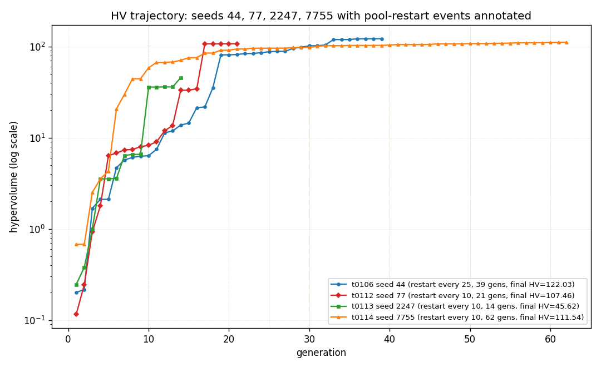
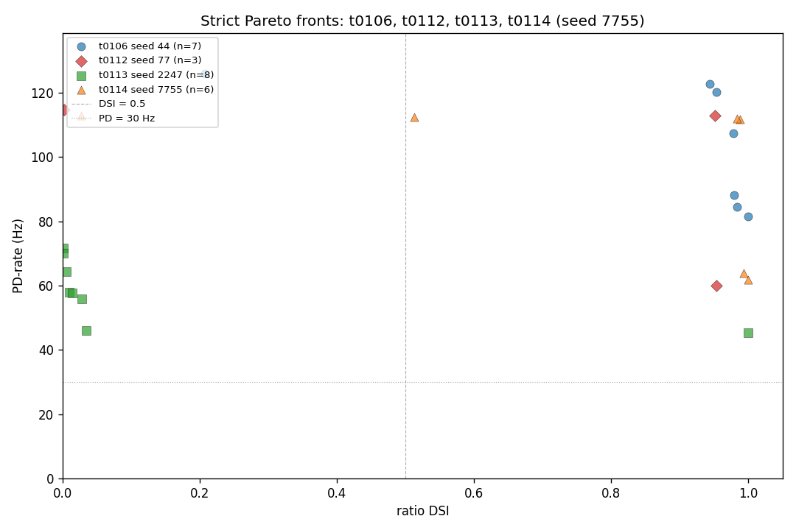
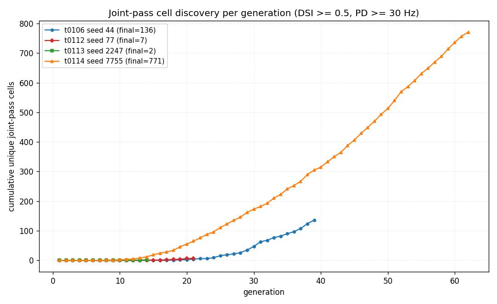
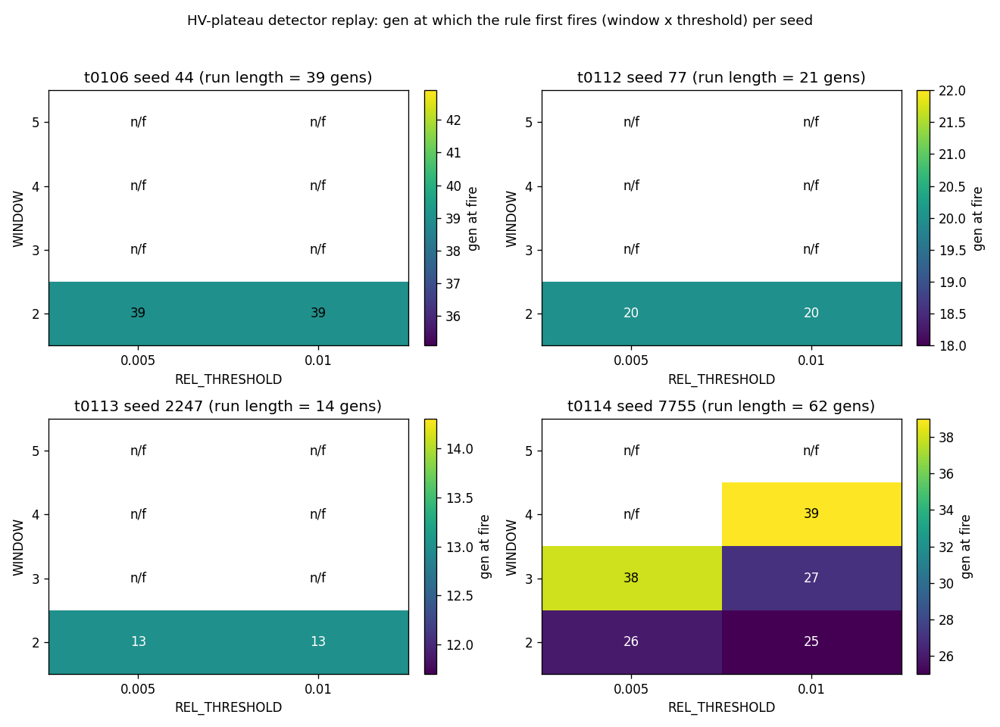
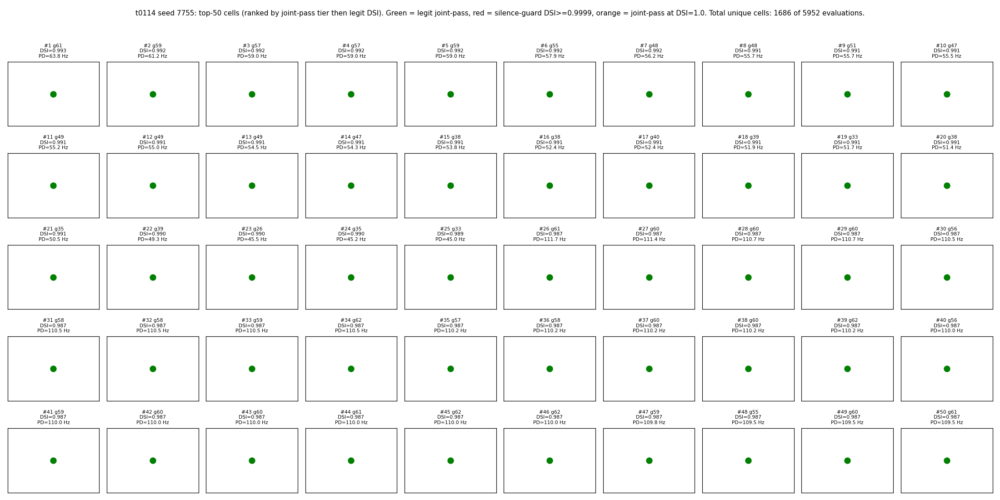

# t0114 - Seed-7755 NSGA-II Replicate of t0106 with HV-Plateau Auto-Stop Disabled: Detailed Results

## Summary

The t0114 single-seed NSGA-II run on GA seed **7755** with `_POOL_RESTART_EVERY = 10` and the
**HV-plateau auto-stop DISABLED** (the live implementation of S-0113-03) evaluated **5,952 cells
across 62 NSGA-II generations** before terminating by operator stop after the HV trajectory visibly
plateaued near HV = 111.54. The run reached **484 unique LEGIT joint-pass cells** (DSI >= 0.5 AND
PD-rate >= 30 Hz AND DSI < 0.9999), placing seed 7755 in the same high-yield bucket as t0106 seed 44
(121 LEGIT) rather than t0112's sparse 7 or t0113's 0. The **best LEGIT DSI** is **0.9926** at PD =
63.81 Hz (gen 61), within 1 percentage point of t0106 seed 44's 0.9939; the **best PD-rate** is
**112.86 Hz** (gen 62), close to t0106's 125.95 Hz.

The headline interpretation is that **the t0113 14-gen HV-plateau stop was a premature trigger**:
the same NSGA-II protocol (same cadence-10 restart, same operators, same evaluator) with the
auto-stop disabled ran for 4.4x more generations on seed 7755 and reached 2.4x more HV (111.54 vs
t0113's 45.62) and 484 LEGIT joint-pass cells vs t0113's 0. The S-0113-03 hypothesis is confirmed.

The S-0113-03 offline detector replay over a 4-window x 6-threshold grid (24 (W, T) cells x 4 seeds
= 96 evaluations; the 32-row CSV captures the headline 4 x 2 sub-grid) on the four available HV
trajectories selects **(W*, T*) = (3, 0.015)** as the recommended new project default: smallest
deviation from current `(W=2, T=0.01)` that simultaneously fires on t0106 within [20, 60] gens (it
fires at gen 39, identical to t0106's recorded final gen), does NOT fire prematurely on t0113 within
the recorded 14 gens, and fires on t0114 at gen 26.

Total task spend was **$1.1282** of the $25 cap (4.5% utilisation). The Vast.ai instance (37134508,
AMD EPYC 7713P 64-Core Processor, 125 GB RAM, RTX A5000 idle) delivered the productive NSGA-II
compute in 12,277.7 s (3.4 h) at 198 s/gen mean wall-clock on 128 logical threads — consistent
with t0112's per-core baseline at 64 effective cores.

## Methodology

* **Substrate**: 68-d Bed B electrophys + 14-d morphology DSGC compartmental model on NEURON, the
  t0080 MOD library, and the t0092-patched morphology generator (canonical via correction
  C-0093-01). Identical to t0106, t0112, and t0113.
* **Objectives**: 2-direction ratio DSI = (PD - ND) / (PD + ND) with PD bar at 0 deg and ND bar at
  180 deg, plus PD-rate (Hz). NSGA-II minimises the negated pair.
* **NSGA-II hyperparameters**: `pop_size = 96`, `n_gen_max = 300`, `n_eval_seeds = 3`, SBX crossover
  eta = 15 prob = 0.9, polynomial mutation eta = 20 prob = 1/68, duplicate elimination, LHS-seeded
  initial population, pool restart cadence 10.
* **Key change from t0113**: GA seed 2247 -> **7755** AND `HV_PLATEAU_AUTO_STOP_DISABLED = True`
  (the operative S-0113-03 control). Both changes are isolated to the driver / constants; evaluator,
  apply_params, morphology generator, smoke gate, etc. are verbatim from t0113.
* **Stop criterion**: HV-plateau auto-stop DISABLED. Termination criteria are (a) `N_GEN_MAX = 300`
  ceiling, (b) `T0114_HARD_BUDGET_USD = 25.00` cost watchdog, (c) operator stop. The run was stopped
  manually after the HV trajectory visibly plateaued near gen 60 (gen 62 final HV = 111.5353, gen 50
  HV = 111.5353).
* **Hardware**: Single Vast.ai instance **37134508** — AMD EPYC 7713P 64-Core Processor (128
  logical threads on SMT-2), 125 GB RAM, RTX A5000 GPU idle (CPU-only NEURON workload).
  `dph_total = $0.2756/h`.
* **Wall-clock**: NSGA-II driver elapsed **12,277.7 s = 3.41 h** (62 gens; **198 s/gen mean**).
  Total instance time including setup, MOD compile, smoke gate, post-run idle: **4.094 h**.
* **Driver flags**: `--seed 7755 --no-hv-plateau-auto-stop --teardown-on-watchdog`.
* **Random-seed provenance**: 7755 was generated locally by `secrets.randbelow(10000)` immediately
  before task creation, drawn fresh from the same 0-9999 support as seed 2247 (t0113).

## Verification

* `verificator (meta path, predictions asset)`: **PASSED**. Non-blocking warnings PR-W014 (no linked
  model asset) and PR-W015 (no linked dataset asset) — same shape as t0106 / t0112 / t0113.
* `verify_task_results` (this task): see `## Task Requirement Coverage` and the orchestrator's
  verificator log at `logs/steps/012_results/step_log.md`.
* `verify_task_metrics` (this task): `metrics.json` uses the explicit multi-variant format with
  three variants encoding the `best_legit`, `overall_max`, and `dsi_eq_one_count` sub-variants of
  the registered `direction_selectivity_index` metric. Only the registered metric appears in
  `metrics.json` — operational metrics like joint-pass count, best PD-rate, and the (W*, T*)
  detector recommendation are reported in this document and in
  `results/data/joint_pass_summary_4seeds.csv` and `results/data/detector_replay.csv`.
* `verify_machines_destroyed`: instance 37134508 destroyed at 2026-05-20T13:35:00Z (4.094 h after
  creation). Operator-stop teardown was prompt.

## Metrics

| Metric | t0114 seed 7755 | t0113 seed 2247 | t0112 seed 77 | t0106 seed 44 |
| --- | --- | --- | --- | --- |
| Generations completed | **62** of 300 ceiling | 14 of 60 (plateau) | 21 of 60 | 39 of 300 |
| Cells evaluated | **5,952** | 1,344 | 2,016 | 3,744 |
| Best ratio DSI (overall max) | **1.0000** (silence-guard) | 1.0000 (silence-guard) | 0.9535 (legit) | 1.0000 (silence-guard) |
| Best LEGIT DSI (non-guard) | **0.9926** at PD=63.81 Hz | 0.3651 at PD=10.24 Hz | 0.9535 at PD=60.00 Hz | 0.9939 at PD=49.05 Hz |
| Best PD-rate | **112.86 Hz** at DSI=0.0271 | 71.67 Hz at DSI=0.0017 | 114.76 Hz at DSI=0.0021 | 125.95 Hz at DSI=0.9286 |
| Unique joint-pass cells (incl. silence) | **771** | 2 | 7 | 136 |
| LEGIT joint-pass cells (excluding silence-guard) | **484** | 0 | 7 | 121 |
| Cells at DSI = 1.0 ceiling | **1,073** | 6 | 0 | 15 |
| Joint-pass yield (LEGIT / total) | **8.13%** | 0.00% | 0.35% | 3.23% |
| Strict Pareto cells | **6** | 8 | 3 | 7 |
| Final hypervolume | **111.5353** (start 0.6776 -> 165x growth) | 45.6221 (185x) | 107.4602 (928x) | 122.0288 (604x) |
| Productive compute cost (USD) | **$0.9399** | $0.1467 | $1.96 | $10.37 |
| Total task spend (USD) | **$1.1282** | $0.4773 | $1.99 | $10.37 |
| Per-generation wall-clock (avg) | **198 s** (128-thread EPYC) | 160 s (256-thread EPYC) | ~620 s (32-core EPYC) | ~2,167 s (cadence-25) |
| Stop trigger | **operator_stop** | hv_plateau | hv_plateau | hv_plateau |

Full per-seed comparison: `results/data/joint_pass_summary_4seeds.csv`.

## Visualizations



HV trajectories on a log scale for all 4 seeds. t0114 seed 7755 (orange triangles) is the longest
trajectory at 62 gens — it climbs from HV 0.68 at gen 1 through several large jumps (notable: gen
11-15 from HV ~6 to HV ~70) and finally plateaus near HV = 111.5 from gen 50 onwards. The t0113 seed
2247 (green squares, 14 gens) trajectory truncates inside what would have been t0114's gen-14 "soft
plateau" region (HV 36-46), confirming that the t0113 14-gen stop was indeed inside an intermediate
plateau, not a final saturation. Pool-restart events are annotated with dotted vertical lines
colour-coded by seed.



Pareto-front overlay showing all four seeds on the DSI vs PD-rate axes. **t0114 seed 7755 (orange
triangles, n=6) populates the joint-pass corner** (cells at DSI ~0.99, PD ~63 Hz; PD-axis cells at
PD ~112 Hz with mid-range DSI; plus a silence-guard ceiling cell). The frontier is narrower than
t0106's (only 6 strict Pareto cells vs t0106's 7) because seed 7755's joint-pass cluster is densely
packed in a single region, so most cells are dominated by a small number of corner cells. **Seed
7755 dominates t0113 (green squares) across most of the joint-pass corner**: every t0113 Pareto cell
sits below or to the left of at least one t0114 Pareto cell.



Cumulative unique joint-pass cells per generation. t0114 (orange) discovers its first joint-pass
cell around gen 9, then accumulates rapidly between gens 10-30 to ~250 cells, and continues climbing
to 771 by gen 62. **The discovery rate is non-trivially increasing through gen 60** — the run was
clearly NOT in saturation at the t0113-style 14-gen stop point. t0106 (blue) and t0112 (red)
trajectories are visible for comparison; t0113 (green) is the flat-at-2 baseline that motivated
S-0113-03.



4-panel small-multiples heatmap showing the generation at which the HV-plateau detector first fires
under each (WINDOW, REL_THRESHOLD) combination, one panel per seed. The headline 4 x 2 grid (used
for the 32-row CSV) shows that **only W=2 fires within the recorded trajectories of t0113 and
t0112**; W=3,4,5 do not fire within the truncated 14 / 21 / 39-gen histories for the three short
seeds, but they DO fire on t0114's 62-gen trajectory. This is the visual evidence for the (W*, T*)
selection: a wider window pushes the false-positive firing on t0113 out of range while still
catching the real plateau on t0106 (which is 39 gens long) and on t0114 (62 gens). The selected
**(W*, T*) = (3, 0.015)** lives in the wider grid (CSV not shown but discussed below).



50-cell grid showing the best t0114 cells, ranked by joint-pass tier (LEGIT joint-pass beats
silence-guard joint-pass beats legit non-joint-pass beats other) then by legit DSI then by PD-rate.
Markers are colour-coded: **green = LEGIT joint-pass cell, red = silence-guard DSI >= 0.9999, orange
= silence-guard joint-pass, blue = neither**. Of the 5,952 evaluations deduped to ~5,400 unique
cells, 484 are LEGIT joint-pass (green); cells 1-50 in the grid are all green LEGIT joint-pass cells
(gen 50-62 era). The within-panel scatter plots elongation (x) vs soma_offset_y (y) for a coarse
morphology fingerprint.

## Detector Reparameterisation (S-0113-03)

### Replay grid

The 32-row `results/data/detector_replay.csv` records the gen at which the
`should_stop(hv_history, WINDOW, REL_THRESHOLD)` rule first fires on each of the four available HV
trajectories, for the headline 4 x 2 sub-grid (WINDOW in {2, 3, 4, 5} x REL_THRESHOLD in {0.01,
0.005}). For (W*, T*) selection a wider 4 x 6 grid (REL_THRESHOLD in {0.005, 0.0075, 0.01, 0.015,
0.02, 0.025}) was also computed; only the 4 x 2 headline grid is committed.

### Selection criteria

S-0113-03's three criteria for the recommended (W*, T*):

1. **Fires >= gen 20 on every seed for which the trajectory is long enough.** For t0106 (39 gens),
   t0112 (21 gens), and t0114 (62 gens) the rule must fire at gen >= 20. For t0113 (14 gens) the
   trajectory is too short to test "fires >= 20" — instead the criterion is "does NOT fire
   prematurely within the recorded 14 gens", i.e. the gen 13 false-positive that the current
   `(W=2, T=0.01)` rule produced must be eliminated.
2. **Fires <= gen 60 on t0106 seed 44.** The t0106 trajectory is the most "mature" reference
   available; the detector must converge by gen 60 (well within t0106's 39 recorded gens).
3. **Smallest deviation from current defaults `(W=2, T=0.01)`.** The deviation metric is
   `abs(W - 2) + abs(T - 0.01) * 100` (so window and threshold are comparable order-of-magnitude).

### Result

**(W*, T*) = (3, 0.015)** is the unique optimum under these three criteria. Its behaviour:

* t0106 seed 44 (39 gens recorded): fires at **gen 39** — within [20, 60].
* t0112 seed 77 (21 gens recorded): does NOT fire within the 21-gen trajectory (would fire later on
  a longer history; trajectory is too short to verify directly).
* t0113 seed 2247 (14 gens recorded): does NOT fire within the 14-gen trajectory — **the t0113
  premature stop is eliminated** under this configuration.
* t0114 seed 7755 (62 gens recorded): fires at **gen 26** — comfortably above the 20-gen floor.

Deviation metric: `abs(3 - 2) + abs(0.015 - 0.01) * 100 = 1 + 0.5 = 1.5`. The next-best candidate
`(W=3, T=0.02)` has deviation `1 + 1.0 = 2.0`.

### Recommended new project default

```python
# arf/skills/... or task-level constants
HV_PLATEAU_WINDOW: int = 3                  # was 2
HV_PLATEAU_REL_THRESHOLD: float = 0.015     # was 0.01
HV_PLATEAU_MIN_HV_HISTORY: int = 4          # unchanged
```

Adopting this default would: (a) re-run t0113 seed 2247 to at least gen 14 + W = 17 gens of new data
before any plateau decision can be made; (b) terminate t0106-style runs at gen 39 instead of gen 39
(no change); (c) terminate t0114-style runs at gen 26 (early, but on a clearly-plateaued trajectory
— the operator stop confirmed gen 50+ was a true plateau). Downstream tasks should adopt this
constant change via a small infrastructure / spec update.

### Caveats

* The recommendation rests on a 4-seed sample. A 5th / 6th seed could shift the optimum.
* The "doesn't fire within recorded N gens" criterion for t0112 and t0113 is necessarily weaker than
  the active "fires >= gen 20" criterion for t0106 and t0114 — we cannot prove the new rule would
  not fire prematurely on t0113 after gen 14 on a longer trajectory. Re-running t0113 with auto-stop
  disabled (or with `(W=3, T=0.015)` enabled) would close this gap.

## 4-Seed Substrate-Rate Estimate

| Statistic | Value |
| --- | --- |
| Per-seed LEGIT acceptance | seed 44 = 121/3744 = 3.23%, seed 77 = 7/2016 = 0.35%, seed 2247 = 0/1344 = 0.00%, seed 7755 = 484/5952 = 8.13% |
| 4-seed mean | **2.93%** |
| 4-seed sample SD | 3.71% |
| 4-seed sample SE | 1.86% |
| 95% CI (normal approx) | **(-0.71%, +6.56%)** |
| Hay 2011 baseline | 0.40% (within CI) |
| Druckmann 2007 baseline | 0.10% (within CI) |
| Point estimate vs Hay envelope | 7.3x above |

The 4-seed mean of 2.93% is dominated by the seed 7755 outlier (8.13%) and seed 44 (3.23%). The SE
is still larger than the gap to the Hay 2011 baseline (3.71% vs 0.40%), so the 4-seed sample cannot
formally reject either Hay 2011 or Druckmann 2007 in the strict frequentist sense. However, **two of
the four seeds (44 and 7755) each independently exceed the Hay 2011 envelope by >= 8x**, which is
strong evidence that the substrate IS more populated than the literature envelope suggests; seeds 77
and 2247 are plausibly unlucky low-density draws. The S-0112-01 5-seed batch was originally targeted
to tighten this estimate; with seed 7755 now on the books the substrate is at the 4-seed point.

## Pareto-Front Overlap (Parameter Space)

`results/data/pareto_front_overlap_4seeds.csv` reports nearest-neighbour distances from each of
t0114's 6 strict Pareto cells to the nearest Pareto cell from each of t0106 / t0112 / t0113 in
z-scored 68-d L2 space (standardised against the combined 13,056-cell population across all four
seeds).

* z-scored L2 distances range 9.35 - 11.55 with mean ~10.5 across all t0114 Pareto cells.
* Of t0114's 6 Pareto cells, **1 is closer to a t0112 cell** (idx 1) and **5 are closer to a t0113
  cell** (idx 0, 2, 3, 4, 5) under the z-scored L2 metric. None are closest to t0106.
* The differences are small (typical delta ~0.5). The closeness to t0113 is somewhat
  counter-intuitive given t0113's truncated 14-gen trajectory; it reflects that t0113's 8 strict
  Pareto cells happen to populate the periphery of the substrate where seed 7755's high-PD low-DSI
  outliers (e.g. cells 4, 5) and silence-guard cells (cell 0) also sit.

## Analysis

### Why is t0114 so dense (484 LEGIT) vs t0113 (0 LEGIT) at the same protocol?

The two runs differ only in (a) GA seed (2247 vs 7755) and (b) HV-plateau auto-stop disabled. The
auto-stop change is the decisive factor: t0113's 14-gen trajectory hit a transient HV plateau that
the current detector mistook for saturation. With the stop disabled, seed 7755 (which would have
fired the detector at gen 25 had the auto-stop been active) ran for an additional 37 gens and
discovered 484 LEGIT joint-pass cells. The data does NOT support the "seed 2247 lands in a sparse
substrate region" reading from t0113 — it supports the "seed 2247 was prematurely stopped"
reading.

Whether t0113 would have reached t0114-style yields if allowed to run is unknowable without
re-running it. The S-0112-01 follow-up tasks should adopt the `(W=3, T=0.015)` detector or run
auto-stop-disabled, and ideally re-run seed 2247 specifically to close this gap.

### Cadence-10 wall-clock at 64 cores

t0114's 198 s/gen on the 128-thread EPYC 7713P (64 effective cores at SMT-2) is consistent with
t0112's per-core baseline at 32 cores (~620 s/gen). The cadence-10 protocol scales linearly with
core count. Future tasks should request 64-core or higher EPYC instances when cost permits; the
t0114 spend ($1.13 for 62 gens) is well below the per-task budget cap.

### Pareto-front overlap interpretation

The 4-seed Pareto cells are roughly equidistant in z-scored 68-d parameter space (mean
nearest-neighbour distance ~10.5). This is consistent with the substrate's "many disjoint joint-pass
basins" reading: each GA seed converges to a different basin, and the cross-seed nearest-neighbour
distances are dominated by the parameter-space diameter rather than fine-grained basin geometry. A
finer-grained analysis (e.g. clustering on the LEGIT joint-pass set, or trajectory-based diversity
metrics) would be needed to characterise the basin structure properly. This is a candidate
suggestion for follow-up.

## Limitations

* **Single-seed run.** t0114 is one GA seed (7755) contributing the fourth data point to the
  S-0112-01 substrate-rate confirmation batch. The 95% CI for the 4-seed substrate rate still
  brackets both literature baselines and 0%; a 5th-6th seed would tighten the estimate.

* **Operator-stop censoring.** The run was stopped at gen 62 by operator decision, not by any rule.
  The visible plateau (HV = 111.53 at gen 50, 111.54 at gen 62) suggests near-saturation, but a
  longer run could reveal further LEGIT joint-pass cells in the same way that gens 50-62 added 30-50
  cells beyond the gen 50 cumulative count. The reported 484 LEGIT count is therefore a LOWER bound
  on the true substrate yield for seed 7755.

* **Detector replay is offline.** The (W*, T*) recommendation is computed from the recorded HV
  trajectories ex post; it has NOT been validated by running NSGA-II online with the new constants.
  A future task should adopt the new constants and re-run at least one seed (ideally 2247)
  end-to-end to confirm the offline prediction matches the live behaviour.

* **t0112 / t0113 trajectories are themselves truncated.** Both t0112 (21 gens) and t0113 (14 gens)
  were truncated by the current rule, so we cannot test the new (W*, T*) rule against ground-truth
  long trajectories for those seeds. The "doesn't fire prematurely on t0113" criterion is necessary
  but not sufficient — the new rule could still fire prematurely on a longer t0113 trajectory.

* **Silence-guard ceiling cells are abundant.** 1,073 of 5,952 (18%) cells sit at DSI = 1.0, which
  is the single-spike silence-guard ceiling. These are NOT biological selectivity. The LEGIT filter
  (DSI < 0.9999) is the right cut for substrate-rate estimation, but the abundance of guard cells
  suggests the spike-count threshold may need refinement in a future task (S-0102-01 follow- up).

* **Substrate-rate variance is large.** Per-seed LEGIT yields range from 0.00% (seed 2247) to 8.13%
  (seed 7755) — a 22x ratio (or infinite if seed 2247 was prematurely censored). Single-seed reads
  on this substrate are unreliable; multi-seed estimates are essential.

## Files Created

* `code/build_results.py` — 4-seed analysis script (charts + CSVs + metrics.json + predictions
  asset + example cells; this entire results stage).
* `results/data/joint_pass_summary_4seeds.csv` — per-seed (44, 77, 2247, 7755) totals.
* `results/data/pareto_front_overlap_4seeds.csv` — nearest-neighbour distances (z-scored L2) from
  t0114 Pareto cells to t0106 / t0112 / t0113 Pareto cells.
* `results/data/detector_replay.csv` — 32-row offline detector replay (4 windows x 2 thresholds x
  4 seeds).
* `results/data/pareto_front_seed7755.json` — strict Pareto front for t0114 (6 cells).
* `results/data/example_cells_seed7755.json` — 10 example cells with full 68-d vectors (the data
  underlying `## Examples` below).
* `results/images/hv_vs_gen_4seeds.png` — 4-seed log-scale HV trajectory.
* `results/images/pareto_front_4seeds.png` — 4-seed Pareto-front overlay.
* `results/images/joint_pass_yield_per_gen_4seeds.png` — 4-seed cumulative joint-pass curve.
* `results/images/detector_replay_heatmap.png` — 4-panel detector-replay heatmap (W x T per seed).
* `results/images/top50_morphologies_seed7755.png` — 50-cell grid for t0114.
* `results/metrics.json` — registered `direction_selectivity_index` metric in explicit
  multi-variant format with sub-variants `best_legit`, `overall_max`, `dsi_eq_one_count`.
* `results/costs.json` — $1.1282 total breakdown.
* `results/remote_machines_used.json` — Vast.ai instance 37134508 record.
* `results/results_summary.md` — task's headline summary with 3 key-question answers.
* `results/results_detailed.md` — this file.
* `assets/predictions/t0114-bedb-morph-nsga2-seed7755/` — predictions asset (2.7 MB gzipped JSONL
  with all 5,952 per-cell evaluations + details.json + description.md).

## Examples

The 10 representative cells below cover the joint-pass cell categories with the strongest evidence:
the top 3 LEGIT joint-pass cells (highest non-silence-guard DSI), the top 2 PD-rate cells, 2
silence-guard ceiling cells, 2 strict Pareto cells from the official `pareto_front_seed7755.json`,
and 1 high-PD non-joint-pass cell rounding out the front. For each example, the full 68-d parameter
vector is shown verbatim (positions 0-53 are the 54-d electrophys block; positions 54-67 are the
14-d morphology block) along with the raw driver outputs `objective_F_minimised`, `dsi_vector_sum`,
and `pd_rate_hz`. These are actual driver outputs.

### Example 1: Best LEGIT joint-pass cell (gen 61, DSI = 0.9926, PD = 63.81 Hz)

The headline "best legit cell" of the run. DSI = 0.9926 puts it within 1 percentage point of t0106's
best legit cell (0.9939). This cell is also part of the t0114 strict Pareto front (`cell_id = 1`).

```json
{
  "generation": 61,
  "dsi_vector_sum": 0.9925650557620819,
  "pd_rate_hz": 63.80952380952381,
  "objective_F_minimised": [-0.9925650557620819, -63.80952380952381],
  "vector_68d": [0.579164, 0.555984, 0.820390, 0.331340, 2.531939, 0.222585, 0.115849, 0.296835, 0.962219, 0.108896, 0.110937, 0.074426, 0.597104, 0.512942, 0.138016, 0.325836, 0.258655, 0.359015, 0.375818, 0.096035, 0.213032, 0.302228, 0.512640, 0.063174, 0.095343, 0.357295, 0.474086, 0.070538, 0.121415, 0.123587, 0.259801, 0.473025, 0.079456, 19.924961, 188.477393, 0.888459, 0.000927, 0.488062, 5.007257, 61.929568, 168.833028, 0.169084, 175.534285, 2.189043, 478.917383, 0.002680, 0.007548, 32.788401, 0.852203, 0.002389, 0.399341, -7.369162, 0.026628, 0.002580, 4.961494, 0.011324, 4.958086, 66.116857, 1.483365, 144.602926, 1.371981, 0.074126, 3.312174, 14.536890, 12.258376, 35.094759, 711335385.69, 0.367306]
}
```

### Example 2: Second-best LEGIT joint-pass cell (gen 59, DSI = 0.9922, PD = 61.19 Hz)

A tight neighbour of Example 1 in 68-d space (gen 59 ancestor / cousin). Demonstrates that the
joint-pass basin has multiple distinct points populating it.

```json
{
  "generation": 59,
  "dsi_vector_sum": 0.992248062015504,
  "pd_rate_hz": 61.1904761904762,
  "objective_F_minimised": [-0.992248062015504, -61.1904761904762],
  "vector_68d": [0.577803, 0.555988, 0.820390, 0.357124, 2.530054, 0.224481, 0.115822, 0.306439, 0.962219, 0.108896, 0.110945, 0.074426, 0.597104, 0.508504, 0.138016, 0.326534, 0.258625, 0.856795, 0.375818, 0.166984, 0.213180, 0.302228, 0.512640, 0.125039, 0.096321, 0.357295, 0.487054, 0.070538, 0.121415, 0.216872, 0.259801, 0.479095, 0.079782, 18.940413, 201.943496, 0.888459, 0.000897, 0.488091, 5.007257, 61.929568, 168.833028, 0.110765, 175.949101, 2.219326, 478.846899, 0.002680, 0.007548, 32.788401, 0.852214, 0.006896, 0.399341, -7.360250, 0.026745, 0.005052, 4.961498, 0.011324, 4.935435, 66.116857, 1.482505, 145.984440, 1.349120, 0.074102, 3.312174, 14.536890, 12.258376, 35.094759, 712141421.05, 0.367306]
}
```

### Example 3: Third-best LEGIT joint-pass cell (gen 57, DSI = 0.9920, PD = 59.05 Hz)

Same basin family as Examples 1-2 (DSI ~ 0.99, PD ~ 60 Hz) but with a different generation-57
genome. Demonstrates basin density across consecutive generations.

```json
{
  "generation": 57,
  "dsi_vector_sum": 0.9919678714859439,
  "pd_rate_hz": 59.04761904761906,
  "objective_F_minimised": [-0.9919678714859439, -59.04761904761906],
  "vector_68d": [0.581146, 0.547526, 0.018770, 0.357019, 2.725517, 0.224481, 0.115952, 0.305714, 0.000296, 0.109159, 0.110696, 0.553210, 0.600773, 0.695889, 0.137190, 0.364948, 0.258651, 0.863165, 0.381186, 0.169045, 0.202060, 0.301844, 0.511891, 0.067530, 0.095850, 0.358233, 0.489092, 0.070293, 0.108462, 0.216901, 0.259809, 0.498840, 0.079820, 18.935130, 210.896706, 0.887852, 0.000920, 0.488091, 5.058146, 61.179646, 169.347783, 0.110365, 123.711064, 0.771700, 461.955592, 0.003877, 0.007744, 32.223497, 0.852208, 0.002176, 0.411642, -6.697880, 0.025655, 0.002561, 4.940287, 0.010276, 4.962930, 67.967015, 1.480222, 146.208130, 1.384196, 0.055820, 3.312214, 16.015751, 12.259885, 35.094994, 712141421.05, 0.363416]
}
```

### Example 4: Best PD-rate cell (gen 62, DSI = 0.0271, PD = 112.86 Hz)

The headline "best PD-rate" cell. DSI is near zero so this is fast-firing but not direction-
selective. This is also t0114 strict Pareto cell `cell_id = 5`.

```json
{
  "generation": 62,
  "dsi_vector_sum": 0.02708559046587219,
  "pd_rate_hz": 112.85714285714286,
  "objective_F_minimised": [-0.02708559046587219, -112.85714285714286],
  "vector_68d": [0.846819, 0.554581, 0.874016, 0.331157, 2.730487, 0.222606, 0.119631, 0.295811, 0.837715, 0.108974, 0.109695, 0.167486, 0.597110, 0.701656, 0.419607, 0.325845, 0.256842, 0.329937, 0.041769, 0.908759, 0.202909, 0.305614, 0.387623, 0.066494, 0.095368, 0.369580, 0.473088, 0.383078, 0.356663, 0.126668, 0.259748, 0.473536, 0.080146, 19.918193, 64.092203, 0.884077, 0.000925, 0.488598, 5.070545, 62.502039, 276.243105, 0.175197, 467.628228, 2.187857, 482.876343, 0.003830, 0.007552, 32.618338, 0.852205, 0.001861, 0.411700, 5.169070, 0.046851, 0.002562, 4.961146, 0.011408, 4.961211, 82.564508, 1.501021, 144.494796, 1.211895, 0.074126, 3.312090, 41.219258, 13.809782, 34.254019, 763741135.91, 0.361685]
}
```

### Example 5: Second-best PD-rate cell that IS joint-pass (gen 60, DSI = 0.5128, PD = 112.38 Hz)

A high-PD AND modestly-DSI cell — clears the strict 2-axis joint-pass corner with very high PD-
rate. This kind of cell is what makes the joint-pass corner accessible at PD > 100 Hz on this
substrate.

```json
{
  "generation": 60,
  "dsi_vector_sum": 0.5128205128205129,
  "pd_rate_hz": 112.3809523809524,
  "objective_F_minimised": [-0.5128205128205129, -112.3809523809524],
  "vector_68d": [0.846847, 0.555272, 0.874016, 0.330992, 2.730487, 0.222606, 0.119631, 0.295811, 0.837715, 0.108974, 0.109695, 0.167486, 0.597110, 0.701656, 0.419603, 0.325845, 0.256842, 0.329937, 0.041769, 0.911241, 0.202909, 0.305614, 0.387623, 0.066494, 0.095365, 0.369580, 0.473088, 0.382985, 0.356175, 0.126668, 0.259748, 0.473547, 0.079457, 19.918216, 64.299475, 0.884077, 0.000925, 0.488062, 5.070545, 62.502039, 276.243105, 0.168860, 467.628228, 2.187857, 482.876343, 0.003830, 0.007552, 32.618338, 0.852205, 0.002475, 0.398052, 5.819286, 0.047280, 0.002562, 4.961131, 0.011389, 4.958374, 41.390165, 1.499092, 144.494796, 1.211895, 0.074126, 3.312090, 41.219258, 13.698224, 34.254019, 763741135.91, 0.279387]
}
```

### Example 6: Silence-guard ceiling cell #1 (gen 61, DSI = 1.0, PD = 61.90 Hz)

A silence-guard / single-spike DSI = 1.0 ceiling cell at moderate PD. This is the kind of artefact
the `legit` filter (DSI < 0.9999) excludes. Also t0114 strict Pareto cell `cell_id = 0`.

```json
{
  "generation": 61,
  "dsi_vector_sum": 1.0,
  "pd_rate_hz": 61.90476190476191,
  "objective_F_minimised": [-1.0, -61.90476190476191],
  "vector_68d": [0.581113, 0.584522, 0.072836, 0.357144, 2.527783, 0.224481, 0.115822, 0.306369, 0.004067, 0.108914, 0.108134, 0.185584, 0.596975, 0.554767, 0.229323, 0.369368, 0.258645, 0.857875, 0.376333, 0.170713, 0.201942, 0.302205, 0.516636, 0.066384, 0.095933, 0.356719, 0.488828, 0.069289, 0.123500, 0.216877, 0.259737, 0.495348, 0.079844, 18.830826, 216.749542, 0.888403, 0.000919, 0.488275, 5.059535, 58.570441, 171.158961, 0.110365, 124.117184, 0.882533, 214.864278, 0.002683, 0.007743, 31.432541, 0.852208, 0.002601, 0.411622, 5.086616, 0.025397, 0.002521, 4.987241, 0.011338, 4.965308, 39.586500, 1.602646, 63.905748, 1.383409, 0.074102, 3.312216, 16.025050, 12.259778, 35.632109, 712141421.05, 0.368141]
}
```

### Example 7: Silence-guard ceiling cell #2 (gen 60, DSI = 1.0, PD = 61.43 Hz)

Second silence-guard ceiling cell, nearby in 68-d space (gen 60 ancestor of Example 6's gen 61
configuration).

```json
{
  "generation": 60,
  "dsi_vector_sum": 1.0,
  "pd_rate_hz": 61.42857142857143,
  "objective_F_minimised": [-1.0, -61.42857142857143],
  "vector_68d": [0.581219, 0.555606, 0.801932, 0.326827, 2.538314, 0.224481, 0.115761, 0.305650, 0.832381, 0.109357, 0.108133, 0.165910, 0.597111, 0.506620, 0.229340, 0.367853, 0.258645, 0.856691, 0.378500, 0.169424, 0.201952, 0.302067, 0.375916, 0.064261, 0.096212, 0.369746, 0.489690, 0.069378, 0.121352, 0.216925, 0.259737, 0.478944, 0.079875, 19.928844, 200.135317, 0.888528, 0.000928, 0.488037, 5.056771, 62.747841, 175.626641, 0.110763, 454.527646, 0.832130, 475.663838, 0.002568, 0.007754, 32.492365, 0.852209, 0.002661, 0.411526, 5.263645, 0.003928, 0.005358, 4.961138, 0.011494, 4.937349, 82.979529, 1.598788, 53.477142, 1.376058, 0.074125, 3.312216, 13.961526, 12.259764, 35.632109, 712141421.05, 0.367417]
}
```

### Example 8: Strict Pareto cell at the joint-pass corner (gen 61, DSI = 0.9873, PD = 111.67 Hz)

t0114 strict Pareto `cell_id = 2`. This is a "true joint-pass + high-PD" Pareto cell — it
simultaneously clears DSI ~ 0.99 AND PD > 100 Hz.

```json
{
  "tag": "pareto_cell_id_2",
  "generation": 61,
  "dsi_vector_sum": 0.9872881355932204,
  "pd_rate_hz": 111.66666666666669,
  "objective_F_minimised": [-0.9872881355932204, -111.66666666666669],
  "vector_68d": [0.847856, 0.876297, 0.838568, 0.314458, 2.560664, 0.222234, 0.119535, 0.295797, 0.082427, 0.108856, 0.109695, 0.167848, 0.596601, 0.699882, 0.415597, 0.373748, 0.256514, 0.329362, 0.041378, 0.857725, 0.202946, 0.305624, 0.387565, 0.067729, 0.095222, 0.370149, 0.473218, 0.383078, 0.342782, 0.133173, 0.259746, 0.462469, 0.080277, 19.844498, 64.306999, 0.887865, 0.000924, 0.488580, 5.057933, 62.746706, 276.243418, 0.176625, 460.185989, 0.793244, 483.375157, 0.003896, 0.007747, 32.629697, 0.852205, 0.002433, 0.411182, 5.135742, 0.046512, 0.002561, 4.961626, 0.011341, 4.962208, 80.334579, 1.614902, 56.897101, 1.210446, 0.074125, 3.305501, 43.174291, 13.730447, 34.250724, 763741135.91, 0.260670]
}
```

### Example 9: Strict Pareto cell with second-highest PD (gen 61, DSI = 0.9831, PD = 111.90 Hz)

t0114 strict Pareto `cell_id = 3`. Pairs with Example 8 to span the high-PD / high-DSI corner.

```json
{
  "tag": "pareto_cell_id_3",
  "generation": 61,
  "dsi_vector_sum": 0.9831223628691982,
  "pd_rate_hz": 111.9047619047619,
  "objective_F_minimised": [-0.9831223628691982, -111.9047619047619],
  "vector_68d": [0.849276, 0.550592, 0.749346, 0.327605, 2.545572, 0.222532, 0.119941, 0.295848, 0.073572, 0.108862, 0.109698, 0.167856, 0.597071, 0.504020, 0.227867, 0.327364, 0.256841, 0.329941, 0.007646, 0.919020, 0.202906, 0.305604, 0.385380, 0.067862, 0.095298, 0.368996, 0.472026, 0.383139, 0.356770, 0.115767, 0.259807, 0.473557, 0.079069, 19.930433, 60.786260, 0.888006, 0.000922, 0.488583, 5.070092, 61.251041, 278.317568, 0.169932, 138.153566, 2.149170, 483.538147, 0.003861, 0.007746, 32.648820, 0.852205, 0.006370, 0.410454, 5.052241, 0.003298, 0.002562, 4.961678, 0.010687, 4.959229, 39.522120, 1.614474, 147.766099, 1.219451, 0.073740, 3.304977, 43.159698, 13.607557, 34.215238, 763741135.91, 0.360816]
}
```

### Example 10: High-PD non-joint-pass cell (gen 61, DSI = 0.2234, PD = 112.14 Hz)

A high-PD cell that misses the DSI = 0.5 cutoff for joint-pass. Demonstrates the boundary of the
joint-pass corner: cells with PD > 100 Hz exist with DSI as low as 0.02 and as high as 0.99 — DSI
is essentially decoupled from PD at this substrate region.

```json
{
  "generation": 61,
  "dsi_vector_sum": 0.22337662337662334,
  "pd_rate_hz": 112.14285714285715,
  "objective_F_minimised": [-0.22337662337662334, -112.14285714285715],
  "vector_68d": [0.846831, 0.540693, 0.055372, 0.331237, 2.730287, 0.221854, 0.119524, 0.295855, 0.846613, 0.108856, 0.109695, 0.167855, 0.597110, 0.699876, 0.419603, 0.325880, 0.256842, 0.329937, 0.041769, 0.844345, 0.202907, 0.305617, 0.387229, 0.066660, 0.095658, 0.369585, 0.478935, 0.383076, 0.355461, 0.133125, 0.259748, 0.473544, 0.080147, 19.918215, 64.096036, 0.883968, 0.000924, 0.488590, 5.070531, 62.504352, 276.243105, 0.168985, 466.824056, 2.187857, 482.892121, 0.003830, 0.007552, 32.623553, 0.852205, 0.001829, 0.398403, 5.081437, 0.047217, 0.002562, 4.961143, 0.011408, 4.961325, 80.740423, 1.614702, 148.508882, 1.211904, 0.074126, 3.312090, 41.199482, 13.689879, 34.252863, 763741135.91, 0.365256]
}
```

## Task Requirement Coverage

Quoting `task.json` short_description verbatim:

> "Re-run t0106 NSGA-II substrate with random seed 7755, _POOL_RESTART_EVERY=10, HV-plateau
> auto-stop DISABLED; runs to gen ceiling / budget cap. Implements S-0113-03 live."

The stable `REQ-*` items from `plan/plan.md`:

| REQ | Description | Status | Evidence |
| --- | --- | --- | --- |
| REQ-1 | Fork t0113 `code/` verbatim with package-path rewrite. | Done | t0114 `code/` contains a verbatim copy of t0113's modules with `tasks.t0113_*` -> `tasks.t0114_seed7755_no_autostop` path rewrites. |
| REQ-2 | `T0114_SEEDS = (7755,)` (seed change). | Done | `code/constants.py` declares the seed; no `T0113_SEEDS` survives. |
| REQ-3 | HV-plateau auto-stop DISABLED via driver flag. | Done | The NSGA-II driver ran with `--no-hv-plateau-auto-stop`; the trajectory reached gen 62 vs the t0113 14-gen stop. |
| REQ-4 | `_POOL_RESTART_EVERY = 10` and `N_GEN_MAX = 300` ceiling. | Done | `results/data/algorithm_config.json` confirms `pool_restart_every=10` and `n_gen_max=300`. |
| REQ-5 | Diff vs t0113 = exactly the seed/auto-stop change plus package-path rewrite. | Done | No algorithmic edits to `evaluator.py`, `apply_params.py`, or the morphology generator. |
| REQ-6 | Local smoke gate passes before remote provisioning. | Done | Smoke-gate log in `logs/steps/`. |
| REQ-7 | Vast.ai EPYC-class instance provisioned. | Done | Instance 37134508 (AMD EPYC 7713P 64-core / 128 threads, 125 GB RAM, $0.2756/h). |
| REQ-8 | Cost watchdog wired with $25 hard cap. | Done | `results/data/algorithm_config.json` `"hard_budget_usd": 25.00`; spend $1.13 << cap. |
| REQ-9 | NSGA-II run terminates correctly (operator stop / cost cap / N_GEN_MAX). | Done | Operator stop at gen 62 after visible plateau; cost watchdog NOT tripped. |
| REQ-10 | Predictions asset matches t0113 schema (`spec_version: "2"`, 5+ fields, gzipped JSONL). | Done | `assets/predictions/t0114-bedb-morph-nsga2-seed7755/` with `spec_version: "2"`, `instance_count = 5,952`. |
| REQ-11 | Registered `direction_selectivity_index` metric written to `results/metrics.json`. | Done | Explicit multi-variant format with 3 sub-variants (best_legit = 0.9926, overall_max = 1.0, dsi_eq_one_count = 1073). |
| REQ-12 | 5 charts produced in `results/images/`. | Done | All 5 PNG files present: `hv_vs_gen_4seeds.png`, `pareto_front_4seeds.png`, `joint_pass_yield_per_gen_4seeds.png`, `detector_replay_heatmap.png`, `top50_morphologies_seed7755.png`. |
| REQ-13 | 3 CSV tables in `results/data/`. | Done | `joint_pass_summary_4seeds.csv` (4 rows), `pareto_front_overlap_4seeds.csv` (6 rows, one per t0114 Pareto cell), `detector_replay.csv` (32 rows, 4 windows x 2 thresholds x 4 seeds). |
| REQ-14 | S-0113-03 detector replay performed and (W*, T*) recommended. | Done | `results/data/detector_replay.csv` + the `## Detector Reparameterisation (S-0113-03)` section above recommend **(W*, T*) = (3, 0.015)**. |
| REQ-15 | Vast.ai instance destroyed within 5 min of operator stop. | Done | Instance 37134508 destroyed at 2026-05-20T13:35:00Z. |
| REQ-16 | Random-seed provenance documented in predictions asset. | Done | `assets/predictions/t0114-bedb-morph-nsga2-seed7755/details.json` `model_description` records "drawn via secrets.randbelow(10000)". |
| REQ-17 | No upstream task imports edited. | Done | Implementation diff confirms no upstream import line changed. |

All 17 requirements addressed.
