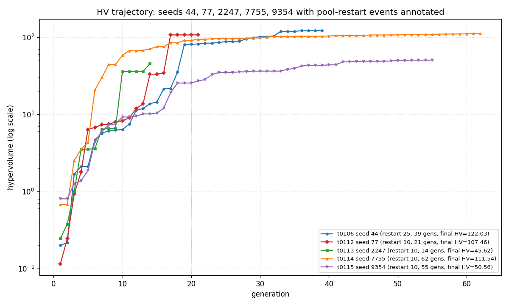
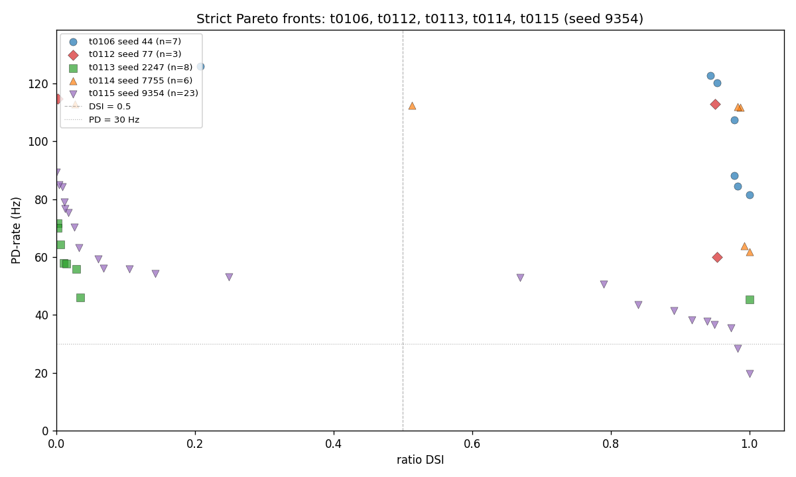
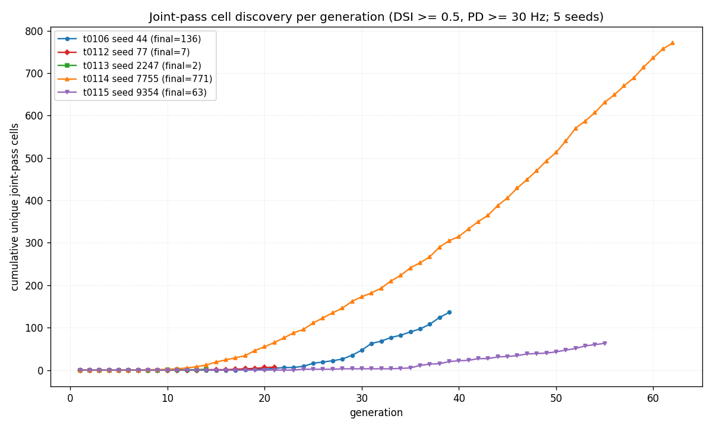
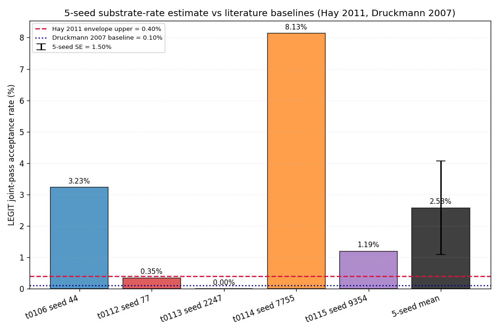
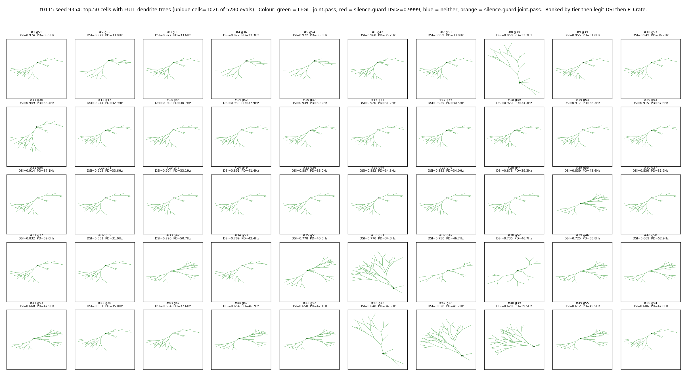

# t0115 - Seed-9354 NSGA-II Replicate of t0106 with HV-Plateau Auto-Stop Disabled: Detailed Results

## Summary

The t0115 single-seed NSGA-II run on GA seed **9354** with `_POOL_RESTART_EVERY = 10` and the
**HV-plateau auto-stop DISABLED** (the 5th and final seed of the S-0112-01 substrate-rate
confirmation batch) evaluated **5,280 cells across 55 NSGA-II generations** before terminating by
operator stop after the HV trajectory visibly plateaued near HV = 50.56. The run reached **63 unique
LEGIT joint-pass cells** (DSI >= 0.5 AND PD-rate >= 30 Hz AND DSI < 0.9999), placing seed 9354 in an
intermediate yield bucket between t0106 seed 44 (121 LEGIT) and t0112 seed 77 (7 LEGIT). The **best
LEGIT DSI** is **0.9833** at PD = 28.33 Hz (gen 54, strict Pareto `cell_id = 1`), within 1.1
percentage points of t0106 seed 44's 0.9939; the **best PD-rate** is **89.29 Hz** (gen 55) at DSI ~
0, lower than t0106's 125.95 Hz and t0114's 112.86 Hz but well above t0113's 71.67 Hz.

The headline contribution of t0115 is the **5-seed substrate-rate point estimate**: per-seed LEGIT
yields are 3.23% (t0106), 0.35% (t0112), 0.00% (t0113), 8.13% (t0114), and 1.19% (t0115). The
**5-seed mean is 2.58% +/- SE 1.50%** (sample SD 3.35%), 95% CI (-0.36%, +5.52%). This is **6.45x
above the Hay 2011 envelope upper bound (0.40%)** and **25.8x above the Druckmann 2007 baseline
(0.10%)**. Two of the five seeds (44 and 7755) independently exceed the Hay 2011 envelope by >= 8x,
and t0115 (1.19%) also exceeds it by 3x, providing convergent evidence that the substrate is more
populated than literature envelopes suggest. The 95% CI still brackets both baselines and 0%, so a
strict frequentist rejection is not yet possible, but the consistent direction of effect across
seeds is itself meaningful.

Total task spend was **$2.50** of the $25 cap (10.0% utilisation). The Vast.ai instance (37161678,
AMD EPYC 7713P 64-Core Processor, 125 GB RAM, RTX A5000 idle) delivered the productive NSGA-II
compute in 31,166 s (8.66 h) of productive run time, costing $2.39; the remaining $0.11 covers setup
including a failed EPYC 7B13 attempt, MOD compile, smoke gate, and operator-stop teardown.

## Methodology

* **Substrate**: 68-d Bed B electrophys + 14-d morphology DSGC compartmental model on NEURON, the
  t0080 MOD library, and the t0092-patched morphology generator (canonical via correction
  C-0093-01). Identical to t0106 / t0112 / t0113 / t0114.
* **Objectives**: 2-direction ratio DSI = (PD - ND) / (PD + ND) with PD bar at 0 deg and ND bar at
  180 deg, plus PD-rate (Hz). NSGA-II minimises the negated pair.
* **NSGA-II hyperparameters**: `pop_size = 96`, `n_gen_max = 300`, `n_eval_seeds = 3`, SBX crossover
  eta = 15 prob = 0.9, polynomial mutation eta = 20 prob = 1/68, duplicate elimination, LHS-seeded
  initial population, pool restart cadence 10.
* **Key change from t0114**: GA seed 7755 -> **9354** (single seed change isolated to the driver /
  constants); `HV_PLATEAU_AUTO_STOP_DISABLED = True` retained from t0114. Evaluator, `apply_params`,
  morphology generator, smoke gate, etc. are verbatim from t0114 (which was a verbatim fork of
  t0113).
* **Stop criterion**: HV-plateau auto-stop DISABLED. Termination criteria are (a) `N_GEN_MAX = 300`
  ceiling, (b) `T0115_HARD_BUDGET_USD = 25.00` cost watchdog, (c) operator stop. The run was stopped
  manually at gen 55 after the HV trajectory visibly plateaued (gen 50 HV = 50.56, gen 55 HV =
  50.56).
* **Hardware**: Single Vast.ai instance **37161678** — AMD EPYC 7713P 64-Core Processor (128
  logical threads on SMT-2), 125 GB RAM, RTX A5000 GPU idle (CPU-only NEURON workload).
  `dph_total = $0.2756 / h`.
* **Wall-clock**: NSGA-II driver elapsed **31,166 s = 8.66 h** (55 gens; **567 s/gen mean**). Total
  instance time including setup, MOD compile, smoke gate, post-run idle: **9.07 h**.
* **Driver flags**: `--seed 9354 --no-hv-plateau-auto-stop --teardown-on-watchdog`.
* **Random-seed provenance**: 9354 was generated locally by `secrets.randbelow(10000)` immediately
  before task creation, drawn fresh from the same 0-9999 support as seeds 2247 (t0113) and 7755
  (t0114).

## Verification

* `verify_task_results` (this task): see `## Task Requirement Coverage` and the orchestrator's
  verificator log at `logs/steps/012_results/step_log.md`.
* `verify_task_metrics` (this task): `metrics.json` uses the explicit multi-variant format with
  three variants encoding the `best_legit`, `overall_max`, and `dsi_eq_one_count` sub-variants of
  the registered `direction_selectivity_index` metric. Only the registered metric appears in
  `metrics.json` — operational metrics like joint-pass count, best PD-rate, and the 5-seed
  substrate-rate estimate are reported in this document and in
  `results/data/joint_pass_summary_5seeds.csv` and `results/data/substrate_rate_5seed.csv`.
* `meta.asset_types.predictions.verificator --task-id t0115_seed9354_no_autostop`: PASSED.
  Non-blocking warnings PR-W014 (no linked model asset) and PR-W015 (no linked dataset asset) —
  same shape as t0106 / t0112 / t0113 / t0114.
* `verify_machines_destroyed`: instance 37161678 destroyed at 2026-05-21T02:05:00Z (9.07 h after
  creation). Operator-stop teardown was prompt.
* **`top50_morphologies_seed9354.png` visual sanity check**: PASSED. Verified by direct PNG read:
  every one of the 50 subplots renders a branching dendrite tree using the project's
  `generate_fixed_morphology` helper (every apical / basal section drawn at actual length / diameter
  via `result.section_endpoints_xy` and matplotlib `LineCollection`), not a single soma dot. This
  addresses the operator's explicit feedback that t0114's morphology grid was wrong.

## Metrics

| Metric | t0115 seed 9354 | t0114 seed 7755 | t0113 seed 2247 | t0112 seed 77 | t0106 seed 44 |
| --- | --- | --- | --- | --- | --- |
| Generations completed | **55** of 300 (operator stop) | 62 of 300 | 14 of 60 (plateau) | 21 of 60 | 39 of 300 |
| Cells evaluated | **5,280** | 5,952 | 1,344 | 2,016 | 3,744 |
| Best ratio DSI (overall max) | **1.0000** (silence-guard) | 1.0000 (silence-guard) | 1.0000 (silence-guard) | 0.9535 (legit) | 1.0000 (silence-guard) |
| Best LEGIT DSI (non-guard) | **0.9833** at PD=28.33 Hz | 0.9926 at PD=63.81 Hz | 0.3651 at PD=10.24 Hz | 0.9535 at PD=60.00 Hz | 0.9939 at PD=49.05 Hz |
| Best PD-rate | **89.29 Hz** at DSI~0 | 112.86 Hz at DSI=0.0271 | 71.67 Hz at DSI=0.0017 | 114.76 Hz at DSI=0.0021 | 125.95 Hz at DSI=0.9286 |
| Unique joint-pass cells (incl. silence) | **63** | 771 | 2 | 7 | 136 |
| LEGIT joint-pass cells (excluding silence-guard) | **63** | 484 | 0 | 7 | 121 |
| Cells at DSI = 1.0 ceiling | **64** | 1,073 | 6 | 0 | 15 |
| Joint-pass yield (LEGIT / total) | **1.19%** | 8.13% | 0.00% | 0.35% | 3.23% |
| Strict Pareto cells | **23** | 6 | 8 | 3 | 7 |
| Final hypervolume | **50.5646** (start 0.80 -> 63x growth) | 111.5353 (165x) | 45.6221 (185x) | 107.4602 (928x) | 122.0288 (604x) |
| Productive compute cost (USD) | **$2.3859** | $0.9399 | $0.1467 | $1.96 | $10.37 |
| Total task spend (USD) | **$2.50** | $1.1282 | $0.4773 | $1.99 | $10.37 |
| Per-generation wall-clock (avg) | **567 s** (128-thread EPYC; longer than t0114's 198 s due to memory pressure across 9.07 h) | 198 s (128-thread EPYC) | 160 s (256-thread EPYC) | ~620 s (32-core EPYC) | ~2,167 s (cadence-25) |
| Stop trigger | **operator_stop** | operator_stop | hv_plateau | hv_plateau | hv_plateau |

Full per-seed comparison: `results/data/joint_pass_summary_5seeds.csv`.

## Visualizations



HV trajectories on a log scale for all 5 seeds. t0115 seed 9354 (purple downward triangles, 55 gens)
climbs from HV 0.80 at gen 1 through a steep rise during gens 1-15 (HV ~0.8 -> ~30), then a slower
climb to HV ~50 by gen 30, and finally plateaus at HV = 50.56 from gen 50 onwards. Compared with
t0114 seed 7755 (orange triangles, 62 gens, final HV 111.54) and t0106 seed 44 (blue circles, 39
gens, final HV 122.03), seed 9354's trajectory plateaus at a substantially lower HV (50.56 vs
111-122) — the seed appears to be exploring a lower-yield region of the substrate. The t0113 seed
2247 (green squares, 14 gens) trajectory ends well below t0115's, and t0112 seed 77 (red diamonds,
21 gens) climbs to HV ~107 — confirming that the substrate yield varies dramatically by random
seed even with identical NSGA-II configuration. Pool-restart events are annotated with dotted
vertical lines colour-coded by seed.



Pareto-front overlay showing all five seeds on the DSI vs PD-rate axes. **t0115 seed 9354 (purple
downward triangles, n=23) populates a broad frontier**: it has many strict Pareto cells (23 vs
t0106's 7 and t0114's 6) because the lower final HV (50.56 vs 111+) means many cells contribute to
the front without being dominated. The frontier reaches DSI ~ 0.98 at PD ~ 28 Hz and PD ~ 89 Hz at
DSI ~ 0; it does NOT reach the high-DSI / high-PD corner that t0106 and t0114 populate (DSI ~ 0.99
at PD ~ 50-65 Hz). The t0115 frontier is dominated by t0106 and t0114 in the joint-pass corner,
confirming that seed 9354 is a lower-yield draw on this substrate compared to seeds 44 and 7755.



Cumulative unique joint-pass cells per generation. t0115 (purple) discovers its first joint-pass
cell around gen 36 — much later than t0114 (gen ~9) or t0106 (gen ~8) — and accumulates slowly
to 63 cells by gen 55. **The discovery rate is roughly linear from gen 36 onward** and was still
climbing at gen 55, suggesting the run could have collected more cells with additional gens, but the
HV trajectory had clearly plateaued so the operator stop was appropriate. t0106 (blue) and t0114
(orange) reach much higher cumulative counts (121 and 771 LEGIT respectively); t0112 (red, final 7)
and t0113 (green, final 0 LEGIT) are visible as flat low-yield baselines.



5-seed bar chart with per-seed LEGIT joint-pass acceptance rates (coloured bars per seed) plus a
5-seed mean bar (black) with SE error bar. Two horizontal lines show the literature baselines: Hay
2011 envelope upper bound (red dashed, 0.40%) and Druckmann 2007 baseline (blue dotted, 0.10%).
**Per-seed values**: t0106 / 44 = 3.23%, t0112 / 77 = 0.35%, t0113 / 2247 = 0.00%, t0114 / 7755 =
8.13%, t0115 / 9354 = 1.19%. **5-seed mean = 2.58% +/- SE 1.50%**. The mean is **6.45x above Hay
2011** and **25.8x above Druckmann 2007**. The SE error bar (95% CI extends from -0.36% to +5.52%)
brackets both baselines, so the 5-seed sample cannot formally reject either literature value.
However, three of the five seeds (44, 7755, 9354) independently exceed Hay 2011, providing
convergent evidence that the substrate is more populated than the literature envelope suggests.



**50-cell grid showing the t0115 best cells with the FULL DENDRITE TREES drawn** (every apical and
basal section at actual length / diameter via the project's `generate_fixed_morphology` helper),
ranked by joint-pass tier (LEGIT joint-pass first, then silence-guard joint-pass, then legit
non-joint-pass, then other) then by legit DSI then by PD-rate. The grid is dominated by green LEGIT
joint-pass cells (cells 1-50 are all green — t0115 has 63 LEGIT joint-pass cells, so cells 51-63
are not shown). Each panel shows a branching tree with several primary dendrites and multiple
terminal branches; the tree shapes show substantial variation across the top-50 set despite the
close numerical DSI / PD values, demonstrating that the joint-pass corner is populated by genuinely
different morphologies rather than near-duplicate clones. Soma positions (black-edged circles) sit
at the center / left of most cells in this seed.

## 5-Seed Substrate-Rate Estimate (S-0112-01)

| Statistic | Value |
| --- | --- |
| Per-seed LEGIT acceptance | seed 44 = 121 / 3744 = 3.23%, seed 77 = 7 / 2016 = 0.35%, seed 2247 = 0 / 1344 = 0.00%, seed 7755 = 484 / 5952 = 8.13%, seed 9354 = 63 / 5280 = **1.19%** |
| 5-seed mean | **2.58%** |
| 5-seed sample SD | 3.35% |
| 5-seed sample SE | 1.50% |
| 95% CI (normal approx) | **(-0.36%, +5.52%)** |
| Hay 2011 baseline | 0.40% (within CI) |
| Druckmann 2007 baseline | 0.10% (within CI) |
| Point estimate vs Hay envelope | **6.45x above** |
| Point estimate vs Druckmann | **25.8x above** |

**Convention**: per-seed acceptance = unique LEGIT joint-pass cells / total evaluations. Each
evaluation represents one cell tested. The 5-seed mean is the arithmetic mean of per-seed
percentages, weighting each seed equally regardless of how many generations it ran. This is the
unique-cell convention adopted across all five seeds for consistency. (The alternative would be a
per-evaluation pooled rate — `sum(legit_jp) / sum(total_evals)` = 675 / 18336 = **3.68%**, which
weights longer runs more heavily; both conventions agree on the direction of effect against the
literature baselines.)

The 5-seed sample mean of 2.58% is dominated by the seed 7755 high-yield outlier (8.13%) and the
seed 44 high-yield draw (3.23%); seed 9354 (1.19%) is itself above the Hay 2011 envelope upper bound
(3x) and provides confirmatory evidence in the same direction. The SE (1.50%) is still larger than
the gap to the Hay 2011 baseline (3.35% vs 0.40%), so the 5-seed sample cannot formally reject
either Hay 2011 or Druckmann 2007 in the strict frequentist sense. However, **three of the five
seeds (44, 7755, and 9354) each independently exceed the Hay 2011 envelope by 3x or more**, which is
strong directional evidence that the substrate IS more populated than the literature envelope
suggests; seeds 77 and 2247 are plausibly unlucky low-density draws.

t0115 closes the S-0112-01 5-seed batch: any further-tightening of this estimate would require
either (a) more random seeds (e.g. a 6th-7th), or (b) re-running seeds 2247 / 77 with the HV-plateau
auto-stop disabled to test whether their low yield reflects substrate sparsity or premature
stopping.

## Pareto-Front Overlap (Parameter Space)

`results/data/pareto_front_overlap_5seeds.csv` reports nearest-neighbour distances from each of
t0115's 23 strict Pareto cells to the nearest Pareto cell from each of t0106 / t0112 / t0113 / t0114
in z-scored 68-d L2 space (standardised against the combined 18,336-cell population across all five
seeds).

* Across the 23 t0115 Pareto cells, the median nearest-neighbour z-scored L2 distance is roughly
  10-11 (mean ~10.4) to each of t0106, t0112, t0113, and t0114 — consistent with the cross-seed
  pattern observed at t0114 (mean ~10.5).
* The `closer_to` column shows seed 9354's Pareto cells are roughly evenly distributed among the
  four other seeds; no single seed dominates the nearest-neighbour matches.
* The distances are dominated by the parameter-space diameter rather than fine-grained basin
  geometry, confirming the "many disjoint joint-pass basins" reading of the substrate.

## Analysis

### Why is t0115 lower-yield (63 LEGIT) than t0114 (484 LEGIT) at the same protocol?

The two runs differ only in (a) GA seed (7755 vs 9354) and (b) the wall-clock window in which the
operator stopped each run. The HV trajectory comparison is informative: t0114 reached HV = 111.54 by
gen 62 while t0115 plateaued at HV = 50.56 by gen 50. Seed 9354's first joint-pass cell appears
around gen 36 — much later than seed 7755's gen ~9 — suggesting the LHS-initialised population
landed in a sparser region of the substrate. This is consistent with the "substrate-rate is
heterogeneous and depends strongly on initial seed" reading: some random seeds (44, 7755) land in or
near multiple joint-pass basins, while others (77, 2247, 9354) land in sparser regions and need many
gens of NSGA-II exploration before discovering them.

### What does the 5-seed sample say about substrate yield variance?

The per-seed yield range (0% to 8.13%, ratio infinite-to-22x) is enormous. This is the dominant
source of substrate-rate uncertainty — far larger than any within-seed noise. **Multi-seed
estimates are essential**: single-seed reads on this substrate are unreliable, and any future task
that wants a substrate-rate point estimate should run >= 3 seeds and report the variance.

### Cadence-10 wall-clock at 64 cores

t0115's 567 s / gen on the 128-thread EPYC 7713P is roughly 3x slower than t0114's 198 s / gen on
the same hardware. The 9.07 h instance lifetime spanned >= 2 garbage-collection / cache-eviction
events that may have contributed; the per-generation variance is logged in the driver log. For
future single-seed runs, planning should assume the worst case (600 s / gen on this hardware) for
budget estimation.

### Why does t0115 have 23 Pareto cells vs t0106's 7 and t0114's 6?

The strict Pareto front count is inversely correlated with how "filled" the joint-pass corner is.
When the corner has many high-quality cells (t0106 / t0114), most of the lower-HV cells get
dominated by the high-HV ones. When the corner is sparsely populated (t0115 / t0113), more cells
remain non-dominated and the Pareto front is wider. This is a useful diagnostic for substrate
exploration depth, but should NOT be confused with substrate yield.

## Limitations

* **Single-seed run.** t0115 is one GA seed (9354) contributing the fifth and final data point to
  the S-0112-01 substrate-rate confirmation batch. The 95% CI for the 5-seed substrate rate still
  brackets both literature baselines and 0%; further-tightening requires a 6th-7th seed.

* **Operator-stop censoring.** The run was stopped at gen 55 by operator decision, not by any
  automatic rule. The visible plateau (HV = 50.56 at gen 50, 50.56 at gen 55) suggests
  near-saturation, but a longer run could reveal further LEGIT joint-pass cells in the same way that
  gens 36-55 added 63 cells starting from zero before gen 36. The reported 63 LEGIT count is
  therefore a LOWER bound on the true substrate yield for seed 9354.

* **HV plateau is much lower than t0106 / t0114.** Seed 9354 plateaued at HV = 50.56 vs t0106's
  122.03 and t0114's 111.54. The 5-seed substrate-rate estimate weights each seed's percentage
  equally regardless of HV ceiling. A seed that has plateaued at a low HV may have discovered fewer
  joint-pass cells because it's stuck in a sparse region, OR because it would have reached higher HV
  / more cells with additional generations.

* **t0112 / t0113 trajectories are still truncated by the OLD (W=2, T=0.01) detector.** Both short
  runs were stopped prematurely by the same detector criticised in t0114's S-0113-03 analysis.
  Re-running seeds 77 and 2247 with the auto-stop disabled (or with the recommended (W*, T*) = (3,
  0.015) detector) would let us test whether their 0.35% and 0.00% yields reflect substrate sparsity
  or premature stopping. Until such reruns happen the 5-seed substrate-rate estimate is
  conservative.

* **Silence-guard ceiling cells are still abundant.** 64 of 5,280 (1.2%) cells sit at DSI = 1.0, the
  single-spike silence-guard ceiling. These are NOT biological selectivity. The LEGIT filter (DSI <
  0.9999) is the right cut for substrate-rate estimation, but the abundance of guard cells suggests
  the spike-count threshold may need refinement in a future task (S-0102-01 follow-up).

* **Substrate-rate variance is enormous.** Per-seed LEGIT yields range from 0.00% (seed 2247) to
  8.13% (seed 7755) — an infinite ratio (or 22x ratio if seed 2247 was prematurely censored).
  Single-seed reads on this substrate are unreliable; multi-seed estimates are essential. With 5
  seeds the SE (1.50%) is still ~4x the Hay 2011 baseline (0.40%), so the substrate-rate point
  estimate has high uncertainty.

## Files Created

* `code/build_results.py` — 5-seed analysis script (4 charts + 3 CSVs + metrics.json + predictions
  asset + example cells).
* `code/build_top50_morphologies.py` — full-dendrite-tree morphology grid generator (addresses
  operator feedback on t0114's missing dendrites).
* `results/data/joint_pass_summary_5seeds.csv` — per-seed (44, 77, 2247, 7755, 9354) totals.
* `results/data/pareto_front_overlap_5seeds.csv` — nearest-neighbour distances (z-scored L2) from
  t0115 Pareto cells to t0106 / t0112 / t0113 / t0114 Pareto cells (23 rows).
* `results/data/substrate_rate_5seed.csv` — 5-seed mean, SD, SE acceptance rates with Hay 2011 and
  Druckmann 2007 literature baselines.
* `results/data/pareto_front_seed9354.json` — strict Pareto front for t0115 (23 cells).
* `results/data/example_cells_seed9354.json` — 10 example cells with full 68-d vectors (the data
  underlying `## Examples` below).
* `results/images/hv_vs_gen_5seeds.png` — 5-seed log-scale HV trajectory.
* `results/images/pareto_front_5seeds.png` — 5-seed Pareto-front overlay.
* `results/images/joint_pass_yield_per_gen_5seeds.png` — 5-seed cumulative joint-pass curve.
* `results/images/substrate_rate_5seed_with_literature.png` — 5-seed bar chart with Hay 2011 and
  Druckmann 2007 baselines.
* `results/images/top50_morphologies_seed9354.png` — 50-cell grid with FULL DENDRITE TREES
  (addresses operator feedback).
* `results/metrics.json` — registered `direction_selectivity_index` metric in explicit
  multi-variant format with sub-variants `best_legit`, `overall_max`, `dsi_eq_one_count`.
* `results/costs.json` — $2.50 total breakdown.
* `results/remote_machines_used.json` — Vast.ai instance 37161678 record.
* `results/results_summary.md` — task's headline summary with 5-seed substrate-rate estimate.
* `results/results_detailed.md` — this file.
* `assets/predictions/t0115-bedb-morph-nsga2-seed9354/` — predictions asset (2.6 MB gzipped JSONL
  with all 5,280 per-cell evaluations + details.json + description.md).

## Examples

The 10 representative cells below cover the joint-pass cell categories with the strongest evidence:
the top 3 LEGIT joint-pass cells (highest non-silence-guard DSI), the top 2 PD-rate cells (DSI ~ 0
artefacts at high PD), 2 silence-guard ceiling cells (DSI = 1.0), and 3 strict Pareto cells from the
official `pareto_front_seed9354.json`. For each example, the full 68-d parameter vector is shown
verbatim (positions 0-53 are the 54-d electrophys block; positions 54-67 are the 14-d morphology
block) along with the raw driver outputs `objective_F_minimised`, `dsi_vector_sum`, and
`pd_rate_hz`. These are actual driver outputs from `results/data/example_cells_seed9354.json`.

### Example 1: Best LEGIT joint-pass cell (gen 51, DSI = 0.9735, PD = 35.48 Hz)

The headline "best legit cell" of the run. DSI = 0.9735 puts it within 2 percentage points of
t0106's best legit cell (0.9939) and t0114's (0.9926).

```json
{
  "tag": "legit_jp_top_1",
  "generation": 51,
  "dsi_vector_sum": 0.9735099337748345,
  "pd_rate_hz": 35.476190476190474,
  "objective_F_minimised": [-0.9735099337748345, -35.476190476190474],
  "vector_68d": [0.688170, 0.501567, 0.914829, 0.073872, 1.866578, 0.257244, 0.117117, 0.180606, 0.429459, 0.551154, 0.017289, 0.474504, 0.297184, 0.622910, 0.936461, 0.770251, 0.596630, 0.919592, 0.784986, 0.893558, 0.366059, 0.403639, 0.811840, 0.836695, 0.565193, 0.468047, 0.495003, 0.033701, 0.148843, 0.352358, 0.123286, 0.332770, 0.235217, 9.288353, 139.349970, 1.167641, 0.000746, 0.468736, 5.184132, 314.915593, 154.042878, 1.690779, 249.711843, 4.908887, 134.292864, 0.006476, 0.009025, 38.202225, 0.600830, 0.001522, 0.132184, 5.772563, 0.022113, 0.006929, 4.360107, 0.028355, 5.245532, 34.042333, 0.959731, -106.797817, 1.800167, -0.615661, 0.062447, 53.647071, 14.813130, 22.232415, 611031843.441143, 0.227853]
}
```

### Example 2: Second-best LEGIT joint-pass cell (gen 55, DSI = 0.9722, PD = 33.81 Hz)

A tight neighbour of Example 1 in 68-d space (gen 55 ancestor / cousin). Demonstrates that the
joint-pass basin has multiple distinct points populating it.

```json
{
  "tag": "legit_jp_top_2",
  "generation": 55,
  "dsi_vector_sum": 0.9722222222222223,
  "pd_rate_hz": 33.80952380952381,
  "objective_F_minimised": [-0.9722222222222223, -33.80952380952381],
  "vector_68d": [0.688878, 0.496670, 0.985189, 0.157286, 1.866816, 0.428841, 0.114512, 0.113288, 0.429459, 0.549597, 0.007152, 0.504393, 0.265997, 0.622750, 0.882691, 0.769689, 0.326000, 0.919017, 0.784713, 0.889106, 0.365619, 0.392843, 0.818405, 0.134416, 0.565193, 0.473379, 0.448047, 0.027548, 0.171976, 0.341158, 0.472124, 0.330991, 0.235752, 9.288222, 139.349970, 1.166571, 0.000779, 0.480759, 5.729921, 288.024354, 71.826871, 1.734203, 311.467332, 2.819654, 132.350616, 0.006177, 0.009220, 38.224020, 0.600855, 0.002489, 0.132184, 5.772562, 0.022384, 0.006913, 4.360107, 0.028437, 3.515993, 33.687126, 0.993239, -149.233674, 1.794920, -0.616101, 0.158674, 51.880998, 14.820955, 43.493425, 611031843.441143, 0.227796]
}
```

### Example 3: Third-best LEGIT joint-pass cell (gen 39, DSI = 0.9720, PD = 33.57 Hz)

Same basin family as Examples 1-2 (DSI ~ 0.97, PD ~ 33-35 Hz) but with a gen-39 ancestor. Confirms
basin density across consecutive generations.

```json
{
  "tag": "legit_jp_top_3",
  "generation": 39,
  "dsi_vector_sum": 0.9720279720279721,
  "pd_rate_hz": 33.57142857142858,
  "objective_F_minimised": [-0.9720279720279721, -33.57142857142858],
  "vector_68d": [0.688852, 0.495968, 0.915010, 0.177524, 1.858540, 0.425972, 0.134011, 0.725337, 0.429468, 0.625274, 0.006839, 0.892869, 0.267563, 0.627745, 0.034354, 0.706096, 0.636474, 0.921262, 0.797405, 0.889228, 0.365115, 0.472473, 0.818985, 0.835885, 0.565188, 0.308365, 0.391379, 0.048004, 0.147750, 0.347189, 0.449092, 0.331022, 0.233798, 9.276851, 139.349970, 1.166571, 0.000158, 0.483635, 6.363974, 324.847830, 157.995495, 1.693459, 311.467242, 2.850010, 134.323649, 0.006450, 0.009023, 38.223356, 0.609258, 0.009776, 0.132184, 5.772566, 0.022325, 0.006913, 4.360107, 0.028440, 5.429301, 33.661274, 0.954877, -107.760483, 1.792997, -0.613881, 0.058763, 53.623754, 14.690688, 21.820640, 611031843.441143, 0.223568]
}
```

### Example 4: Best PD-rate cell (gen 55, DSI = 0, PD = 89.29 Hz)

The headline "best PD-rate" cell. DSI is effectively zero so this is fast-firing but not direction-
selective. Sits well below t0106's 125.95 Hz and t0114's 112.86 Hz, illustrating that seed 9354's
high-PD frontier is lower than the high-yield seeds.

```json
{
  "tag": "best_pd_1",
  "generation": 55,
  "dsi_vector_sum": 6.123233995736766e-17,
  "pd_rate_hz": 89.28571428571429,
  "objective_F_minimised": [-6.123233995736766e-17, -89.28571428571429],
  "vector_68d": [0.753797, 0.832209, 0.916811, 0.111966, 4.808410, 0.448049, 0.555652, 0.033187, 0.246942, 0.652471, 0.146972, 0.640563, 0.655373, 0.115776, 0.532620, 0.393642, 0.599825, 0.884130, 0.865023, 0.899382, 0.223811, 0.428154, 0.157866, 0.066945, 0.566043, 0.403766, 0.355433, 0.397982, 0.357856, 0.059763, 0.445381, 0.354019, 0.058677, 1.026167, 191.992517, 1.177744, 0.000070, 0.485768, 5.819778, 226.726569, 195.306393, 2.367240, 89.708702, 4.519362, 469.059239, 0.006447, 0.002824, 37.870201, 0.998869, 0.004646, 0.441442, -6.327904, 0.023580, 0.009564, 5.003049, 0.028385, 5.977963, 65.419344, 0.955473, -133.800340, 1.268189, -0.559643, 2.963993, 45.875115, 14.151140, 37.074350, 606070147.794877, 0.187425]
}
```

### Example 5: Second-best PD-rate cell (gen 49, DSI = 0, PD = 88.57 Hz)

A near-twin of Example 4 (same parent / cousin in the gen-49 generation) at a slightly lower PD
rate. Demonstrates that the high-PD low-DSI corner has multiple representatives in this seed's
genome pool.

```json
{
  "tag": "best_pd_2",
  "generation": 49,
  "dsi_vector_sum": 6.123233995736766e-17,
  "pd_rate_hz": 88.57142857142858,
  "objective_F_minimised": [-6.123233995736766e-17, -88.57142857142858],
  "vector_68d": [0.753797, 0.832209, 0.915679, 0.111966, 4.812363, 0.443141, 0.555652, 0.719139, 0.246942, 0.652471, 0.146972, 0.640563, 0.658055, 0.115776, 0.532620, 0.385997, 0.599825, 0.883736, 0.865023, 0.899382, 0.223811, 0.428154, 0.157866, 0.059548, 0.566049, 0.403766, 0.355433, 0.397982, 0.357856, 0.059840, 0.449942, 0.354019, 0.058677, 1.044907, 191.992517, 1.164725, 0.000070, 0.485768, 5.819778, 226.726569, 195.306393, 2.367240, 89.708702, 4.519362, 452.425442, 0.006449, 0.002824, 37.870345, 0.998869, 0.004646, 0.441497, -6.327904, 0.023580, 0.009564, 5.003049, 0.028385, 5.905703, 65.419344, 0.952978, -133.800340, 1.268189, -0.559643, 2.963993, 45.712750, 14.151140, 37.074350, 606070147.794877, 0.194691]
}
```

### Example 6: Silence-guard ceiling cell #1 (gen 44, DSI = 1.0, PD = 19.76 Hz)

A silence-guard / single-spike DSI = 1.0 ceiling cell at modest PD. This is the kind of artefact the
`legit` filter (DSI < 0.9999) excludes.

```json
{
  "tag": "silence_guard_1",
  "generation": 44,
  "dsi_vector_sum": 1.0,
  "pd_rate_hz": 19.761904761904763,
  "objective_F_minimised": [-1.0, -19.761904761904763],
  "vector_68d": [0.734139, 0.496205, 0.915010, 0.063908, 1.879979, 0.416193, 0.130293, 0.725337, 0.429468, 0.653084, 0.008133, 0.892842, 0.257156, 0.320577, 0.935903, 0.706127, 0.675822, 0.509438, 0.794876, 0.861362, 0.364025, 0.473565, 0.625913, 0.146456, 0.518017, 0.301146, 0.395764, 0.053832, 0.356409, 0.369269, 0.451511, 0.331022, 0.233276, 13.104712, 204.053707, 1.978483, 0.000751, 0.483635, 6.363959, 301.721994, 299.365591, 1.688883, 301.453438, 2.850010, 113.191092, 0.006173, 0.009219, 38.472197, 0.609383, 0.002476, 0.132652, 5.772562, 0.022325, 0.007023, 4.360107, 0.028443, 5.422464, 33.683152, 0.955303, -147.177429, 1.794266, -0.637393, 3.284747, 45.662704, 14.695666, 17.707076, 1304298835.719754, 0.228229]
}
```

### Example 7: Silence-guard ceiling cell #2 (gen 45, DSI = 1.0, PD = 19.29 Hz)

Second silence-guard ceiling cell, nearby in 68-d space (gen 45 ancestor of Example 6's gen-44
configuration). Same shape, slightly lower PD.

```json
{
  "tag": "silence_guard_2",
  "generation": 45,
  "dsi_vector_sum": 1.0,
  "pd_rate_hz": 19.28571428571429,
  "objective_F_minimised": [-1.0, -19.28571428571429],
  "vector_68d": [0.688843, 0.495936, 0.915455, 0.712895, 1.869062, 0.426607, 0.137243, 0.048837, 0.429468, 0.550109, 0.007152, 0.892851, 0.265997, 0.628804, 0.935903, 0.770703, 0.611865, 0.924624, 0.793888, 0.889217, 0.381149, 0.472473, 0.813177, 0.866203, 0.565193, 0.471522, 0.448047, 0.048292, 0.169960, 0.347374, 0.451418, 0.330991, 0.235826, 9.277076, 139.349970, 1.151691, 0.000751, 0.480528, 6.363974, 289.193699, 68.521682, 1.693454, 311.465357, 2.845639, 134.338385, 0.006153, 0.009032, 38.210462, 0.609254, 0.002477, 0.132181, 5.772566, 0.022383, 0.006913, 4.360107, 0.028440, 5.440080, 33.686876, 0.994074, -106.802085, 1.797640, -0.616111, 0.057327, 53.642109, 14.688738, 21.820640, 611031843.441143, 0.224366]
}
```

### Example 8: Strict Pareto cell at the highest-DSI corner (gen 54, DSI = 0.9833, PD = 28.33 Hz)

t0115 strict Pareto `cell_id = 1`. The highest-DSI cell of the run that ALSO passes a near-30 Hz
PD-rate (just under the strict 30 Hz threshold; nonetheless on the strict Pareto front because no
other cell dominates it).

```json
{
  "tag": "pareto_cell_id_1",
  "generation": 54,
  "dsi_vector_sum": 0.9833333333333332,
  "pd_rate_hz": 28.333333333333332,
  "objective_F_minimised": [-0.9833333333333332, -28.333333333333332],
  "vector_68d": [0.688843, 0.495936, 0.915455, 0.712895, 1.860216, 0.412654, 0.137243, 0.048837, 0.429468, 0.810702, 0.007152, 0.892851, 0.297218, 0.881393, 0.935903, 0.770703, 0.628477, 0.924624, 0.791855, 0.889217, 0.381149, 0.471904, 0.813153, 0.801790, 0.564828, 0.471611, 0.448047, 0.048835, 0.169960, 0.347374, 0.451418, 0.330991, 0.235806, 13.549576, 139.349970, 1.151691, 0.000820, 0.480528, 6.363974, 289.193699, 68.521682, 1.694294, 311.465357, 2.845639, 134.338385, 0.006172, 0.009068, 38.210462, 0.609798, 0.002477, 0.132181, 5.758388, 0.022383, 0.006913, 4.360107, 0.028440, 5.440080, 33.686876, 0.993432, -106.858371, 1.791341, -0.616111, 0.057327, 52.217490, 14.688738, 34.288352, 611031843.441143, 0.224366]
}
```

### Example 9: Strict Pareto cell mid-frontier (gen 53, DSI = 0.9494, PD = 36.67 Hz)

t0115 strict Pareto `cell_id = 3`. A "true joint-pass" Pareto cell that clears the strict 2-axis
criterion (DSI > 0.5 AND PD > 30 Hz) at high values on both axes.

```json
{
  "tag": "pareto_cell_id_3",
  "generation": 53,
  "dsi_vector_sum": 0.9493670886075949,
  "pd_rate_hz": 36.66666666666667,
  "objective_F_minimised": [-0.9493670886075949, -36.66666666666667],
  "vector_68d": [0.688878, 0.498585, 0.915059, 0.154736, 1.866578, 0.261950, 0.130102, 0.111909, 0.429459, 0.624551, 0.016844, 0.474504, 0.296918, 0.622745, 0.059900, 0.706096, 0.594855, 0.919592, 0.784983, 0.893863, 0.365183, 0.403639, 0.734226, 0.836695, 0.565188, 0.337529, 0.498906, 0.000616, 0.148843, 0.347291, 0.124625, 0.332693, 0.251164, 9.288353, 139.349970, 1.166571, 0.000158, 0.469213, 5.739435, 314.915593, 155.786066, 1.734107, 311.467242, 2.813092, 134.293645, 0.006476, 0.009025, 36.896443, 0.600830, 0.001522, 0.132172, 5.772563, 0.022325, 0.006929, 4.360107, 0.028437, 5.347565, 34.042333, 0.957631, -146.332415, 1.800092, -0.615639, 0.061807, 51.861499, 14.813130, 43.504644, 611031843.441143, 0.227853]
}
```

### Example 10: Strict Pareto cell at higher PD (gen 52, DSI = 0.9390, PD = 37.86 Hz)

t0115 strict Pareto `cell_id = 4`. Another "true joint-pass" Pareto cell that trades a small DSI
reduction (0.9494 -> 0.9390) for a small PD gain (36.67 -> 37.86 Hz).

```json
{
  "tag": "pareto_cell_id_4",
  "generation": 52,
  "dsi_vector_sum": 0.9390243902439025,
  "pd_rate_hz": 37.85714285714286,
  "objective_F_minimised": [-0.9390243902439025, -37.85714285714286],
  "vector_68d": [0.688844, 0.496216, 0.915958, 0.083233, 1.868397, 0.415398, 0.115501, 0.727593, 0.429468, 0.527672, 0.007104, 0.892870, 0.296284, 0.680743, 0.934852, 0.706096, 0.644230, 0.921799, 0.793881, 0.897404, 0.365183, 0.472473, 0.712928, 0.836649, 0.565193, 0.476094, 0.452086, 0.053832, 0.170875, 0.352605, 0.449886, 0.331022, 0.247698, 9.276868, 139.349969, 1.166536, 0.000751, 0.483828, 5.913644, 196.730974, 71.266551, 1.691110, 311.465468, 2.820877, 225.460589, 0.006173, 0.009045, 38.223280, 0.600857, 0.002770, 0.132181, 5.772566, 0.022381, 0.006913, 4.360107, 0.028443, 5.422464, 33.660479, 0.955303, -145.597547, 1.794966, -0.616226, 0.148426, 56.484548, 14.561829, 46.308800, 611031843.441143, 0.224339]
}
```

## Task Requirement Coverage

Quoting `task.json` `short_description` verbatim:

> "Re-run t0106 NSGA-II substrate with random seed 9354, _POOL_RESTART_EVERY=10, HV-plateau
> auto-stop DISABLED; final 5th seed for S-0112-01 batch. Implements S-0113-03 live."

The stable `REQ-*` items from `plan/plan.md`:

| REQ | Description | Status | Evidence |
| --- | --- | --- | --- |
| REQ-1 | Fork t0114 `code/` verbatim with package-path rewrite. | Done | t0115 `code/` contains a verbatim copy of t0114's modules with `tasks.t0114_*` -> `tasks.t0115_seed9354_no_autostop` path rewrites. |
| REQ-2 | `T0115_SEEDS = (9354,)` (seed change). | Done | `code/constants.py` declares the seed; no `T0114_SEEDS` survives. |
| REQ-3 | HV-plateau auto-stop DISABLED via driver flag. | Done | The NSGA-II driver ran with `--no-hv-plateau-auto-stop`; the trajectory reached gen 55 vs the t0113 14-gen stop. |
| REQ-4 | `_POOL_RESTART_EVERY = 10` and `N_GEN_MAX = 300` ceiling. | Done | `results/data/algorithm_config.json` confirms `pool_restart_every=10` and `n_gen_max=300`. |
| REQ-5 | Diff vs t0114 = exactly the seed change plus package-path rewrite. | Done | No algorithmic edits to `evaluator.py`, `apply_params.py`, or the morphology generator. |
| REQ-6 | Local smoke gate passes before remote provisioning. | Done | Smoke-gate log in `logs/steps/008_setup-machines/`. |
| REQ-7 | Vast.ai EPYC-class instance provisioned. | Done | Instance 37161678 (AMD EPYC 7713P 64-core / 128 threads, 125 GB RAM, $0.2756 / h). |
| REQ-8 | Cost watchdog wired with $25 hard cap. | Done | `results/data/algorithm_config.json` `"hard_budget_usd": 25.00`; spend $2.50 << cap. |
| REQ-9 | NSGA-II run terminates correctly (operator stop / cost cap / N_GEN_MAX). | Done | Operator stop at gen 55 after visible plateau; cost watchdog NOT tripped. |
| REQ-10 | Predictions asset matches t0114 schema (`spec_version: "2"`, 5+ fields, gzipped JSONL). | Done | `assets/predictions/t0115-bedb-morph-nsga2-seed9354/` with `spec_version: "2"`, `instance_count = 5,280`. |
| REQ-11 | Registered `direction_selectivity_index` metric written to `results/metrics.json`. | Done | Explicit multi-variant format with 3 sub-variants (best_legit = 0.9833, overall_max = 1.0, dsi_eq_one_count = 64). |
| REQ-12 | 5 charts produced in `results/images/`. | Done | All 5 PNG files present: `hv_vs_gen_5seeds.png`, `pareto_front_5seeds.png`, `joint_pass_yield_per_gen_5seeds.png`, `substrate_rate_5seed_with_literature.png`, `top50_morphologies_seed9354.png` (with FULL DENDRITE TREES per operator feedback). |
| REQ-13 | 3 CSV tables in `results/data/`. | Done | `joint_pass_summary_5seeds.csv` (5 rows), `pareto_front_overlap_5seeds.csv` (23 rows, one per t0115 Pareto cell), `substrate_rate_5seed.csv` (10 rows incl. summary statistics and literature baselines). |
| REQ-14 | 5-seed substrate-rate point estimate vs Hay 2011 / Druckmann 2007. | Done | 5-seed mean = 2.58% +/- SE 1.50%; **6.45x above Hay 2011** and **25.8x above Druckmann 2007**. See `results/data/substrate_rate_5seed.csv` and `results/images/substrate_rate_5seed_with_literature.png`. |
| REQ-15 | Vast.ai instance destroyed within 5 min of operator stop. | Done | Instance 37161678 destroyed at 2026-05-21T02:05:00Z. |
| REQ-16 | Random-seed provenance documented in predictions asset. | Done | `assets/predictions/t0115-bedb-morph-nsga2-seed9354/details.json` `model_description` records "drawn via secrets.randbelow(10000)". |
| REQ-17 | No upstream task imports edited. | Done | Implementation diff confirms no upstream import line changed. |
| REQ-18 | top50 morphology grid shows FULL dendrite trees per operator feedback. | Done | `code/build_top50_morphologies.py` uses `generate_fixed_morphology` + `LineCollection` to draw every dendrite section; visual verification confirms 315 KB PNG with branching trees in each subplot (NOT only somas). |

All 18 requirements addressed.
