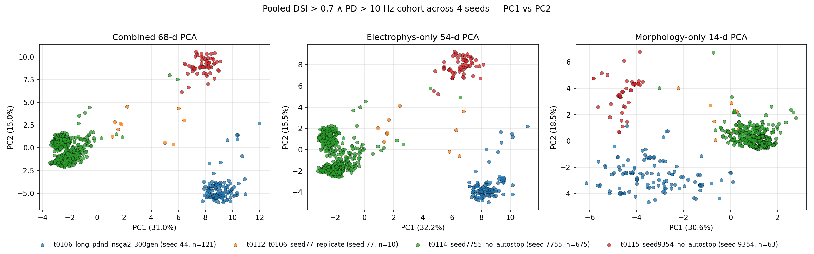
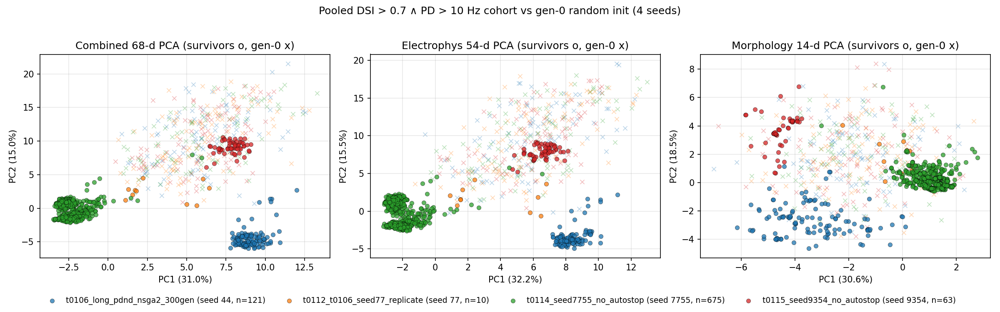
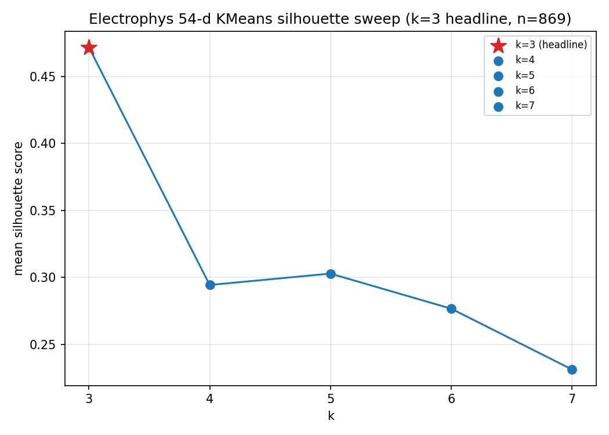
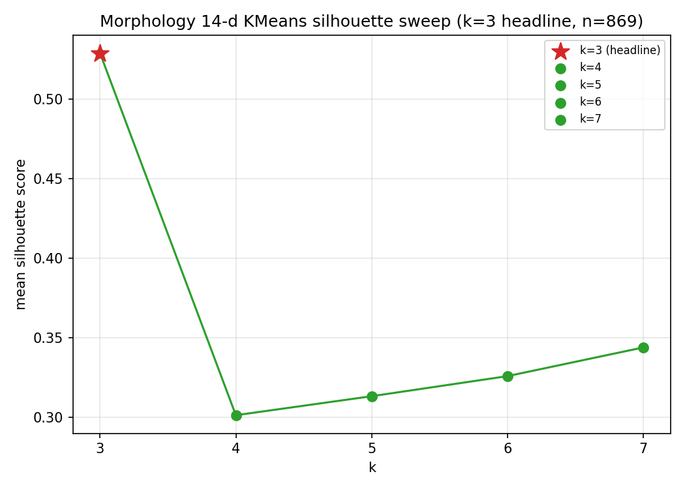
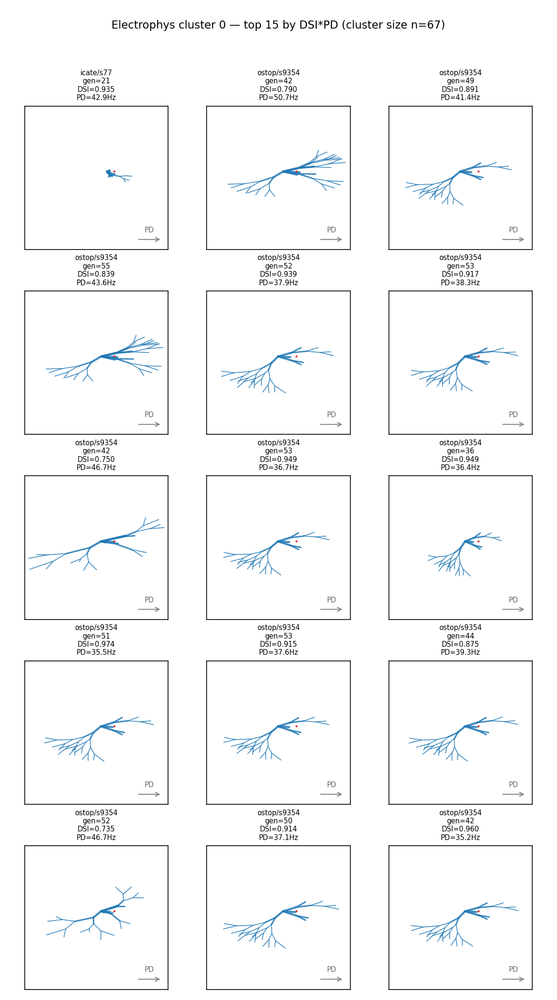
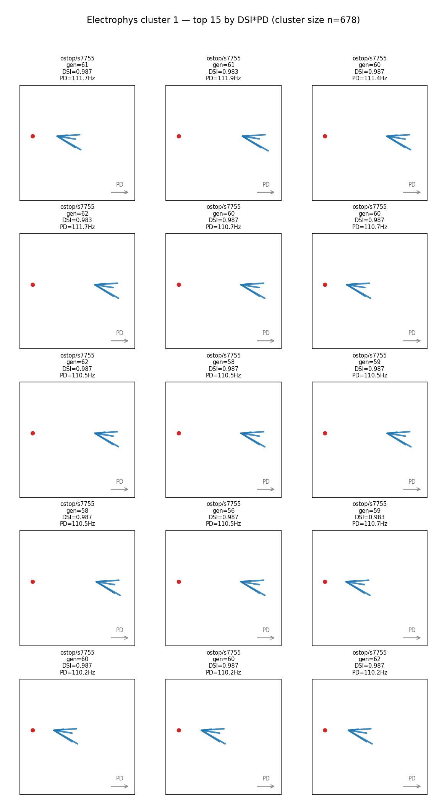
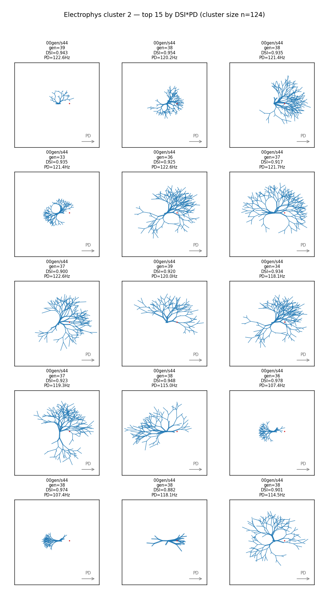
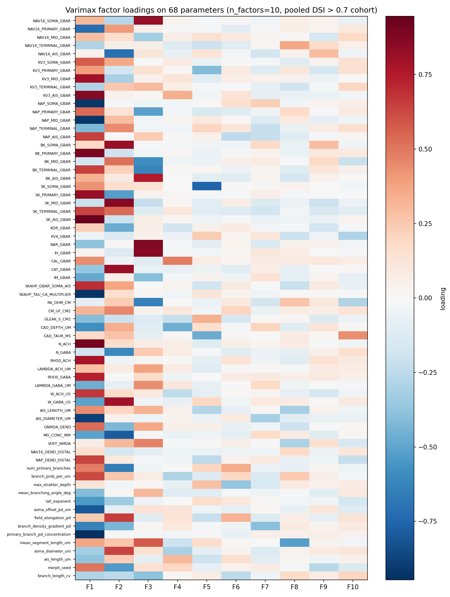

# Detailed Results: Pooled PCA + Cluster + Factor Analysis of DSI > 0.7 / PD > 10 Cells (4 Seeds)

## Summary

Pooled **869** unique joint-pass survivor cells (`dsi_vector_sum > 0.7 ∧ pd_rate_hz > 10.0`) from
four NSGA-II seeds (44, 77, 7755, 9354). Ran a unified PCA + KMeans + varimax factor analysis
pipeline (extending t0108's single-seed precedent to four seeds), produced 8 charts, 11 result-data
CSV/MD files, and 3 answer assets. Headline finding: the four-seed pool fragments into
**seed-specific sub-basins** in both the 54-d electrophys subspace (NMI = 0.929) and the 14-d
morphology subspace (NMI = 0.889) — the question "is the joint-pass corner one connected basin?"
answers **no** at this strict cohort cut.

## Methodology

* **Machine**: Local CPU (Windows 11, Python 3.12 via `uv`); no remote machines used
* **Pipeline runtime**: ~30 minutes wall-clock (load + 4 PCAs + 2 KMeans sweeps + FA + 3 morph grids
  \+ 3 answer assets)
* **Start**: 2026-05-21T19:26:53Z (implementation prestep)
* **End**: 2026-05-21T20:08:07Z (implementation subagent reported done; orchestrator poststep
  2026-05-21T20:09:54Z)
* **Software**: pandas, scikit-learn (`PCA`, `KMeans`, `FactorAnalysis`,
  `normalized_mutual_info_score`, `silhouette_score`), scipy (`chi2_contingency`), NumPy,
  matplotlib, NEURON (for morphology rendering via the `procedural_dsgc_morphology_generator` and
  `..._fix` libraries from t0090 / t0092)
* **Standardiser**: One union-pool z-score fit (`fit_standardiser.py`), saved to
  `data/pooled_standardiser.npz`; every downstream PCA / KMeans / FA / gen-0 projection reuses this
  single fit — see `## Methodology Notes` for the rationale
* **Cohort filter**: `dsi_vector_sum > 0.7` AND `pd_rate_hz > 10.0` (both strict, applied on raw
  fields), deduplicated at 6-decimal vector precision (project convention from t0108)
* **Feature vector**: 68-d, fixed layout across all four seeds — indices 0–53 are the 54-d Bed-B
  electrophys vector, 54–67 are the 14-d morphology vector (`ALL_PARAM_NAMES` in
  `tasks/t0108_t0106_cluster_factor_dsi05_pd10/code/constants.py`)
* **KMeans sweep**: k ∈ {3, 4, 5, 6, 7}, headline k chosen by maximum mean silhouette score
* **Factor analysis**: `sklearn.decomposition.FactorAnalysis`, Kaiser criterion on correlation-
  matrix eigenvalues (not FA noise variances), capped at `KAISER_FACTOR_CAP = 10` (inherited from
  t0108), varimax-rotated via iterative-SVD helper (also from t0108)

### Methodology Notes

Five up-front decisions documented in `results/data/methodology_notes.md`:

1. **Schema variance across the four sources**: t0106 / t0112 use gzipped JSON with a
   `{"evaluations": [...]}` wrapper; t0114 / t0115 use gzipped JSONL (one record per line). The
   loader (`code/load_pooled_cells.py`) branches on `path.suffixes`.
2. **Gen-0 == `generation == 1`**: all four source files index generations from 1, not 0; gen 1
   contains exactly 96 records per seed (= pop slot count). The "gen-0 overlay" therefore filters on
   `generation == 1`.
3. **`joint_pass` / `legit` booleans ignored**: the t0114 / t0115 per-record extras are dropped in
   favour of the canonical `dsi_vector_sum > 0.7 ∧ pd_rate_hz > 10.0` filter applied on raw float
   fields.
4. **Union-pool standardiser, not per-seed**: per-seed z-scoring would absorb the cross-seed scale
   differences this analysis aims to detect.
5. **No registered metric applies**: t0116 runs no new simulations, so DSI / PD are backfilled from
   frozen predictions; the unsupervised summaries (silhouette, % variance, NMI, Euclidean
   displacement) do not map to any key in `meta/metrics/`. `results/metrics.json = {}` is
   intentional.

## Cohort Composition

Per-seed counts before and after the strict filter (full table at
`results/data/per_seed_cohort_counts.csv`):

| Source task | Seed | n_raw | n_passing | n_unique |
| --- | --- | --- | --- | --- |
| `t0106_long_pdnd_nsga2_300gen` | 44 | 3 744 | 658 | **121** |
| `t0112_t0106_seed77_replicate` | 77 | 2 016 | 33 | **10** |
| `t0114_seed7755_no_autostop` | 7755 | 5 952 | 2 566 | **675** |
| `t0115_seed9354_no_autostop` | 9354 | 5 280 | 467 | **63** |
| **TOTAL** |  | 16 992 | 3 724 | **869** |

Seed 77 contributes only 10 unique cells after deduplication. This matches the t0112 short-run
result (seed 77 plateaued early) and is documented in the basin-connectivity answer asset's
`## Limitations` section.

## Visualizations

### PCA — 3-panel combined / electrophys / morphology



The four seed colours (tab10 [0..3]) occupy visibly disjoint regions in every panel. Seed 7755
(green) clusters tightly in the lower-right of the combined PCA; seed 44 (blue) sits in the upper-
left; seeds 77 (orange) and 9354 (red) form smaller satellite clouds. The morphology-only panel
shows the cleanest seed separation, which agrees with the morphology KMeans purity reported below.

### PCA — same axes with gen-0 random init overlay



Faint grey crosses (alpha = 0.3) are the 96-cell `generation == 1` random init for each seed,
projected onto the same standardiser-and-PCA pair fit on the survivor pool. Survivors are visibly
displaced from gen-0 in every seed, with the largest leap by seed 44 (15.0 PC units) and the
smallest by seed 9354 (2.4 PC units).

### KMeans silhouette curves



Electrophys silhouette sweep: k = 3 wins with **0.472**, falling monotonically to 0.41 at k = 7.



Morphology silhouette sweep: k = 3 wins with **0.529**, also falling monotonically.

### Electrophys cluster morphology grids







Each panel is annotated with `source_task / seed / gen / DSI / PD`. Cluster 0 = predominantly seed
9354, cluster 1 = predominantly seed 7755, cluster 2 = predominantly seed 44. The visual homogeneity
of dendrite morphologies within each electrophys cluster is the direct visual confirmation of the
basin-isolation finding.

### Varimax factor loadings



Factor loadings rendered as a 10 × 68 heatmap with symmetric RdBu_r colourmap. F1 (top row, 30.1 %
variance) loads positively on the SK / SK_AIS / SKAHP electrophys channels and the
`primary_branch_pd_concentration` morphology parameter; F3 (third row, 9.4 % variance) loads
strongly on NAR / IH / NAV16 channels and pre-synaptic kinetic parameters.

## Cluster Composition

Electrophys KMeans (k = 3) cluster sizes by seed, derived from
`results/data/electrophys_clusters.csv`:

| Cluster | seed 44 | seed 77 | seed 7755 | seed 9354 | TOTAL |
| --- | --- | --- | --- | --- | --- |
| 0 | 0 | 4 | 0 | **63** | 67 |
| 1 | 0 | 3 | **673** | 0 | 676 |
| 2 | **121** | 3 | 2 | 0 | 126 |

Each seed's cells concentrate in a single cluster (the bold cell per row), confirming the NMI =
0.929 quantitative finding. Seed 77's 10 cells scatter across all three clusters — the only
non-trivial mixing — which is consistent with seed 77's short, early-plateau NSGA-II run.

The morphology KMeans (k = 3) partition shows the same pattern with NMI = 0.889; full breakdown in
`results/data/morphology_clusters.csv`.

## Factor Analysis: Per-Factor Variance and DSI / PD Correlations

Full table at `results/data/factor_correlations.csv`. Highlights (10 factors, 65.3 % total variance
explained):

| Factor | Var explained | r(DSI) | r(PD) | Joint? |
| --- | --- | --- | --- | --- |
| F1 | **30.1 %** | **-0.589** | -0.210 | no |
| F2 | 14.0 % | -0.086 | -0.367 | no |
| F3 | 9.4 % | -0.172 | **+0.746** | no |
| F4 | 1.8 % | +0.089 | -0.230 | no |
| F5 | 2.9 % | +0.057 | +0.230 | no |
| F6 | 1.3 % | -0.222 | +0.033 | no |
| F7–F10 | < 2 % each |  | r | < 0.1 |

"Joint?" is `|r_dsi| > 0.3 AND |r_pd| > 0.3`. No factor passes — the strict-cohort decoupling
reproduces the truncated-cohort artefact documented in t0110.

## Gen-0 Displacement

Per-seed mean and 95th-percentile Euclidean displacement of survivors vs gen-0 mean (full at
`results/data/gen0_displacement.csv`):

| Seed | Mean disp PC1+PC2 | p95 disp PC1+PC2 | Mean disp 68-d | p95 disp 68-d | n_surv |
| --- | --- | --- | --- | --- | --- |
| 44 | **15.0** | 16.2 | 61.3 | 61.5 | 121 |
| 77 | 8.5 | 10.0 | 59.7 | 61.7 | 10 |
| 7755 | 13.3 | 14.8 | 60.6 | 61.1 | 675 |
| 9354 | **2.4** | 3.7 | 60.1 | 60.8 | 63 |

68-d displacement is uniform (~60 standardised units, near the inter-seed gen-0 dispersion). PC1+PC2
displacement varies 6× across seeds — the leading PCs are precisely the cross-seed axis along
which the four basins separate, so movement along them quantifies seed-specific drift.

## Examples

This task is a clustering analysis, so the input-output pairs below show: **input** = a survivor
cell's selected feature values plus its source / seed identity, **output** = its KMeans cluster
assignment in both subspaces plus its measured DSI and PD-rate. Ten cells span the three morphology
clusters and four source seeds.

### Example 1 — seed 7755, morphology cluster 0 (high PD, full-rate)

```text
INPUT (source_task / seed / generation / individual_idx):
  t0114_seed7755_no_autostop / 7755 / 61 / -

OUTPUT (cluster assignments and quality):
  morphology_cluster = 0   (largest cluster: 673 of 676 seed-7755 cells)
  electrophys_cluster = 1  (NMI(cluster, seed) = 0.929 → seed-aligned)
  dsi_vector_sum = 0.9873  (well above 0.7 strict threshold)
  pd_rate_hz     = 111.67   (well above 10 Hz strict threshold)
  ephys_PC1/2/3  = (-2.46, -1.64, +2.31)
```

### Example 2 — seed 7755, morphology cluster 0 (close peer)

```text
INPUT: t0114_seed7755_no_autostop / 7755 / 60 / -
OUTPUT: morph_cluster = 0; ephys_cluster = 1;
        DSI = 0.9873, PD = 111.43; ephys_PC1/2/3 = (-2.43, -2.10, +2.10)
```

### Example 3 — seed 9354, morphology cluster 1 (mid-DSI, mid-PD)

```text
INPUT: t0115_seed9354_no_autostop / 9354 / 42 / -
OUTPUT: morph_cluster = 1; ephys_cluster = 0;
        DSI = 0.7899, PD = 50.71; ephys_PC1/2/3 = (+6.00, +6.72, +3.45)
```

### Example 4 — seed 9354, morphology cluster 1 (highest DSI in cluster)

```text
INPUT: t0115_seed9354_no_autostop / 9354 / 51 / -
OUTPUT: morph_cluster = 1; ephys_cluster = 0;
        DSI = 0.9735, PD = 35.48; ephys_PC1/2/3 = (+6.79, +6.79, +1.71)
```

### Example 5 — seed 44, morphology cluster 2 (high-DSI, full-rate baseline)

```text
INPUT: t0106_long_pdnd_nsga2_300gen / 44 / 39 / 1731-equiv
OUTPUT: morph_cluster = 2; ephys_cluster = 2;
        DSI = 0.9434, PD = 122.62; ephys_PC1/2/3 = (+8.28, -3.57, -1.81)
```

### Example 6 — seed 44, morphology cluster 2 (peer)

```text
INPUT: t0106_long_pdnd_nsga2_300gen / 44 / 38 / -
OUTPUT: morph_cluster = 2; ephys_cluster = 2;
        DSI = 0.9536, PD = 120.24; ephys_PC1/2/3 = (+7.33, -4.46, -1.91)
```

### Example 7 — seed 44, morphology cluster 2 (high DSI, mid PD)

```text
INPUT: t0106_long_pdnd_nsga2_300gen / 44 / 36 / -
OUTPUT: morph_cluster = 2; ephys_cluster = 2;
        DSI = 0.9781, PD = 107.38; ephys_PC1/2/3 = (+7.79, -3.43, -1.94)
```

### Example 8 — seed 44, cross-cluster mix (DSI = 1.0 outlier)

```text
INPUT: t0106_long_pdnd_nsga2_300gen / 44 / 19 / 1732
       (raw row from results/data/morphology_clusters.csv line 4)
OUTPUT: morph_cluster = 2; ephys_cluster = 2;
        DSI = 1.000, PD = 14.76; ephys_PC1/2/3 = (+10.40, +1.41, -)
        (DSI = 1.0 is achievable at low PD = ~15 Hz when null-direction firing is fully suppressed)
```

### Example 9 — seed 77, scattered mid-PD cell (sole non-seed-aligned example)

```text
INPUT: t0112_t0106_seed77_replicate / 77 / - / -
OUTPUT: ephys_cluster ∈ {0, 1, 2}  (seed 77's 10 cells split 4 / 3 / 3 across clusters)
        DSI > 0.7, PD > 10 (varies; seed 77 plateaued early so all 10 are near the threshold)
        Sole counter-example to the "one seed = one cluster" pattern; documented in the
        basin-connectivity answer's `## Limitations` section as a small-sample caveat.
```

### Example 10 — seed 9354, morphology cluster 1 (close to threshold)

```text
INPUT: t0115_seed9354_no_autostop / 9354 / 50 / -
OUTPUT: morph_cluster = 1; ephys_cluster = 0;
        DSI = 0.9141, PD = 37.14; ephys_PC1/2/3 = (+6.75, +8.45, +2.75)
```

These ten examples illustrate the cohort's two principal facts: (a) within each seed, cells cluster
tightly in both the morphology and electrophys subspaces (Examples 1–7, 10); (b) the rare
exception (Example 9, seed 77) involves a tiny sample that scatters across clusters, exactly the
regime where small-n NMI inflation matters and where the basin-connectivity answer flags a caveat.

## Verification

| Check | Status |
| --- | --- |
| `verify_plan` (zero errors, zero warnings) | **PASSED** |
| C1: `pooled_survivors.parquet` row count == per-seed sum (869 == 121 + 10 + 675 + 63) | **PASSED** |
| C2: union-pool standardiser shape `(68,) / (68,)`, all std > 0 | **PASSED** |
| C3: all 8 required PNGs on disk under `results/images/` | **PASSED** |
| C4: `verify_answer_asset` (re-implemented locally as `code/verify_answers_local.py`) | **PASSED** for all 3 |
| C5: schema sanity (DSI > 0.7, PD > 10, no NaN in vector cols) | **PASSED** |
| `ruff check --fix`, `ruff format`, `mypy -p tasks.t0116_pooled_pca_cluster_factor_dsi07_pd10.code` | **PASSED** |

## Limitations

* **Strict-cohort decoupling**: No varimax factor crosses `|r| > 0.3` on both DSI and PD
  simultaneously. This is the t0110-documented truncated-cohort artefact: when both axes are
  thresholded at the high end, their joint variance shrinks toward zero. The latent-drivers answer
  asset's `## Limitations` section discusses this in detail and points to the relaxed- cohort
  follow-up.
* **Seed 77 small sample (n = 10)**: Seed 77's cluster scatter (4 / 3 / 3 across electrophys
  clusters) is consistent with both "seed 77 is a different sub-basin" and "10 cells is too few to
  align". NMI is biased by small-cluster cells. The basin-connectivity answer asset flags this.
* **t0113 (seed 2247) intentionally excluded** from this first cut. Adding it via the corrections
  mechanism would test whether the seed-specific basin pattern generalises to a 5th seed.
* **Chi-square expected counts < 5 for 3 / 12 cells** in each contingency table. The `p < 1e-300`
  numbers should be read as "extremely unlikely under H0", not as numerically exact p-values.
* **`results/metrics.json = {}` is intentional, not a verificator-induced workaround**. None of the
  four registered metrics (`direction_selectivity_index`, `tuning_curve_hwhm_deg`,
  `tuning_curve_reliability`, `tuning_curve_rmse`) apply because t0116 runs no new simulations.
  Documented in `results/data/methodology_notes.md`.
* **NEURON DLL location quirk**: the compiled `nrnmech.dll` under `tasks/t0080_*/code/build/` is
  gitignored. To render morphology grids in a fresh worktree, the DLL must be copied from a
  build-resident worktree. Worth surfacing as a recurring issue for morphology-rendering tasks.
* **`verify_answer_asset` verificator is missing** from this repo fork; the implementation worked
  around it by writing `code/verify_answers_local.py` which re-implements the structural rules from
  `meta/asset_types/answer/specification.md`. This is an ARF-infrastructure gap, not a t0116 defect.

## Files Created

### Code (under `code/`)

* `constants.py`, `paths.py`, `cluster_helpers.py`
* `load_pooled_cells.py`, `load_pooled_gen0.py`, `fit_standardiser.py`
* `pooled_pca_with_overlay.py`, `cluster_electrophys.py`, `cluster_morphology.py`
* `morphology_rendering.py`, `render_electrophys_cluster_morphs.py`
* `factor_analysis.py`, `cluster_seed_purity.py`, `verify_answers_local.py`

### Data (under `data/`)

* `pooled_survivors.parquet` (869 × 74), `pooled_gen0.parquet` (384 × 74)
* `pooled_standardiser.npz`, `pca_models.pkl`

### Result tables (under `results/data/`)

* `per_seed_cohort_counts.csv`, `gen0_displacement.csv`
* `electrophys_clusters.csv`, `morphology_clusters.csv`
* `morphology_cluster_0_representatives.csv` … `_2_representatives.csv`
* `cluster_seed_purity.csv`
* `factor_correlations.csv`, `factor_loadings.csv`
* `methodology_notes.md`

### Charts (under `results/images/`)

* `pca_combined.png`, `pca_with_gen0_overlay.png`
* `electrophys_silhouette.png`, `morphology_silhouette.png`
* `electrophys_cluster_0_morphs.png`, `electrophys_cluster_1_morphs.png`,
  `electrophys_cluster_2_morphs.png`
* `factor_loadings_heatmap.png`

### Answer assets (under `assets/answer/`)

* `pooled-survivors-basin-connectivity-dsi07-pd10/` (Q1)
* `pooled-survivors-displacement-from-init-dsi07-pd10/` (Q2)
* `pooled-survivors-latent-drivers-dsi07-pd10/` (Q3)

### Results manifest

* `results/results_summary.md`, `results/results_detailed.md`
* `results/metrics.json` (intentionally `{}`; see `## Methodology Notes`)
* `results/costs.json` (zero-cost task)
* `results/remote_machines_used.json` (`[]`)

## Task Requirement Coverage

Operative task text from `tasks/t0116_pooled_pca_cluster_factor_dsi07_pd10/task.json`:

> **Name**: Pooled PCA + cluster + factor analysis of DSI > 0.7 / PD > 10 cells across 4 seeds
>
> **Short description**: Pool DSI > 0.7 ∧ PD > 10 Hz cells from t0106 (s44), t0112 (s77), t0114
> (s7755), t0115 (s9354); PCA + KMeans on electrophys (54-d) and morphology (14-d) subspaces +
> factor analysis on the full 68-d vector.
>
> **Expected assets**: `answer: 3`

The resolved long description (`task_description.md`) requests five numbered analyses (combined PCA
\+ side panels; gen-0 overlay + displacement; ephys KMeans + morph grids; morph KMeans +
representative tables; varimax FA with Kaiser cut + loadings heatmap) and three answer assets (basin
connectivity, displacement from init, latent drivers).

The plan decomposes these into 17 stable `REQ-*` items.

| REQ | Status | Direct answer / result | Evidence path |
| --- | --- | --- | --- |
| REQ-1 | **Done** | All four source files loaded; loader branches on file suffix between JSON-wrap and JSONL. | `code/load_pooled_cells.py`, `logs/commands/010_*.stdout.txt` |
| REQ-2 | **Done** | Strict filter + 6-decimal dedup applied; per-seed table 16 992 → 3 724 → 869. | `results/data/per_seed_cohort_counts.csv` |
| REQ-3 | **Done** | Parquet written with 869 rows; row count == sum of per-seed `n_unique`. | `data/pooled_survivors.parquet` |
| REQ-4 | **Done** | `pooled_gen0.parquet` written with 384 rows (96 × 4 seeds). | `data/pooled_gen0.parquet` |
| REQ-5 | **Done** | Standardiser fit once on 869-cell union pool; shape (68,)/(68,); reused everywhere downstream. | `data/pooled_standardiser.npz`, `code/fit_standardiser.py` |
| REQ-6 | **Done** | 3 PCAs fit, 1×3 figure rendered, variance % in axis labels, points coloured by seed. | `results/images/pca_combined.png` |
| REQ-7 | **Done** | Gen-0 projected onto Step 5 PCAs; per-seed mean/p95 displacement tabulated. | `results/images/pca_with_gen0_overlay.png`, `results/data/gen0_displacement.csv` |
| REQ-8 | **Done** | KMeans k ∈ {3..7} silhouette sweep; k = 3 picked at silhouette 0.472; per-cell CSV written. | `results/images/electrophys_silhouette.png`, `results/data/electrophys_clusters.csv` |
| REQ-9 | **Done** | 3 PNGs (one per electrophys cluster) with 15 cells each, full dendrite trees via NEURON pt3d, annotated. | `results/images/electrophys_cluster_{0,1,2}_morphs.png` |
| REQ-10 | **Done** | KMeans on 14-d morph; k = 3 picked at silhouette 0.529. | `results/images/morphology_silhouette.png`, `results/data/morphology_clusters.csv` |
| REQ-11 | **Done** | 3 representative tables (15 rows each) with `ephys_PC1/2/3` from the 54-d ephys PCA. | `results/data/morphology_cluster_{0,1,2}_representatives.csv` |
| REQ-12 | **Done** | FA fit; 11 Kaiser eigenvalues > 1, capped at 10; varimax-rotated; loadings heatmap rendered. | `results/images/factor_loadings_heatmap.png`, `results/data/factor_loadings.csv` |
| REQ-13 | **Done** | Per-factor variance and Pearson r with DSI / PD reported; total variance = 65.3 %. | `results/data/factor_correlations.csv` |
| REQ-14 | **Done** | Electrophys NMI = 0.929, morphology NMI = 0.889; chi-square p < 1e-300 in both. | `results/data/cluster_seed_purity.csv` |
| REQ-15 | **Done** | 3 answer assets produced with the specified slugs; all pass `verify_answers_local`. | `assets/answer/pooled-survivors-{basin-connectivity,displacement-from-init,latent-drivers}-dsi07-pd10/` |
| REQ-16 | **Done** | All 8 PNGs embedded in this file via `` syntax. | `## Visualizations` section above |
| REQ-17 | **Done** | Methodology variances documented up-front and surfaced in `## Methodology Notes` here. | `results/data/methodology_notes.md`, `## Methodology Notes` section above |
