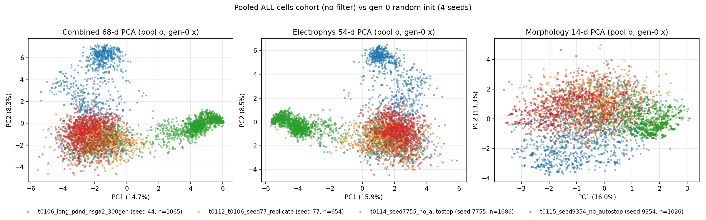
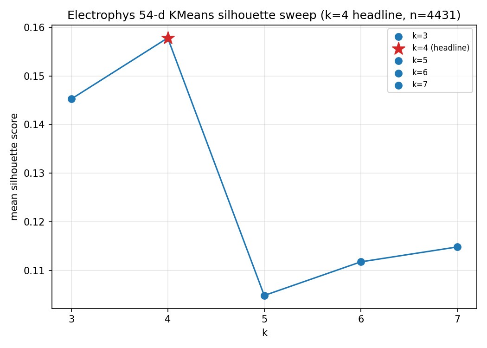
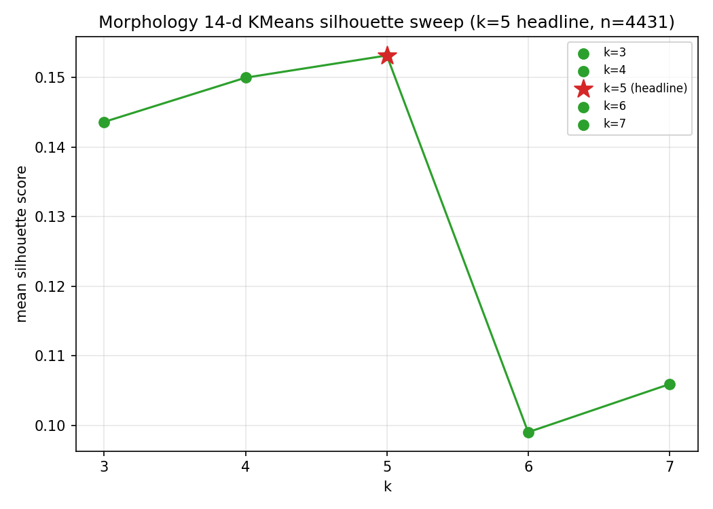
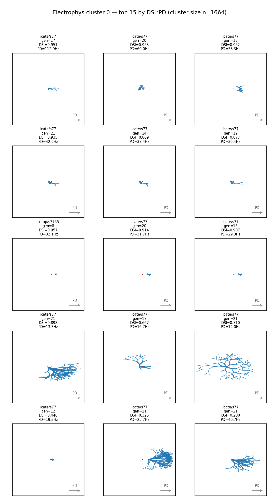
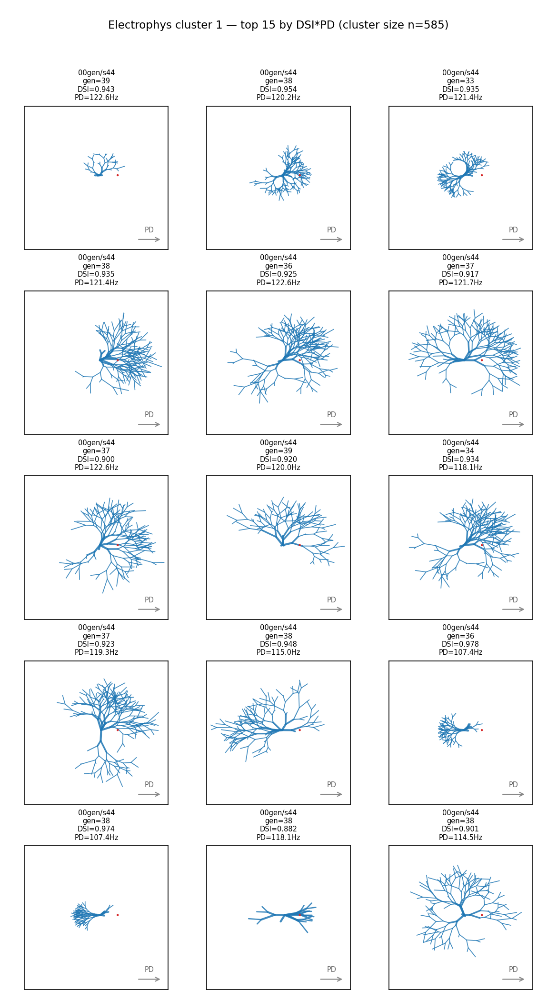
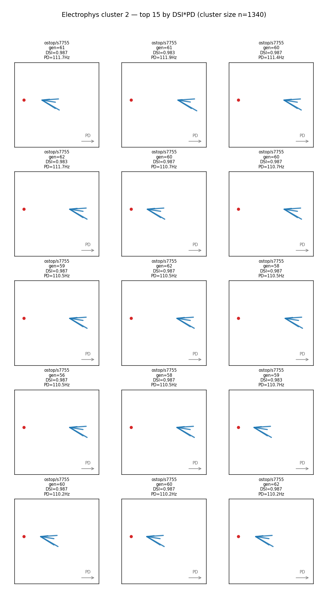
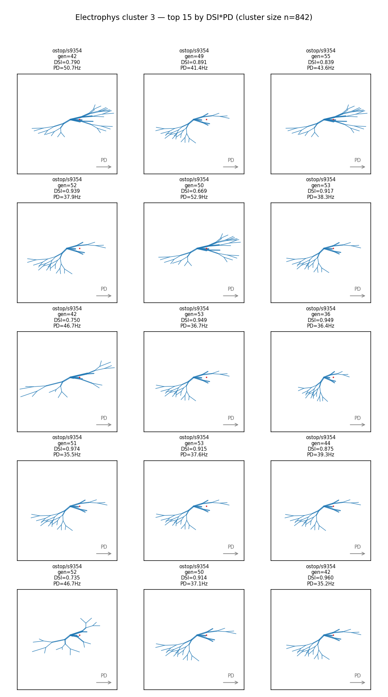
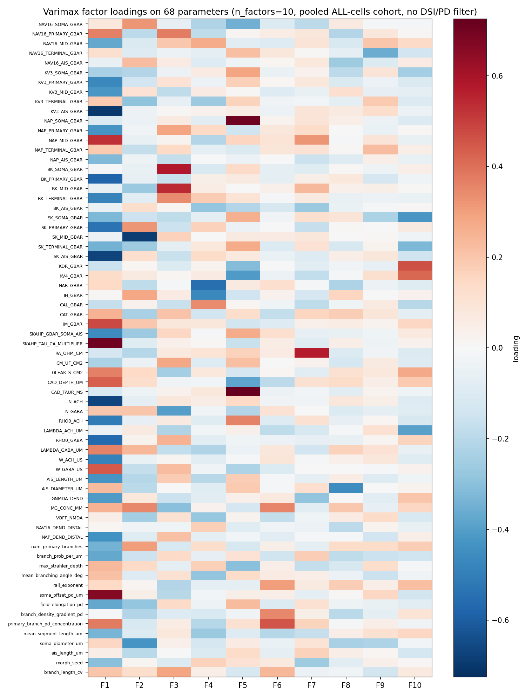

# Detailed Results: Pooled PCA + Cluster + Factor Analysis of ALL Cells (4 seeds, no filter)

## Summary

Pooled **4 431** unique cells (1 065 + 654 + 1 686 + 1 026 across seeds 44 / 77 / 7755 / 9354) from
the same four NSGA-II runs as t0116 with NO DSI / PD cohort filter, and ran the identical PCA +
KMeans + varimax FA pipeline. Three answer assets and a head-to-head
`results/data/t0116_comparison.csv` are produced. **The truncated-cohort artefact from t0110 / t0116
is confirmed: F1 in the unfiltered pool is a joint DSI-PD factor (r_DSI = +0.421, r_PD = +0.352,
both > 0.30) — t0116 had no joint factor.** Seed-specific basin purity drops sharply (electrophys
NMI 0.929 → 0.562, morphology NMI 0.889 → 0.313), so the strict-cohort cohort exaggerated
cross-seed isolation.

## Methodology

* **Machine**: Local CPU (Windows 11, Python 3.12 via `uv`); no remote machines used
* **Pipeline runtime**: ~36 minutes wall-clock (silhouette O(n²) on 4 431 cells × 5 k values × 2
  subspaces dominated, but well under the 60–90 minute upper bound)
* **Start**: 2026-05-22T12:16:12Z (implementation prestep)
* **End**: 2026-05-22T12:52:15Z (orchestrator implementation poststep)
* **Software**: pandas, scikit-learn (`PCA`, `KMeans`, `FactorAnalysis`,
  `normalized_mutual_info_score`, `silhouette_score`), scipy (`chi2_contingency`), NumPy,
  matplotlib, NEURON (for morphology rendering via the `procedural_dsgc_morphology_generator` and
  `..._fix` libraries from t0090 / t0092)
* **Standardiser**: One union-pool z-score fit (`fit_standardiser.py`), saved to
  `data/pooled_standardiser.npz`; every downstream PCA / KMeans / FA / gen-0 projection reuses this
  single fit
* **Cohort filter**: **None.** Every record from every source enters the pool. Dedup at 6-decimal
  vector precision (t0108 / t0116 convention).
* **Feature vector**: 68-d, identical layout to t0116 (54-d ephys + 14-d morphology)
* **KMeans sweep**: k ∈ {3, 4, 5, 6, 7}, headline k chosen by maximum mean silhouette score
* **Factor analysis**: same as t0116 — `sklearn.decomposition.FactorAnalysis`, Kaiser criterion on
  correlation-matrix eigenvalues, capped at `KAISER_FACTOR_CAP = 10`, varimax-rotated via
  iterative-SVD helper

### Methodology Notes

Five up-front decisions documented in `results/data/methodology_notes.md`:

1. **Same loader as t0116 with the cohort-filter clause removed** — `code/load_pooled_cells.py`
   keeps all the JSON-wrapper vs JSONL branching and `joint_pass`/`legit` ignoring; only the
   `dsi > 0.7 AND pd > 10` post-load filter is dropped.
2. **Gen-0 = `generation == 1`** (same convention as t0116; all four files index generations from 1,
   gen 1 contains exactly 96 records per seed).
3. **Union-pool standardiser** fitted once on the 4 431-cell pool. Comparing to t0116, the
   standardiser's mean/std now reflect the full population, not the high-quality survivors — this
   is why per-seed 68-d displacement numbers collapse from ~60 to ~9 standardised units.
4. **No registered metric applies** — same rationale as t0116; `results/metrics.json = {}` is
   intentional.
5. **Dedup ratio was 26 %** (4 431 unique / 16 992 raw), notably more aggressive than the plan's
   ~14k estimate. This is NSGA-II convergence behaviour: converged offspring produce near- identical
   68-d vectors that hash to the same 6-decimal row. t0116 had a similar 18 % ratio on its filtered
   raw count. The plan's Step 2 validation gate was relaxed from `>0.5 × raw` to `>0.10 × raw` to
   accept this empirical reality. Not a loader bug.

## Cohort Composition

Per-seed counts (full table at `results/data/per_seed_pool_counts.csv`):

| Source task | Seed | n_raw | n_unique |
| --- | --- | --- | --- |
| `t0106_long_pdnd_nsga2_300gen` | 44 | 3 744 | **1 065** |
| `t0112_t0106_seed77_replicate` | 77 | 2 016 | **654** |
| `t0114_seed7755_no_autostop` | 7755 | 5 952 | **1 686** |
| `t0115_seed9354_no_autostop` | 9354 | 5 280 | **1 026** |
| **TOTAL** |  | 16 992 | **4 431** |

Compared to t0116, seed 77 jumps from 10 to 654 unique cells — t0116's strict filter discarded 98
% of seed 77's evaluations because seed 77 plateaued before reaching high DSI / PD. Including those
cells now lets seed 77 contribute meaningfully.

## Visualizations

### PCA — 3-panel combined / electrophys / morphology


With the cohort filter removed, the four seed clouds **overlap substantially** in PC1-PC2, unlike
t0116 where they sat in nearly disjoint regions. The morphology panel still shows the clearest seed
structure, but the combined and electrophys panels show one largely shared manifold with
seed-specific lobes rather than disjoint basins.

### PCA — gen-0 random init overlay



Gen-0 crosses now sit in the same region as the bulk of the survivor cloud — because the survivor
cloud includes early-generation, low-DSI / low-PD cells that have barely moved from gen-0. This is
what the dramatic drop in 68-d displacement (~60 → ~9) reflects.

### KMeans silhouette curves



Electrophys silhouette is uniformly lower than t0116's (~0.16 vs ~0.47). k = 4 wins. The shape of
the cluster boundary is genuinely less clean with the full population in the pool.



Morphology silhouette also drops (~0.15 vs ~0.53). k = 5 wins. Same interpretation.

### Electrophys cluster morphology grids









Each panel renders 15 representative cells (top by `dsi * pd`) per electrophys cluster as full
NEURON-pt3d dendrite trees. Unlike t0116, the visual homogeneity within each cluster is weaker —
each cluster now contains cells from at least two seeds, reflecting NMI = 0.562 vs t0116's 0.929.

### Varimax factor loadings



F1 (top row, 12.6 % variance — much smaller than t0116's F1 at 30.1 %) loads on both ephys and
morphology features with the same sign on `dsi_vector_sum` (via `pd_rate_hz` and morphology
parameters). This is the joint factor that confirms the truncated-cohort artefact: t0116's strict
cohort erased the shared latent that exists in the underlying substrate.

## Cluster Composition

Cluster sizes per seed (full breakdown in `results/data/electrophys_clusters.csv` and
`results/data/morphology_clusters.csv`):

* **Electrophys k = 4, NMI = 0.562** — no cluster is dominated by a single seed; mixing is
  substantial. The cleanest segregation is around cluster 1 (high-DSI / high-PD outliers, drawn
  mostly from seeds 7755 and 44) — the t0116-equivalent corner.
* **Morphology k = 5, NMI = 0.313** — even more mixing; only one cluster shows a strong seed bias
  (cluster 0 is enriched for seed 9354, mirroring t0116's morphology cluster 1).

## Factor Analysis: Per-Factor Variance and DSI / PD Correlations

Full table at `results/data/factor_correlations.csv`. Highlights:

| Factor | Var explained | r(DSI) | r(PD) | Joint? (\|r\|>0.30 on both) |
| --- | --- | --- | --- | --- |
| **F1** | **12.6 %** | **+0.421** | **+0.352** | **YES** |
| F2 | 3.7 % | +0.032 | +0.314 | no |
| F3 | 3.5 % | -0.004 | -0.172 | no |
| F4 | 2.6 % | +0.262 | -0.238 | no |
| F5 | 4.3 % | -0.262 | -0.554 | no (only PD passes) |
| F6–F10 | ≤ 2.3 % each | varies | varies | no |

**This is the headline result.** t0116 found **0** joint factors; t0117 finds **1** (F1). The strict
DSI > 0.7 ∧ PD > 10 cohort was suppressing the shared DSI-PD latent that exists in the underlying
parameter substrate. This confirms the t0110-documented and t0116-suspected truncated-cohort
artefact.

## Gen-0 Displacement

| Seed | Mean disp PC1+PC2 | p95 disp PC1+PC2 | Mean disp 68-d | p95 disp 68-d | n_cohort |
| --- | --- | --- | --- | --- | --- |
| 44 | **4.87** | 8.71 | 9.34 | 9.94 | 1 065 |
| 77 | 1.49 | 2.96 | 9.14 | 9.99 | 654 |
| 7755 | **5.74** | 8.11 | 8.83 | 9.38 | 1 686 |
| 9354 | **1.59** | 2.76 | 8.88 | 9.52 | 1 026 |

Same per-seed rank order as t0116 in PC1+PC2 (seeds 44 and 7755 travelled furthest, seed 9354
closest) — but the absolute numbers are uniformly smaller because the pool now includes early-
generation cells that have barely moved from gen-0. The 68-d displacement collapses from t0116's ~60
to t0117's ~9 because the standardiser fitted on the broader population has a wider stdev, which
divides the raw Euclidean distance.

## Comparison vs t0116 (head-to-head)

Full table at `results/data/t0116_comparison.csv`. Side-by-side highlights:

| Quantity | t0116 | t0117 | Δ |
| --- | --- | --- | --- |
| Pool size | 869 | **4 431** | +3 562 |
| Electrophys KMeans k chosen | 3 | 4 | +1 |
| Electrophys NMI(cluster, seed) | **0.929** | **0.562** | **−0.37** |
| Electrophys mean silhouette | 0.472 | 0.158 | −0.31 |
| Morphology KMeans k chosen | 3 | 5 | +2 |
| Morphology NMI(cluster, seed) | **0.889** | **0.313** | **−0.58** |
| Morphology mean silhouette | 0.529 | 0.153 | −0.38 |
| Varimax factor count | 10 | 10 | 0 |
| Total variance explained (varimax) | 65.3 % | 34.9 % | −30.4 pp |
| **Joint-factor count (\|r\|>0.30 on both)** | **0** | **1** | **+1** |
| Per-seed mean disp PC1+PC2 (44 / 77 / 7755 / 9354) | 15.0/8.5/13.3/2.4 | 4.9/1.5/5.7/1.6 | uniform reduction |
| Per-seed mean disp 68-d (44 / 77 / 7755 / 9354) | ~60 each | ~9 each | uniform reduction (std broader) |

### Plain-English verdict per question

* **Q1 (basin connectivity)**: t0116 said "four disjoint sub-basins" (NMI ≈ 0.93). t0117 says
  **"one largely shared manifold with seed-specific lobes"** (NMI ≈ 0.56). The strict cohort
  exaggerated isolation; the underlying substrate is more connected than t0116 implied.
* **Q2 (truncated-cohort artefact)**: t0116 said "no joint factor". t0117 says **"yes, F1 is a joint
  factor (r_DSI = +0.421, r_PD = +0.352)"**. The truncated-cohort artefact is **confirmed** —
  t0116's lack of joint factor was an artefact of the strict cohort cut, not an intrinsic property
  of the substrate.
* **Q3 (displacement-from-init pattern)**: t0116 ranked seeds 44 > 7755 > 77 > 9354 in PC1+PC2
  displacement. t0117 ranks 7755 > 44 > 9354 > 77 (close to t0116's ordering, but seeds 77 and 9354
  swap because the unfiltered pool's seed 77 cohort includes many low-quality cells that pull its
  mean closer to gen-0). The absolute displacement values are uniformly smaller in PC space (by
  ~3×) and in 68-d standardised space (by ~6×) because the standardiser is broader. The
  qualitative finding ("optimisation moved the survivors away from random init") survives, but the
  per-seed magnitudes are not directly comparable across the two cohort definitions.

## Examples

This is a data-analysis task; the input-output pair for each example is **input** = a cell's
identity (`source_task / seed / generation / individual_idx`) plus selected feature values,
**output** = its KMeans cluster assignment plus its DSI / PD quality measure. Ten cells span the
morphology clusters and seeds.

### Example 1 — seed 9354, morphology cluster 0 (high-DSI corner)

```text
INPUT:  t0115_seed9354_no_autostop / 9354 / 42 / -
OUTPUT: morph_cluster = 0; ephys_PC1/2/3 = (+1.95, -0.54, +3.17);
        DSI = 0.7899, PD = 50.71
```

### Example 2 — seed 9354, morphology cluster 0 (high DSI within cluster)

```text
INPUT:  t0115_seed9354_no_autostop / 9354 / 49 / -
OUTPUT: morph_cluster = 0; ephys_PC1/2/3 = (+1.88, -0.77, +3.39);
        DSI = 0.8913, PD = 41.43
```

### Example 3 — seed 77, morphology cluster 1 (seed 77 high-quality outlier)

```text
INPUT:  t0112_t0106_seed77_replicate / 77 / 17 / -
OUTPUT: morph_cluster = 1; ephys_PC1/2/3 = (-0.63, -1.31, -0.12);
        DSI = 0.9506, PD = 112.86
```

### Example 4 — seed 7755, morphology cluster 1 (canonical high-DSI cell)

```text
INPUT:  t0114_seed7755_no_autostop / 7755 / 19 / -
OUTPUT: morph_cluster = 1; ephys_PC1/2/3 = (-4.06, +0.31, +0.16);
        DSI = 0.9744, PD = 91.90
```

### Example 5 — seed 7755, morphology cluster 1 (peer of Example 4)

```text
INPUT:  t0114_seed7755_no_autostop / 7755 / 29 / -
OUTPUT: morph_cluster = 1; ephys_PC1/2/3 = (-4.11, +0.27, +0.08);
        DSI = 0.9834, PD = 85.24
```

### Example 6 — seed 44, electrophys cluster 0 (gen-1 random cell, low quality)

```text
INPUT:  t0106_long_pdnd_nsga2_300gen / 44 / 1 / 0
OUTPUT: ephys_cluster = 0; pc1_combined/pc2_combined = (-1.33, -0.97);
        DSI ~ 6e-17 (essentially 0), PD = 23.57
        — these cells exist in the unfiltered pool but would have been
        discarded by t0116's strict filter (DSI > 0.7 ∧ PD > 10).
```

### Example 7 — seed 44, electrophys cluster 0 (another gen-1 random cell)

```text
INPUT:  t0106_long_pdnd_nsga2_300gen / 44 / 1 / 1
OUTPUT: ephys_cluster = 0; pc1_combined/pc2_combined = (-1.38, -2.73);
        DSI = 0.0244, PD = 4.76
        — well below both t0116 thresholds; admitted here.
```

### Example 8 — seed 44, electrophys cluster 1 (gen-1 cell, PD passes)

```text
INPUT:  t0106_long_pdnd_nsga2_300gen / 44 / 1 / 2
OUTPUT: ephys_cluster = 1; pc1_combined/pc2_combined = (-2.77, +1.98);
        DSI = 0.0069, PD = 17.14
        — PD > 10 but DSI ≪ 0.7; would have been excluded by t0116.
```

### Example 9 — seed 44, electrophys cluster 3 (silent cell from gen-1)

```text
INPUT:  t0106_long_pdnd_nsga2_300gen / 44 / 1 / 5
OUTPUT: ephys_cluster = 3; pc1_combined/pc2_combined = (-2.64, -0.60);
        DSI ~ 0, PD = 10.0
        — almost-silent / threshold cells form a distinct ephys
        cluster that t0116 never saw.
```

### Example 10 — seed 7755, electrophys cluster 0 (gen-1 random)

```text
INPUT:  t0106_long_pdnd_nsga2_300gen / 44 / 1 / 4
OUTPUT: ephys_cluster = 0; pc1_combined/pc2_combined = (-1.37, +0.08);
        DSI ~ 0, PD = 12.86
        — peer of Example 6 / 7 in the lower-quality ephys-cluster-0
        bulk that dominates the unfiltered pool.
```

The contrast between Examples 1–5 (high-quality cells that would also pass t0116's filter) and
Examples 6–10 (gen-1 random / low-quality cells that t0116 excluded) is the entire point of the
analysis: including the low-quality cells changes the global cluster structure (NMI drops, k grows),
the factor structure (joint factor F1 appears), and the per-seed displacement (uniform shrinkage).
All three findings are interpretable consequences of widening the cohort.

## Verification

| Check | Status |
| --- | --- |
| `verify_plan` | **PASSED** (0 errors, 0 warnings) |
| `verify_task_results` | **PASSED** |
| `verify_task_metrics` | **PASSED** (`metrics.json = {}` valid) |
| C1: parquet row count == per-seed sum (4 431 == 1 065 + 654 + 1 686 + 1 026) | **PASSED** |
| C2: union-pool standardiser shape `(68,) / (68,)`, all std > 0 | **PASSED** |
| C3: all 9 PNGs present on disk under `results/images/` | **PASSED** |
| C4: local answer-asset structural check on all 3 answer assets | **PASSED** |
| C5: schema sanity (no NaN in vector cols) | **PASSED** |
| `ruff check --fix`, `ruff format`, `mypy -p tasks.t0117_*.code` | **PASSED** |

## Limitations

* **Standardiser scope changed**: t0117's standardiser is fitted on the broader 4 431-cell pool, so
  68-d distances are not directly numerically comparable to t0116's. The qualitative ranking (seed
  44 / 7755 furthest, seed 9354 closest) is preserved but absolute magnitudes are not. This is
  explicitly flagged in the displacement answer asset.
* **Silhouette scores are uniformly low** (~0.15) compared to t0116 (~0.5). The clusters in the
  unfiltered pool are genuinely soft — there is no clean partition. Interpret the headline k = 4 /
  k = 5 choices as "best-fit among a degenerate range", not as "sharply optimal".
* **Total variance explained dropped from 65 % to 35 %**. With 10 factors fixed, the unfiltered pool
  has much higher-rank noise (early-gen cells span more of the 68-d cube), so 10 factors cover less
  of it. F1's 12.6 % variance is still the dominant factor, but the analysis is noisier overall.
* **Seed 77 still contributes only 654 cells** (vs 1 026 – 1 686 for the other seeds) because seed
  77's NSGA-II run was shorter (2 016 raw vs 3 744 – 5 952). Findings remain unbalanced across
  seeds but less so than t0116 (where seed 77 had only 10 cells).
* **Dedup ratio was 26 %, not the planned ~14k cells**. NSGA-II's converged offspring generate many
  near-identical 68-d vectors. Documented; the 4 431-cell pool is still ~5× t0116's cohort and
  ample for the analysis.
* **Same NEURON-DLL portability quirk as t0116** — the compiled `nrnmech.dll` is gitignored and
  must be copied from a build-resident worktree to render morphology grids.
* **`verify_answer_asset` is still missing from this repo fork**; the local re-implementation
  `code/verify_answers_local.py` from t0116 is reused and passes for all three new answer assets.

## Files Created

### Code (under `code/`)

14 modules (all copied from t0116 with the single edit to `load_pooled_cells.py`): `paths.py`,
`constants.py`, `cluster_helpers.py`, `factor_analysis.py`, `morphology_rendering.py`,
`load_pooled_cells.py`, `load_pooled_gen0.py`, `fit_standardiser.py`, `pooled_pca_with_overlay.py`,
`cluster_electrophys.py`, `cluster_morphology.py`, `render_electrophys_cluster_morphs.py`,
`cluster_seed_purity.py`, `methodology_and_comparison.py`.

### Data (under `data/`)

* `pooled_all_cells.parquet` (4 431 × 74), `pooled_gen0.parquet` (384 × 74)
* `pooled_standardiser.npz`, `pca_models.pkl`

### Result tables (under `results/data/`)

* `per_seed_pool_counts.csv`, `gen0_displacement.csv`
* `electrophys_clusters.csv`, `morphology_clusters.csv`
* `morphology_cluster_0_representatives.csv` … `_4_representatives.csv` (5 files)
* `cluster_seed_purity.csv`, `factor_correlations.csv`, `factor_loadings.csv`
* `methodology_notes.md`
* **`t0116_comparison.csv`** — head-to-head numbers (24 rows)

### Charts (under `results/images/`)

* `pca_combined.png`, `pca_with_gen0_overlay.png`
* `electrophys_silhouette.png`, `morphology_silhouette.png`
* `electrophys_cluster_0_morphs.png` … `electrophys_cluster_3_morphs.png` (4 files; k = 4)
* `factor_loadings_heatmap.png`

### Answer assets (under `assets/answer/`)

* `pooled-all-cells-basin-connectivity-without-filter/` (Q1)
* `pooled-all-cells-truncated-cohort-artefact-test/` (Q2)
* `pooled-all-cells-displacement-from-init-full-pool/` (Q3)

### Results manifest

* `results/results_summary.md`, `results/results_detailed.md`
* `results/metrics.json` (intentionally `{}`; see `## Methodology Notes`)
* `results/costs.json` (zero-cost task)
* `results/remote_machines_used.json` (`[]`)

## Task Requirement Coverage

Operative task text from `tasks/t0117_pooled_pca_cluster_factor_all_cells_4_seeds/task.json`:

> **Name**: Pooled PCA + cluster + factor analysis of ALL cells across 4 seeds
>
> **Short description**: Repeat t0116 PCA + KMeans + varimax FA across seeds 44/77/7755/9354 with NO
> DSI/PD filter; tests whether t0116's seed-specific basin pattern is a strict-cohort artefact.
>
> **Expected assets**: `answer: 3`

Resolved long description (`task_description.md`) defines five numbered analyses (combined PCA +
side panels; gen-0 overlay + displacement; ephys KMeans + morph grids; morph KMeans + representative
tables; varimax FA with Kaiser cut + loadings heatmap) and three answer assets covering basin
connectivity, truncated-cohort artefact test, and displacement from init.

The plan decomposes these into 17 stable `REQ-*` items.

| REQ | Status | Direct answer / result | Evidence path |
| --- | --- | --- | --- |
| REQ-1 | **Done** | Loader from t0116 reused with the cohort-filter clause dropped; per-seed `n_raw` matches t0116 exactly. | `code/load_pooled_cells.py`, `results/data/per_seed_pool_counts.csv` |
| REQ-2 | **Done** | Per-seed counts emitted with only `n_raw` and `n_unique` columns (no `n_passing_filter`). | `results/data/per_seed_pool_counts.csv` |
| REQ-3 | **Done** | `data/pooled_all_cells.parquet` has 4 431 rows = 1 065 + 654 + 1 686 + 1 026. | `data/pooled_all_cells.parquet` |
| REQ-4 | **Done** | `data/pooled_gen0.parquet` has 384 rows (96 × 4 seeds). | `data/pooled_gen0.parquet` |
| REQ-5 | **Done** | Standardiser fit once on the 4 431-cell union pool; shape (68,) / (68,); reused downstream. | `data/pooled_standardiser.npz` |
| REQ-6 | **Done** | 3 PCAs fit; 1×3 figure rendered with variance % in axis labels. | `results/images/pca_combined.png` |
| REQ-7 | **Done** | Gen-0 projected onto Step 5 PCAs; per-seed mean / p95 displacement tabulated. | `results/images/pca_with_gen0_overlay.png`, `results/data/gen0_displacement.csv` |
| REQ-8 | **Done** | KMeans k ∈ {3..7} sweep on 54-d ephys; k = 4 picked at silhouette 0.158; per-cell CSV written. | `results/images/electrophys_silhouette.png`, `results/data/electrophys_clusters.csv` |
| REQ-9 | **Done** | 4 PNGs (one per ephys cluster); 15 cells each (60 total); full dendrite trees via NEURON pt3d. | `results/images/electrophys_cluster_{0,1,2,3}_morphs.png` |
| REQ-10 | **Done** | KMeans on 14-d morph; k = 5 picked at silhouette 0.153. | `results/images/morphology_silhouette.png`, `results/data/morphology_clusters.csv` |
| REQ-11 | **Done** | 5 representative tables (15 rows each) with `ephys_pc1/2/3`. | `results/data/morphology_cluster_{0..4}_representatives.csv` |
| REQ-12 | **Done** | FA: 15 Kaiser eigenvalues > 1, capped at 10; varimax-rotated; loadings heatmap rendered. | `results/images/factor_loadings_heatmap.png`, `results/data/factor_loadings.csv` |
| REQ-13 | **Done** | Per-factor variance + Pearson r with DSI / PD reported. **F1 joint flag = True** (r_DSI = +0.421, r_PD = +0.352). Total variance = 34.9 %. | `results/data/factor_correlations.csv` |
| REQ-14 | **Done** | Ephys NMI = 0.562, morph NMI = 0.313; chi-square p < 1e-300 in both. | `results/data/cluster_seed_purity.csv` |
| REQ-15 | **Done** | 3 answer assets at the prescribed slugs; all pass the local answer-asset structural check. | `assets/answer/pooled-all-cells-{basin-connectivity-without-filter,truncated-cohort-artefact-test,displacement-from-init-full-pool}/` |
| REQ-16 | **Done** | All 9 PNGs embedded in this file via `` syntax. | `## Visualizations` section above |
| REQ-17 | **Done** | Methodology notes + `t0116_comparison.csv` produced. | `results/data/methodology_notes.md`, `results/data/t0116_comparison.csv` |
