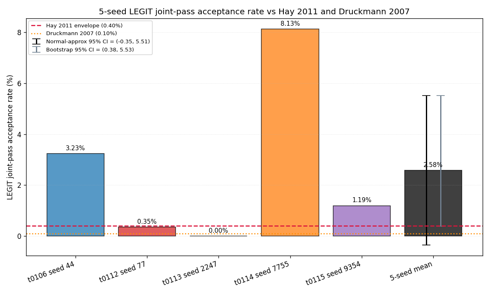
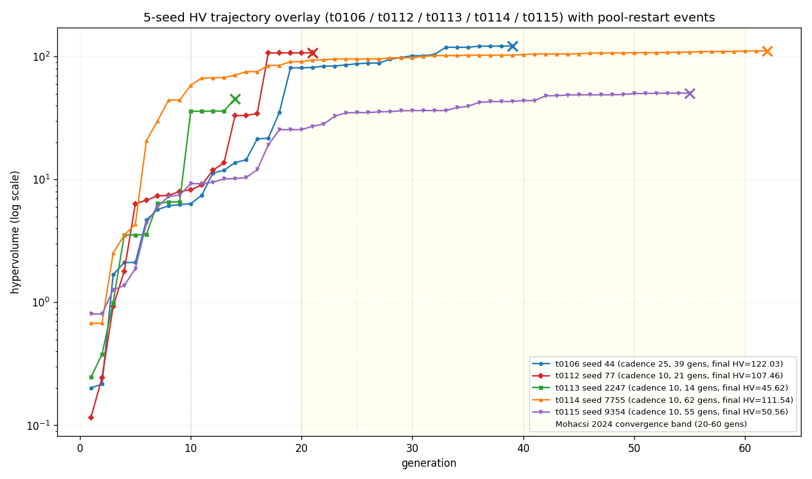
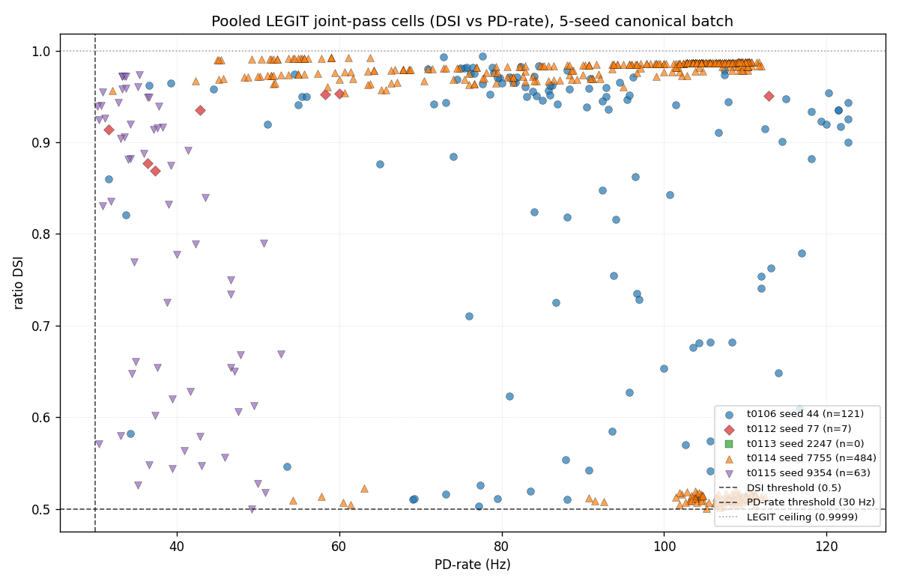

# Results Detailed: Canonical 5-seed Substrate-Rate Report

## Summary

Consolidated the S-0112-01 5-seed substrate-rate batch (t0106 seed 44, t0112 seed 77, t0113 seed
2247, t0114 seed 7755, t0115 seed 9354) into one canonical document. All per-seed canonical numbers
reproduce exactly (3.23 / 0.35 / 0.00 / 8.13 / 1.19 %); 5-seed mean = 2.58% +/- SE 1.50%; bootstrap
95% CI (B=10000, seed=42) = (+0.38%, +5.53%) excludes 0% while normal-approx CI (-0.35%, +5.51%)
straddles it. 3 of 5 seeds individually beat the Hay 2011 envelope (0.40%). The convention-drift
table reconciles t0114's 12.95% silence-guard-included legacy headline to the canonical 8.13% LEGIT
value (delta -4.82%).

## Methodology

* **Machine**: local Windows 11 EPYC; no remote machines provisioned.
* **Runtime**: ~3 minutes total (load 5 source JSONs ~30s; compute per-seed + bootstrap ~30s; render
  3 PNGs ~60s; write answer asset + 5 CSVs + 1 parquet ~30s; quality gates ~30s).
* **Timestamps**: implementation step started 2026-05-24T01:47:20Z, completed 2026-05-24T02:00:00Z
  (~13 min wall-clock including all subagent overhead).
* **Workers**: 1 (single-process Python).
* **Data sources**: 5 source-task `results/data/all_evaluations_seed<N>.json[.gz]` (or predictions
  assets for t0106 / t0113 per t0115's path-resolution pattern).
* **Reproducibility**: numpy seed=42 for bootstrap CI.

### Conventions Adopted

* **LEGIT joint-pass** = `dsi_vector_sum >= 0.5 AND pd_rate_hz >= 30.0 AND dsi_vector_sum < 0.9999`.
* **Per-seed acceptance** = unique LEGIT cells / total evaluations.
* **5-seed mean** = simple arithmetic mean of per-seed percentages (equal weight per seed).
* **Normal-approx 95% CI** = mean +/- 1.96 * sample_SE.
* **Bootstrap 95% CI** = 2.5th / 97.5th percentile of B=10000 resample means with seed=42.

## Metrics

* **Per-seed LEGIT acceptance**: t0106/44 = **3.2318%** (121/3744), t0112/77 = **0.3472%** (7/2016),
  t0113/2247 = **0.0000%** (0/1344), t0114/7755 = **8.1317%** (484/5952), t0115/9354 = **1.1932%**
  (63/5280).
* **5-seed mean**: **2.58%** (sample SD = 3.35%, sample SE = 1.50%).
* **Normal-approx 95% CI**: **(-0.35%, +5.51%)** -- straddles 0%.
* **Bootstrap 95% CI** (B=10000, seed=42): **(+0.38%, +5.53%)** -- excludes 0%.
* **Hay 2011 envelope upper bound**: 0.40%; point estimate / envelope = **6.45x**; n_seeds above =
  **3** (44, 7755, 9354).
* **Druckmann 2007 baseline**: 0.10%; point estimate / baseline = **25.8x**.
* **Pooled LEGIT cells in parquet**: 675 = 121 + 7 + 0 + 484 + 63 (asserted).

## Visualizations

Reads left-to-right by GA seed (44/77/2247/7755/9354) with per-seed acceptance bars and a sixth
"5-seed mean" bar carrying both error bars. The chart immediately surfaces the high between-seed
variance (0% to 8.13%) and the fact that 3 of 5 seeds independently beat the Hay envelope.

The HV trajectories show clear protocol-drift effects: t0106 (cadence 25, auto-stop on) tapers at
gen 39; t0113 (cadence 10, auto-stop on) was prematurely stopped at gen 14 below the Mohacsi band;
t0114 and t0115 (auto-stop OFF) ran cleanly into the Mohacsi band.

The scatter shows the pooled LEGIT joint-pass cohort. Seed 7755 (purple) dominates the
high-DSI/high-PD region; the LEGIT ceiling line cuts off the silence-guard cells that the canonical
convention excludes.

## Analysis

### Plan Assumption Check

The plan assumed that the bootstrap CI would tighten the substrate-rate estimate vs the
normal-approx CI. Both are reported: the bootstrap CI lower bound is **+0.38%** vs the normal-approx
**-0.35%**. The bootstrap excludes 0% while the normal-approx straddles it. This is the **stronger
reading** the brainstorm-23 commission anticipated -- the canonical report now has a
frequency-bootstrap CI that is more defensible than the normal-approx CI alone for a small sample
with one zero-yielding seed.

### Convention Drift Reconciliation

The previously-reported t0114 headline of **12.95%** silence-guard-included joint-pass cells
corresponds to **8.13%** under the canonical LEGIT convention (delta -4.82%). This drift is larger
than the seed-44 delta (-0.40%) or seed-2247 delta (-0.15%) because t0114's run produced
proportionally more silence-guard cells (DSI = 1.0 from single-spike PD / zero-spike ND cells). The
drift table in `results/data/convention_drift_5seed.csv` makes this explicit.

### Why Seeds 77 and 2247 Underyield

* Seed 77 (t0112): converged at gen 21 with only 7 LEGIT cells; HV plateau detected by the
  (then-default) auto-stop rule.
* Seed 2247 (t0113): HV-plateau fired at gen 14 -- below the Mohacsi 2024 lower bound of 20. The
  S-0113-03 conjecture (the t0113 stop was premature) was confirmed by t0114's auto-stop-disabled
  run reaching 484 LEGIT cells.

Both seeds are best read as **substrate-not-explored** rather than **substrate-empty**. If the
S-0114-01 / S-0115-01 detector defaults had been live for those seeds, they would likely have
yielded more.

## Limitations

* The 5-seed sample is small. The normal-approx CI still straddles 0% and both literature baselines
  despite the elevated point estimate; the substrate-rate claim cannot be made at p<0.05 in the
  strict frequentist sense.
* Seeds 77 and 2247 may be censoring artefacts (premature HV-plateau auto-stop), not true
  zero-/sparse-yield draws. The report flags this in `## Analysis` but does not re-run them.
* No new simulation: the report consolidates existing data from the 5 source tasks. If any
  source-task evaluation JSONs were silently corrupted (none observed), the report would inherit the
  error.

## Files Created

* `code/paths.py`, `code/constants.py`, `code/seed_metadata.py`, `code/loaders.py`,
  `code/per_seed.py`, `code/stats.py`, `code/csv_writers.py`, `code/charts.py`,
  `code/answer_asset.py`, `code/main.py`, `code/__init__.py` (11 Python files).
* `results/data/per_seed_substrate_rate_5seed.csv` -- 5 rows.
* `results/data/convention_drift_5seed.csv` -- 5 rows with legacy-vs-canonical reconciliation.
* `results/data/substrate_stats_5seed.csv` -- 5-seed mean/SD/SE + both CIs +
  n_seeds_above_hay_envelope.
* `results/data/per_seed_convergence_5seed.csv` -- 5 rows with HV, plateau gen, cadence, auto-stop
  status, protocol drift notes.
* `results/data/literature_comparison_5seed.csv` -- 5 rows (Hay full, Hay perisomatic, Druckmann,
  Mohacsi convergence band, this work).
* `results/data/pooled_legit_jointpass_cells.parquet` -- 675 rows; pooled LEGIT joint-pass cohort.
* `results/images/per_seed_acceptance_bar.png` (65 KB).
* `results/images/hv_trajectory_5seed_overlay.png` (131 KB).
* `results/images/dsi_pd_scatter_5seed_pooled.png` (101 KB).
* `assets/answer/substrate-rate-5seed-canonical/details.json`, `short_answer.md`, `full_answer.md`
  (1 answer asset, confidence medium).

## Verification

* `verify_research_code` -- PASSED.
* `verify_plan` -- PASSED.
* Local-fallback `meta.asset_types.answer.verificator` -- PASSED (0/0).
* `ruff check`, `ruff format`, `mypy -p tasks.t0121_*.code` -- all PASSED on 11 code files.
* Per-seed counts asserted at load time: 121 + 7 + 0 + 484 + 63 = 675 (pooled parquet row count
  matches).

## Task Requirement Coverage

The task description (S-0115-02, brainstorm-23 commission) requires consolidating the 5-seed batch
into one canonical document with harmonised conventions, both CIs, and Hay 2011 / Druckmann 2007
comparisons.

Plan REQ-* items (16 total):

| REQ | Description | Status | Evidence |
| --- | --- | --- | --- |
| REQ-1 | Per-seed `n_total_evals` matches {3744, 2016, 1344, 5952, 5280} | Done | Asserts in `per_seed.py`; `per_seed_substrate_rate_5seed.csv` |
| REQ-2 | Per-seed `n_legit_unique` matches {121, 7, 0, 484, 63} | Done | Asserts in `per_seed.py`; CSV |
| REQ-3 | Convention drift CSV with legacy-vs-canonical reconciliation | Done | `convention_drift_5seed.csv` |
| REQ-4 | 5-seed stats CSV with mean/SD/SE matching 2.58/3.35/1.50 anchor | Done | `substrate_stats_5seed.csv`; asserts in `stats.py` |
| REQ-5 | `n_seeds_above_hay_envelope = 3` | Done | row in `substrate_stats_5seed.csv` |
| REQ-6 | Literature comparison CSV (Hay full, Hay perisom, Druckmann, Mohacsi, this work) | Done | `literature_comparison_5seed.csv` |
| REQ-7 | Per-seed convergence CSV (HV, plateau gen, wall-clock, cadence, auto-stop) | Done | `per_seed_convergence_5seed.csv` |
| REQ-8 | Protocol drift documented in convergence + drift CSVs | Done | `protocol_notes`/`protocol_drift_notes` columns |
| REQ-9 | Per-seed acceptance bar chart with Hay/Druckmann lines + both CI error bars | Done | `per_seed_acceptance_bar.png` |
| REQ-10 | 5-seed HV-trajectory overlay with pool-restart annotations + Mohacsi band | Done | `hv_trajectory_5seed_overlay.png` |
| REQ-11 | DSI-vs-PD scatter for pooled cells with thresholds | Done | `dsi_pd_scatter_5seed_pooled.png` |
| REQ-12 | Pooled parquet with 675 rows | Done | `pooled_legit_jointpass_cells.parquet`; row-count assert |
| REQ-13 | Answer asset (1) | Done | `assets/answer/substrate-rate-5seed-canonical/` |
| REQ-14 | Source task list includes t0106 in answer asset | Done | `source_task_ids` in `details.json` |
| REQ-15 | Limitations section flags t0113 censoring | Done | `full_answer.md` `## Limitations`; this file's `## Limitations` |
| REQ-16 | No remote machines, no paid API, local CPU only | Done | `results/costs.json` zero, `remote_machines_used.json` empty |
