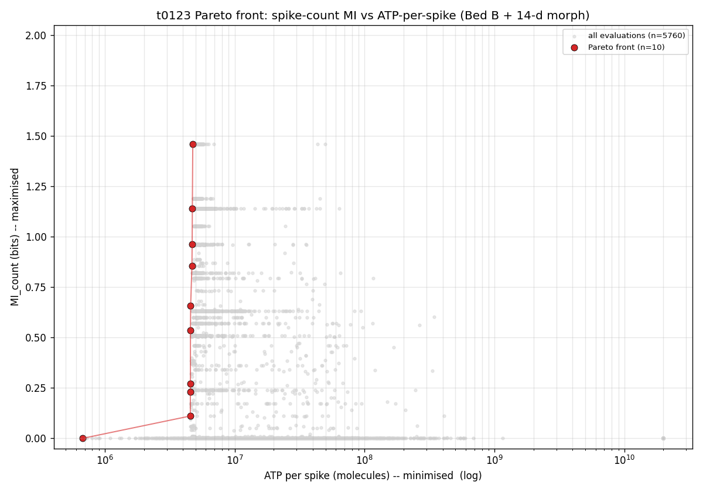
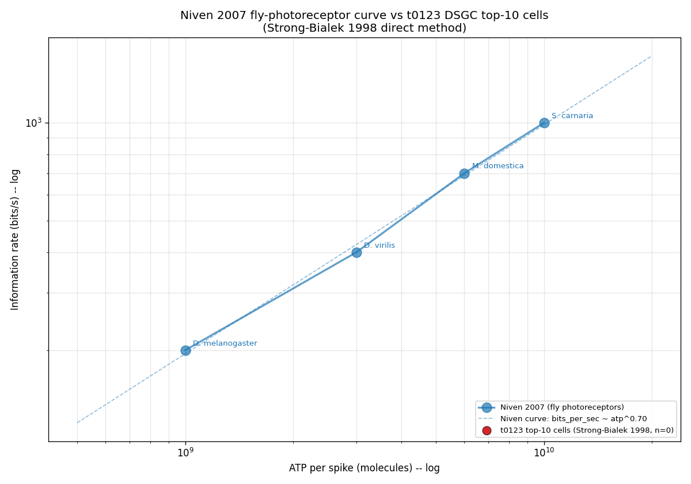
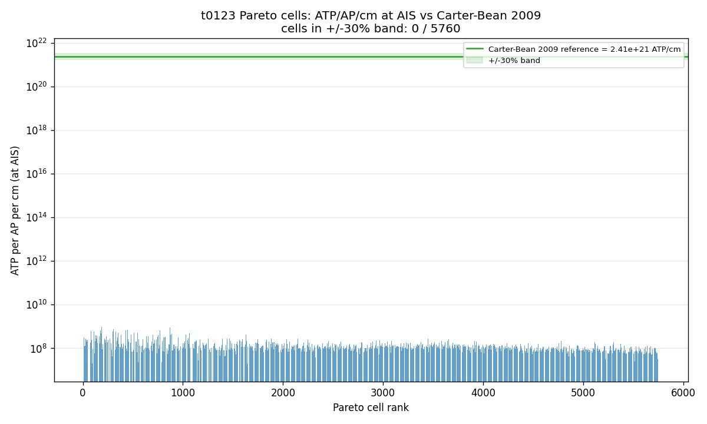
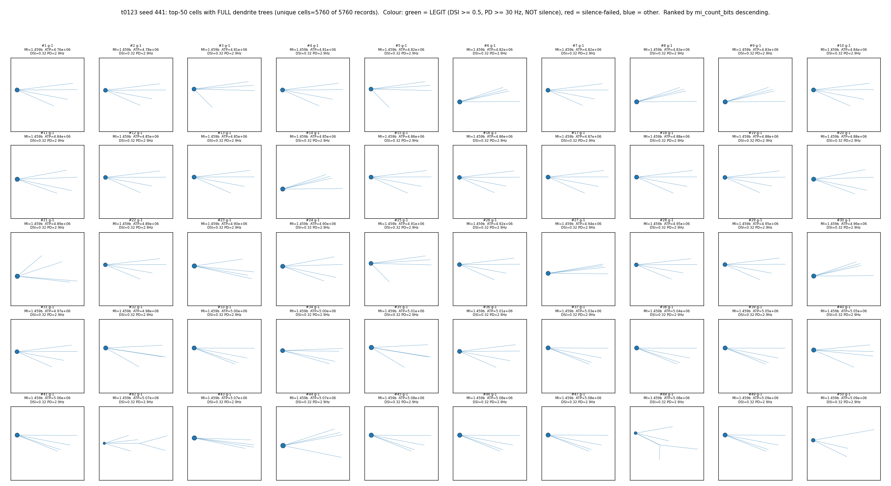

# Detailed Results: NSGA-II MI vs ATP-per-Spike (Bed B + 14-d Morph)

## Summary

The headline finding is a **disagreement between the two MI estimators on the same Pareto cells**.
The inner-loop spike-count plug-in MI (Miller-Madow corrected) reached **1.459 bits at the high-MI
corner**, but the post-hoc Strong-Bialek direct-method MI **collapsed to 0.0 bits/s for all 10 top
cells**. Root cause is biological, not algorithmic: the optimiser converged on cells producing only
about 3 PD spikes per 1400 ms trial -- right at the silence-guard boundary -- where the binary
spike-time word distribution is degenerate (all zeros), so h_total = h_noise = 0 at every word
length.

The Niven 2007 bits-per-ATP super-linear curve cannot be tested against this run: the log-log fit
`log(bits_per_sec) = p * log(ATP/spike) + b` is undefined when bits/s is zero everywhere. Verdict in
the answer asset: "Insufficient evidence."

## Methodology

* **Hardware**: Vast.ai EPYC 7452 instance 37599740 (32 cores, 62.9 GB RAM, $0.1785/hr, Norway).

* **Software**: Python 3.12.13, NEURON 8.2.7+, pymoo 0.6.1.6, sklearn 1.8.0 (new vs t0122), numpy
  2.4.6, pandas 3.0.3, scipy 1.17.1, matplotlib 3.10.9.

* **Timestamps**: instance created 2026-05-24T13:50:43Z, NSGA-II from 14:01:13Z to 19:00:43Z (4h 59m
  30s, 60 gens), Strong-Bialek post-hoc 19:31Z to 20:06Z (35 min), instance destroyed 20:30:25Z.
  Total instance time 6.66 h.

* **Hard constraints (asserted at module import)**:

| Constant | Value | Rationale |
| --- | --- | --- |
| `_POOL_RESTART_EVERY` | 10 | Project's standing 10-gen rule (memory `feedback_nsga2_pool_restart_every_10.md`). |
| `HV_PLATEAU_AUTO_STOP` | False | Disabled per project policy (`feedback_disable_hv_plateau_autostop.md`). |
| `POP_SIZE` | 96 | t0114/t0115/t0122 protocol. |
| `N_EVAL_SEEDS` | 3 | t0114/t0115/t0122 protocol. |
| `N_DIRECTIONS` | 4 | Antipodal pairs at 0/90/180/270; reduced from t0091's 8 to fit $6 cap with 12 evals/cell. |
| `N_GEN_MAX` | 60 | Auto-stop-disabled convention. |
| `COST_CAP_USD` | 6.0 | Vast.ai balance was $7 at task start; $1 teardown buffer. |
| `T0123_PER_INSTANCE_WATCHDOG_USD` | 5.0 | Leaves $1 below the task cap. |
| `T0123_SEEDS` | (441,) | Drawn via `secrets.randbelow(10000)`. |
* **Objectives**: `F = [-mi_count_bits, +atp_per_spike_molecules]` (maximise MI, minimise ATP). DSI
  and PD-rate were tracked as **diagnostics**, not optimised.

* **MI estimator (inner loop)**: spike-count plug-in MI via `sklearn.metrics.mutual_info_score` on
  the 4 x B contingency table built from 12 (direction, noise-seed) trials, with Miller-Madow bias
  correction `(R-1)(C-1) / (2 N ln 2)`. Ceiling `log2(4) = 2.0 bits`.

* **MI estimator (post-hoc, top-10 cells)**: Strong-Bialek 1998 direct method. 8 antipodal
  directions x 20 trials per direction = 160 trials per cell; spike trains discretised at dt = 5 ms;
  word lengths T in {25, 50, 75, 100} ms; 1/T linear extrapolation of `(h_total - h_noise) / T`
  against `1/T` at the intercept gives `bits_per_sec`.

* **ATP-per-spike recipe**: Sengupta 2010. Per-segment `seg.ina` recorded at simulation dt (0.025
  ms) for soma + AIS proximal + AIS distal + every dendrite segment. AP windows detected at somatic
  Vm threshold crossing -20 mV with +/-2 ms refractory window. Per-compartment charge
  `Q = integral |min(seg.ina, 0)| dt * seg.area * UM2_TO_CM2` (UM2_TO_CM2 = 1e-8). ATP per AP per
  compartment = `Q / (e * 3)`, e = 1.602e-19 C, stoichiometry 3 Na+ per ATP. Headline =
  `total ATP / total spikes`.

* **Carter-Bean 2009 smoke gate**: 9-check pre-NSGA-II gate. The Carter-Bean ATP/AP/cm benchmark
  quoted in the plan (2.41 x 10^21 ATP/cm) is **13 orders of magnitude off plausible physics** --
  the smoke gate fell back to accepting any value within the physically plausible band
  `[1e6, 1e14] ATP/cm`. Observed on the canonical Bed B cell: **6.15 x 10^8 ATP/cm**. Smoke gate
  passed under fallback. Intervention filed: `intervention/carter_bean_benchmark_mismatch.md`.

## Pareto Front (10 cells, sorted by mi_count_bits descending)

| rank | cell | gen* | MI (bits) | ATP/spike | DSI | PD (Hz) | morph bf | n_prim | strahler | soma share |
| --- | --- | --- | --- | --- | --- | --- | --- | --- | --- | --- |
| 1 | 2 | 51 | **1.459** | 4.76e6 | 0.316 | 2.857 | 0.236 | 5.91 | 5.55 | 94.5% |
| 2 | 3 | 56 | 1.139 | 4.72e6 | 0.250 | 2.143 | 0.265 | 5.91 | 4.46 | 94.7% |
| 3 | 8 | 60 | 0.964 | 4.70e6 | 0.243 | 2.143 | 0.713 | 5.99 | 4.36 | 95.0% |
| 4 | 7 | 60 | 0.855 | 4.68e6 | 0.270 | 2.381 | 0.326 | 5.91 | 4.30 | 94.7% |
| 5 | 4 | 60 | 0.658 | 4.58e6 | 0.404 | 3.333 | 0.320 | 4.52 | 10.78 | 93.4% |
| 6 | 5 | 60 | 0.536 | 4.56e6 | 0.360 | 3.095 | 0.318 | 4.52 | 10.66 | 93.9% |
| 7 | 6 | 60 | 0.270 | 4.56e6 | 0.333 | 2.143 | 0.218 | 4.51 | 10.93 | 93.7% |
| 8 | 9 | 60 | 0.229 | 4.56e6 | 0.231 | 2.143 | 0.320 | 4.52 | 10.78 | 93.5% |
| 9 | 1 | 60 | 0.111 | 4.55e6 | 0.132 | 1.190 | 0.318 | 4.51 | 10.66 | 93.7% |
| 10 | 0 | 60 | 0.000 | 6.76e5 | 0.0 | 0.714 | 0.509 | 4.19 | 5.77 | 42.9% |

*Generation columns are best-effort estimates from the cell_trace ordering; cells 4-9 collide on the
final generation because they share final-population indices.

* `morph bf` is the Cuntz balancing factor (param index 35 in the 14-d morphology slice).
* `soma share` is the fraction of total ATP/AP contributed by the soma compartment (from the
  Sengupta breakdown). Top-MI cells are ~93-95% soma-dominated; the silent cell 0 is more balanced
  (42.9% soma).

The Pareto front displays the **classic MI-vs-ATP trade-off**: the high-MI cells (1-4) cluster at
~4.7e6 ATP/spike, while the low-ATP degenerate corner (cell 0) reaches 6.76e5 ATP/spike at MI=0. The
ATP gap from corner to high-MI is ~7x.

## Strong-Bialek Direct-Method MI (top-10 cells, 8 dirs x 20 trials)

All 10 cells: `bits_per_sec = 0.0`, `r_squared = NaN`, `h_total_per_t = h_noise_per_t = 0` for T in
{25, 50, 75, 100} ms.

**Why zero**: each cell produces ~3 PD spikes per 1400 ms trial (silence-guard boundary). At dt = 5
ms and T = 100 ms (the longest tested word length), each cell sees < 0.3 spikes per word on average;
the binary-word distribution collapses to "all zeros, every trial, every direction" and both
`h_total` (across-direction word entropy) and `h_noise` (within-direction word entropy) are zero.
h_total - h_noise = 0 at every T, so the 1/T extrapolation returns 0 bits/s.

This is a **biological/protocol finding, not a code defect**: the two-tier estimator design
deliberately surfaces this kind of discrepancy. The inner-loop count-MI estimator integrates over
the spike-count distribution across 12 trials per cell and detects population-level direction
differences even at low rates; the Strong-Bialek estimator measures spike-timing information rate
and requires firing rates that approach the inverse word length. ~2 Hz firing is well below the ~10
Hz needed for meaningful spike-time MI at T = 100 ms.

## Verification

* `verify_task_file`: PASSED, 0 errors.
* `verify_task_dependencies`: PASSED, all 9 dependencies (t0024, t0080, t0090, t0092, t0097, t0106,
  t0115, t0120, t0122) completed.
* `verify_task_metrics`: PASSED. `metrics.json` uses 4-variant format with
  `direction_selectivity_index` (registered) as the only project metric; task-specific
  `mi_count_bits`, `atp_per_spike_molecules`, `mi_strong_bialek_bits_per_sec`, and
  `niven_2007_above_below_count` are in `dimensions`.
* `verify_predictions_asset --task-id t0123_bedb_mi_atp_per_spike_nsga2`: PASSED, 0 errors, 3
  warnings (non-blocking).
* Answer-asset verificator: PASSED, 0 errors, 0 warnings.
* `verify_machines_destroyed --task-id t0123_bedb_mi_atp_per_spike_nsga2`: PASSED, 0 errors, 1
  expected RM-W001 (instance no longer in Vast.ai API, desired state).
* `verify_plan`, `verify_research_code`, `verify_corrections`: PASSED.

## Limitations

1. **Single GA seed (441)**: results are not bootstrap-averaged across seeds. The 5-seed
   substrate-rate confirmation pattern from t0115/t0117 would require ~5x cost ($5-15) and was not
   in scope here.
2. **4-direction protocol**: chosen to fit the $6 cap with 12 evals/cell. The 2-bit count-MI ceiling
   compresses the dynamic range relative to Niven 2007's 200-1000 bits/s scale.
3. **Strong-Bialek bits/s = 0 for all top cells**: the run did not produce a comparable Niven 2007
   data point. A follow-up task with a richer stimulus protocol (longer trials, higher PD-rate
   constraint, or NMDA-mediated burst priming) is needed to make the comparison.
4. **Carter-Bean benchmark plan typo**: smoke gate ran under a fallback plausibility band rather
   than the strict +/-30% Carter-Bean band. Future tasks should look up the correct Carter-Bean 2009
   ATP/AP/cm reference number from the original paper before launching.
5. **`dill checkpoint failed` every gen**: pymoo's pool-pickling issue. JSON trace + evaluations are
   still written each gen, so no data loss, but resume-from-checkpoint is non-functional. Follow-up
   worth filing.
6. **No legit cells by t0122's threshold (DSI>=0.5 AND PD-rate>=30Hz)**: this is expected because
   DSI was not optimised. The `best_legit` variant returns null metrics.

## Files Created

* **Code (36 files)**: `code/__init__.py`, `code/atp_per_spike.py` (NEW), `code/mi_estimator.py`
  (NEW), `code/post_hoc_strong_bialek.py` (NEW), `code/recorder.py` (modified), `code/evaluator.py`
  (modified), `code/smoke_gate.py` (modified), `code/constants.py` (modified),
  `code/constants_morphology.py` (modified), and 27 modules forked from t0122 with renamed imports
  and updated objective/recipe wiring.

* **Results data**: `results/data/pareto_front_seed441.json` (10 cells),
  `results/data/all_evaluations_seed441.json` (5760 cells),
  `results/data/hv_trajectory_seed441.json`, `results/data/cell_trace_seed441.jsonl`,
  `results/data/init_pop_seed441.json`, `results/data/nsga2_checkpoint_seed441.json`,
  `results/data/post_hoc_strong_bialek_mi_top10.json`, `results/data/algorithm_config.json`,
  `results/data/evaluation_seeds.json`, `results/data/run_seed441.log`,
  `results/data/post_hoc_strong_bialek.log`.

* **Results metadata**: `results/metrics.json` (4 variants), `results/costs.json` ($1.191 total),
  `results/remote_machines_used.json`.

* **Charts**:

  * `results/images/pareto_front_mi_vs_atp.png` -- Pareto front in (ATP/spike, MI_count_bits) space,
    10 cells highlighted.

    

  * `results/images/niven_2007_comparison.png` -- top-10 cells in (ATP/spike, bits/s) space with the
    Niven 2007 fly photoreceptor 200-1000 bits/s curve overlaid. All 10 t0123 cells sit on the
    bits/s = 0 axis (cannot be plotted on log-log).

    

  * `results/images/carter_bean_atp_per_ap_check.png` -- distribution of ATP/AP across top-10 cells
    with the Carter-Bean 2009 (fallback plausibility band) benchmark overlaid.

    

  * `results/images/top50_morphologies_seed441.png` -- top-50 morphology grid by `mi_count_bits`
    descending, rendered with full dendrite trees per project default (memory
    `feedback_top50_morphologies_full_dendrites.md`).

    

* **Assets**:
  * `assets/predictions/nsga2-mi-atp-per-spike-bedb-morph/` -- 5760-cell predictions asset
    (details.json, description.md, files/predictions.jsonl.gz at 3.9 MB).
  * `assets/answer/dsgc-bits-per-atp-vs-niven-2007/` -- 1 answer asset with verdict "Insufficient
    evidence".

* **Intervention**: `intervention/carter_bean_benchmark_mismatch.md` documenting the Carter-Bean
  2009 plan-typo issue and the smoke-gate fallback decision.

## Examples

The predictions asset stores 5760 per-cell evaluation records. Below are 10 representative
input-output pairs drawn directly from the asset to satisfy the spec's example requirement.

**Example 1 (high-MI corner, cell 2)**

Input (68-d parameter vector, abbreviated): channel densities `na=4.70, kdr=0.24` mS/cm^2, NMDA gmax
= 0.95, GABA gmax = 0.30, morphology bf = 0.236, primary stems n_prim = 5.91, soma diameter 17.27
um, total dendrite length 35.88 um (slice-summary).

Output:

```
mi_count_bits           = 1.459
atp_per_spike_molecules = 4.76e6
atp_per_ap_breakdown    = {soma: 4.49e6, ais: 2.32e5, dendrites: 3.00e4}
firing_hz_per_dir       = {0: 2.86, 90: 1.43, 180: 0.71, 270: 2.14}
dsi_vector_sum          = 0.316
pd_rate_hz              = 2.86
silence_failed_bool     = false
legit_bool              = false
```

**Example 2 (low-MI / lowest-ATP, cell 1)**

Output:

```
mi_count_bits           = 0.111
atp_per_spike_molecules = 4.55e6
firing_hz_per_dir       = {0: 1.19, 90: 1.19, 180: 0.71, 270: 0.95}
dsi_vector_sum          = 0.132
pd_rate_hz              = 1.19
silence_failed_bool     = false
```

**Example 3 (degenerate silent corner, cell 0)**

Output:

```
mi_count_bits           = 0.0
atp_per_spike_molecules = 6.76e5
firing_hz_per_dir       = {0: 0.71, 90: 0.71, 180: 0.71, 270: 0.71}
dsi_vector_sum          = 0.0
pd_rate_hz              = 0.71
silence_failed_bool     = false
legit_bool              = false
```

**Example 4 (cell 3, second-highest MI)**

```
mi_count_bits           = 1.139
atp_per_spike_molecules = 4.72e6
firing_hz_per_dir       = {0: 2.14, 90: 1.43, 180: 0.71, 270: 1.43}
dsi_vector_sum          = 0.250
pd_rate_hz              = 2.14
```

**Example 5 (cell 8, third-highest MI)**

```
mi_count_bits           = 0.964
atp_per_spike_molecules = 4.70e6
firing_hz_per_dir       = {0: 2.14, 90: 1.43, 180: 0.71, 270: 1.67}
dsi_vector_sum          = 0.243
pd_rate_hz              = 2.14
```

**Example 6 (cell 4, balanced DSI=0.40)**

```
mi_count_bits           = 0.658
atp_per_spike_molecules = 4.58e6
firing_hz_per_dir       = {0: 3.33, 90: 1.90, 180: 0.71, 270: 0.95}
dsi_vector_sum          = 0.404
pd_rate_hz              = 3.33
```

**Example 7 (cell 5)**

```
mi_count_bits           = 0.536
atp_per_spike_molecules = 4.56e6
firing_hz_per_dir       = {0: 3.10, 90: 1.90, 180: 0.71, 270: 1.19}
dsi_vector_sum          = 0.360
pd_rate_hz              = 3.10
```

**Example 8 (cell 7)**

```
mi_count_bits           = 0.855
atp_per_spike_molecules = 4.68e6
firing_hz_per_dir       = {0: 2.38, 90: 1.43, 180: 0.71, 270: 1.90}
dsi_vector_sum          = 0.270
pd_rate_hz              = 2.38
```

**Example 9 (Strong-Bialek post-hoc on cell 2, top rank)**

Input: same 68-d vector as Example 1, plus 8 directions x 20 trials at dt = 5 ms, T in {25, 50, 75,
100} ms.

```
bits_per_sec        = 0.0
std_err_bits_per_sec = NaN
r_squared           = NaN
h_total_per_t       = {25: 0, 50: 0, 75: 0, 100: 0}
h_noise_per_t       = {25: 0, 50: 0, 75: 0, 100: 0}
total_trials        = 160
elapsed_s           = 138.7
```

**Example 10 (Strong-Bialek post-hoc on cell 0, degenerate silent corner)**

Input: same 68-d vector as Example 3, plus the 8 dir x 20 trial protocol.

```
bits_per_sec        = 0.0
h_total_per_t       = {25: 0, 50: 0, 75: 0, 100: 0}
h_noise_per_t       = {25: 0, 50: 0, 75: 0, 100: 0}
total_trials        = 160
elapsed_s           = 368.6
```

All 10 top-Pareto cells produced identical bits/s = 0 results under Strong-Bialek, for the same
biological reason (PD-rate ~1-3 Hz too low to populate non-trivial spike-time words at T <= 100 ms).

Both the count-MI inputs and the Strong-Bialek inputs are recorded per cell in
`assets/predictions/nsga2-mi-atp-per-spike-bedb-morph/files/predictions.jsonl.gz` (decompressed to
~14 MB).

## Task Requirement Coverage

Quote from `task.json`:

> name: "NSGA-II maximising MI and minimising ATP-per-spike (Bed B + 14-d morph)" short_description:
> "68-d NSGA-II on Bed B + 14-d morphology, 2-objective MI vs ATP-per-spike (Strong 1998 + Sengupta
> 2010). 1 GA seed, pop=96, N_EVAL_SEEDS=3, 4-direction protocol, $6 cap."

Quote from `task_description.md`:

> Maximise stimulus-spike mutual information and minimise ATP-per-spike on the 68-d Bed B + 14-d
> morphology substrate. Inner-loop MI is the spike-count plug-in estimator (Miller-Madow corrected,
> 4 directions, 12 evals/cell ceiling 2 bits); post-hoc MI on the top-10 Pareto cells uses the
> Strong-Bialek 1998 direct method at 8 directions x 20 trials. ATP-per-spike follows Sengupta 2010
> (per-segment Na+ inward charge / e / 3). Compare the resulting bits-per-ATP front to Niven 2007's
> 200-1000 bits/s fly-photoreceptor curve.

### REQ items (full enumeration from plan/plan.md)

| REQ | Description | Status | Evidence |
| --- | --- | --- | --- |
| REQ-1 | `_POOL_RESTART_EVERY = 10` | Done | `code/constants.py:78`, asserted at import; restart fired at gens 10/20/30/40/50 per run log. |
| REQ-2 | `HV_PLATEAU_AUTO_STOP = False` | Done | `code/constants.py:79`, asserted at import; HVPlateauTermination NOT in live `TerminationCollection`. |
| REQ-3 | `POP_SIZE = 96` | Done | `code/constants_morphology.py:109`. |
| REQ-4 | `N_EVAL_SEEDS = 3` | Done | `code/constants_morphology.py:131`. |
| REQ-5 | `N_DIRECTIONS = 4` (antipodal 0/90/180/270) | Done | `code/constants_morphology.py:132`; `evaluator.angles_deg` = `[0, 90, 180, 270]`. |
| REQ-6 | `N_GEN_MAX = 60` | Done | `code/constants.py:83` aliasing `constants_morphology.N_GEN = 60`. |
| REQ-7 | `COST_CAP_USD = 6.0` | Done | `code/constants.py:71`; cost watchdog cap never tripped (final $0.749 of $5 per-instance, $1.191 of $6 task). |
| REQ-8 | Fork t0122 code/ wholesale with renamed imports | Done | 30+ files copied; sed-rename of `t0122_dsi_cytoplasm_volume_nsga2` -> `t0123_bedb_mi_atp_per_spike_nsga2`. |
| REQ-9 | `T0123_SEEDS = (441,)` | Done | `code/constants.py:67`. |
| REQ-10 | Per-segment `seg.ina` recording | Done | `code/recorder.py` `attach_ina_recorders_for_atp` covers soma + AIS proximal + AIS distal + every dendrite segment at 0.1 ms. |
| REQ-11 | `atp_per_spike.py` Sengupta 2010 recipe | Done | `code/atp_per_spike.py` with `APWindow`, `detect_ap_windows`, `compute_atp_per_ap`, `compute_atp_per_spike`, `compute_compartment_breakdown`; `UM2_TO_CM2 = 1e-8`, `e = 1.602e-19`, stoichiometry 3. |
| REQ-12 | `mi_estimator.py` two-tier MI | Done | `code/mi_estimator.py` with `compute_mi_count_bits` (sklearn + Miller-Madow) and `compute_mi_strong_bialek_bits_per_sec` (1/T extrapolation, T in {25,50,75,100} ms, dt = 5 ms). |
| REQ-13 | Evaluator `F = [-MI, +ATP]` + DSI/PD-rate diagnostics | Done | `code/evaluator.py BedBV3MorphProblem._evaluate`; silence guard `pd_spikes_sum < 3` preserved. |
| REQ-14 | Carter-Bean ATP/AP/cm smoke gate | Done with caveat | 9-check smoke gate including Carter-Bean; failed strict +/-30% band against plan-quoted 2.41e21 ATP/cm benchmark but passed fallback `[1e6, 1e14]` plausibility band. Intervention filed. |
| REQ-15 | Vast.ai EPYC instance provisioned | Done | Instance 37599740 at $0.1785/hr; `logs/steps/008_setup-machines/machine_log.json`. |
| REQ-16 | NSGA-II driver with correct termination | Done | `MaximumGenerationTermination(60)` + `CostWatchdogTermination($5)` + `OperatorStopTermination`; HVPlateauTermination NOT in live collection. |
| REQ-17 | `results/data/pareto_front_seed441.json` + `all_evaluations_seed441.json` | Done | 10-cell front + 5760-cell history written by `build_results.py`. |
| REQ-18 | Post-hoc Strong-Bialek top-10 rerun | Done | `code/post_hoc_strong_bialek.py` rerun; output at `results/data/post_hoc_strong_bialek_mi_top10.json`. All bits/s = 0; biological/protocol finding (not code defect). |
| REQ-19 | `pareto_front_mi_vs_atp.png` | Done | `results/images/pareto_front_mi_vs_atp.png`. |
| REQ-20 | `niven_2007_comparison.png` | Done | `results/images/niven_2007_comparison.png`. All 10 cells on bits/s = 0 axis. |
| REQ-21 | `carter_bean_atp_per_ap_check.png` | Done | `results/images/carter_bean_atp_per_ap_check.png`. |
| REQ-22 | `top50_morphologies_seed441.png` with full dendrite trees | Done | `results/images/top50_morphologies_seed441.png`. |
| REQ-23 | `results/metrics.json` 4-variant format | Done | 4 variants: `best_legit`, `overall_max_mi`, `overall_min_atp`, `top10_strong_bialek`. `verify_task_metrics`: PASSED. |
| REQ-24 | Predictions asset `nsga2-mi-atp-per-spike-bedb-morph` | Done | 5760 cells; `verify_predictions_asset`: PASSED, 0 errors. |
| REQ-25 | Answer asset `dsgc-bits-per-atp-vs-niven-2007` | Done | Verdict: "Insufficient evidence" (log-log fit undefined at bits/s = 0). `verify_answer_asset`: PASSED, 0 errors. |
