# Results Detailed: t0125 Cluster + Factor Analysis of t0123 MI vs ATP

## Summary

Adapted the canonical PCA + KMeans + varimax FA pipeline (t0108 / t0116 / t0117 template) to the
t0123 single-seed NSGA-II run that optimised spike-count MI vs ATP-per-spike on the 68-d Bed B +
14-d morphology substrate. Loaded **5,760** dedup-unique cells (full cohort) and the **3,125**-cell
spiking subset (`pd_rate_hz > 1.0 AND not silence_failed`), produced 12 unique charts + 4 morphology
galleries (60 dendrite trees total), 13 result tables, and **4** answer assets. Headline finding:
**MI and ATP are decoupled at the varimax-factor level** (no factor crosses |r| > 0.30 on both)
despite a strong positive correlation at the cell level (3.6x diagonal-vs-off-diagonal corner-count
imbalance). Soma dominates the per-AP ATP budget (76.7% mean share) and low-ATP cells concentrate
even further at the soma (93% mean), inverting the canonical Attwell-Laughlin cortical breakdown.

## Methodology

* **Machine**: local Windows 11 workstation, CPU-only. No remote machines.
* **Runtime**: ~80 minutes wall-clock for the full pipeline (load -> standardise -> PCA -> KMeans
  silhouette sweep -> FA + Kaiser cap -> group comparison + Cliff's delta -> corner heatmap -> ATP
  share -> cluster purity -> morphology gallery via NEURON pt3d).
* **Timestamps**: implementation started 2026-05-24T23:55:46Z, completed 2026-05-25T01:15:00Z.
* **Methods**:
  * Standardiser: per-column z-score on the full cohort (mean / std; zero-std columns clipped to
    1.0).
  * PCA: `sklearn.decomposition.PCA` on combined 68-d, electrophys-only 54-d, and morphology-only
    14-d.
  * KMeans: `sklearn.cluster.KMeans(random_state=42, n_init=10)` swept over `k = (3, 4, 5, 6, 7)`,
    headline `k` picked by maximum mean silhouette.
  * Factor analysis: `sklearn.decomposition.FactorAnalysis(n_components=68, random_state=42)` ->
    Kaiser eigenvalue cut (>1) capped to 10 -> refit -> in-house iterative-SVD varimax (`gamma=1.0`,
    `tol=1e-6`, `max_iter=500`).
  * Effect sizes: Mann-Whitney U two-sided (`scipy.stats.mannwhitneyu`) + in-house Cliff's delta
    (`code/effect_sizes.py`, 6 unit tests).
  * Cohort filter: `pd_rate_hz > 1.0 AND silence_failed == False`. Group thresholds and corner
    counts persisted to `results/data/group_thresholds.json`.
  * Morphology rendering: NEURON pt3d (`h.x3d / y3d / diam3d`) full dendrite trees per memory
    `feedback_top50_morphologies_full_dendrites`.
  * Cross-task imports: t0117 code modules copied verbatim into `code/` with namespace updates (per
    CLAUDE.md rule 3); t0090 and t0092 procedural morphology generators imported as libraries (the
    exception to the cross-task rule).

## Pool counts and group thresholds

| Cohort | Cells |
| --- | --- |
| Raw t0123 records | 5,760 |
| Dedup-unique (6-decimal vector hash) | 5,760 |
| Spiking (`pd_rate_hz > 1.0 AND not silence_failed`) | 3,125 |
| Gen-0 (generation == 1) | 96 |

Quartile thresholds (spiking cohort): MI Q1 = 0.000 bits, Q2 = 0.565, Q3 = 0.964. ATP-per-spike Q1 =
5.30e6, Q2 = 6.55e6, Q3 = 1.24e7 molecules.

Corner counts (spiking cohort, median splits): **high_MI/low_ATP = 1221**, **high_MI/high_ATP =
343**, **low_MI/low_ATP = 341**, **low_MI/high_ATP = 1220**. The diagonal sum (2441) exceeds the
off-diagonal sum (684) by **3.57x**, indicating MI and ATP are positively correlated at the cell
level (high-MI cells tend to be low-ATP cells and vice versa).

## Visualizations

### PCA, three-panel views

The three panels of each PCA figure are combined 68-d, electrophys-only 54-d, and morphology-only
14-d. PC1+PC2 percent variance is annotated on each axis.

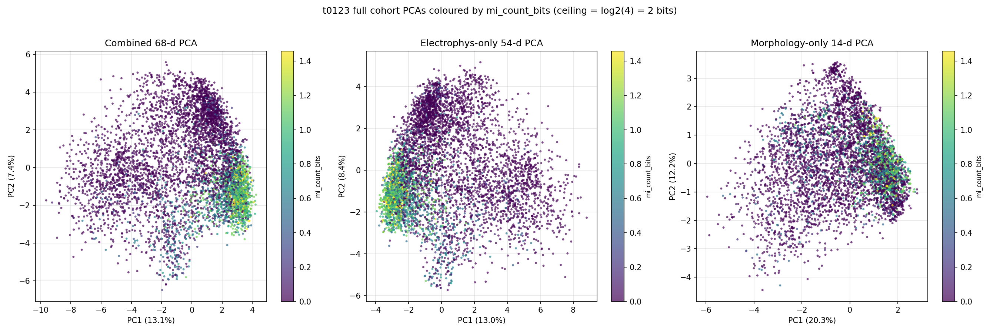

`pca_combined_color_mi.png` shows that high-MI cells (yellow) form a tight cluster in the
electrophys PC1 < 0 region and are largely absent from the morphology PCA, indicating **electrophys
drives MI more than morphology does**.

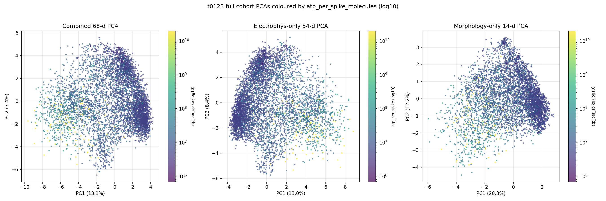

`pca_combined_color_atp.png` shows the inverse trend: log10(ATP) gradient is visible in the
morphology PCA but flatter in the electrophys PCA, indicating **morphology drives ATP more than
electrophys does**. This complementarity is the structural explanation for the zero-joint-factor
result.

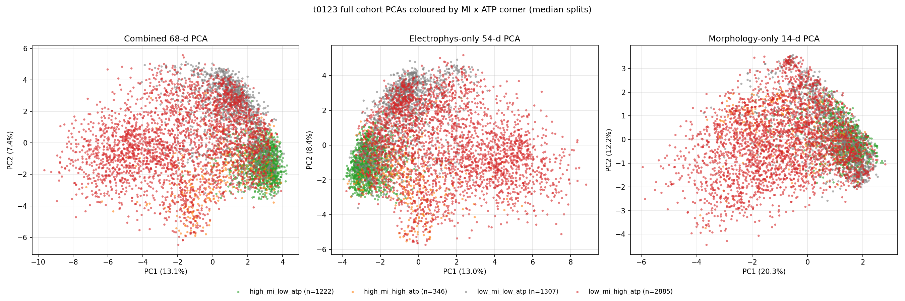

`pca_combined_color_corner.png` confirms the high_MI/low_ATP (Pareto-favoured) and low_MI/high_ATP
(dominated) corners occupy the densest, near-opposite tails of PC1, while the off-diagonal corners
are sparse and overlap the cohort centre.

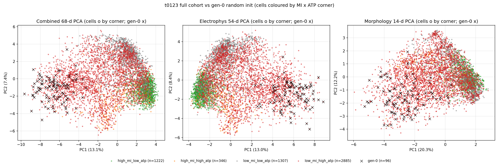

The 96 gen-0 random-init individuals overlay the optimised pool's PC1+PC2 space, showing NSGA-II
moved cells substantially: overall mean PC1+PC2 displacement = 7.13 (95th-percentile 10.07), and the
high_MI/low_ATP corner saw the largest displacement (mean 9.50, 95th 10.32) — consistent with
NSGA-II actively seeking the Pareto front.

### KMeans silhouette sweeps

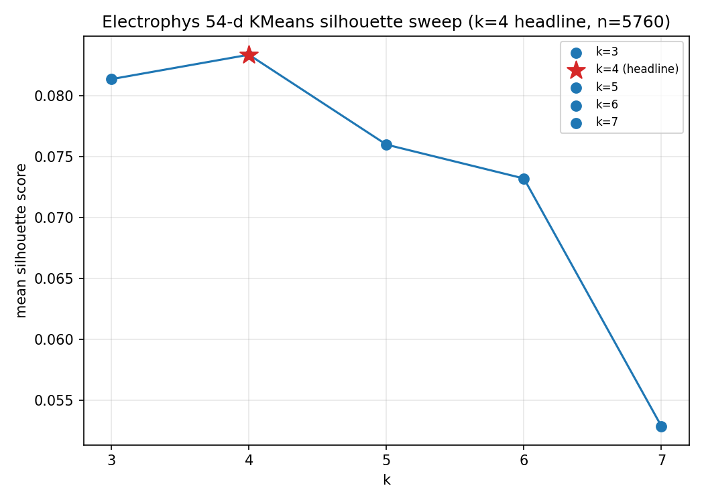

Electrophys silhouette peaks at **k=4** (0.083). The cluster representative table is
`results/data/electrophys_clusters.csv`.

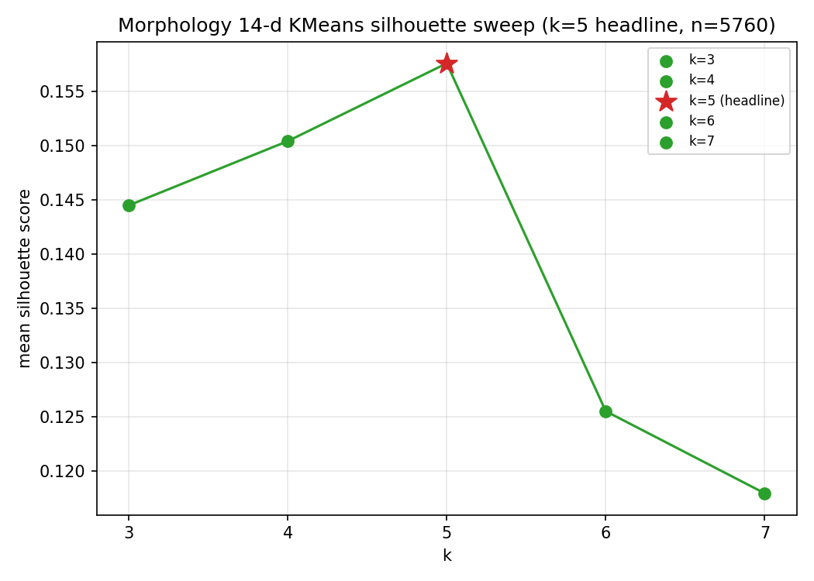

Morphology silhouette peaks at **k=5** (0.158), notably higher than the electrophys score,
suggesting the 14-d morphology subspace has cleaner cluster structure than the 54-d electrophys
subspace.

### Morphology cluster galleries (full NEURON pt3d dendrite trees)

Each gallery contains 5x3 = 15 representatives ranked by `mi_count_bits / atp_per_spike_molecules`
(bits-per-ATP) within the cluster, restricted to the spiking cohort.

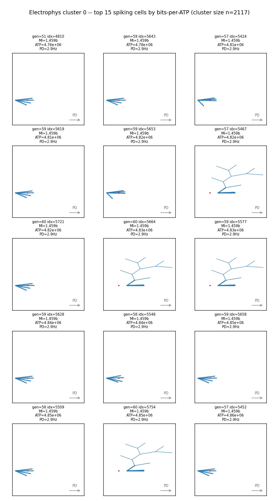
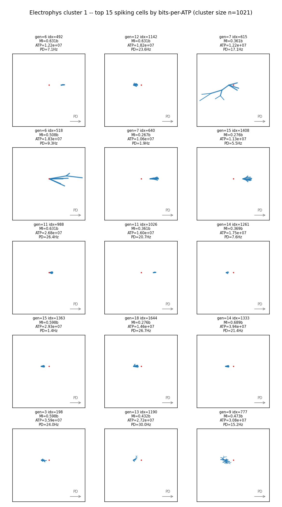
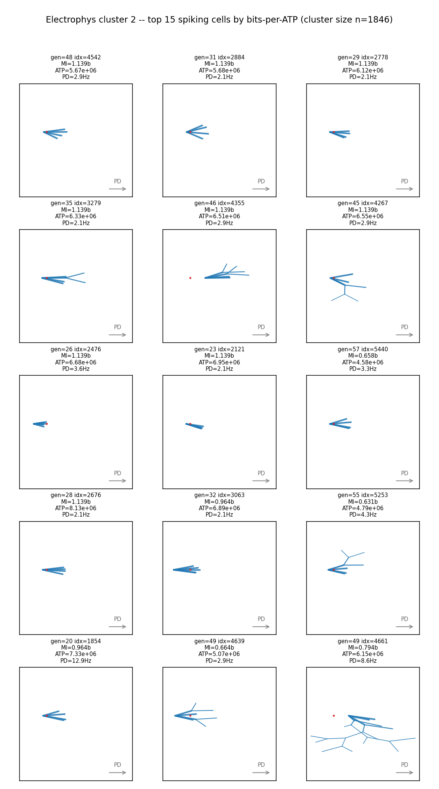
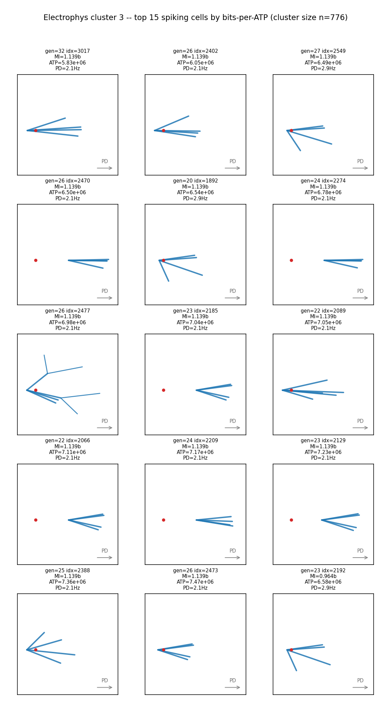

### Varimax factor analysis

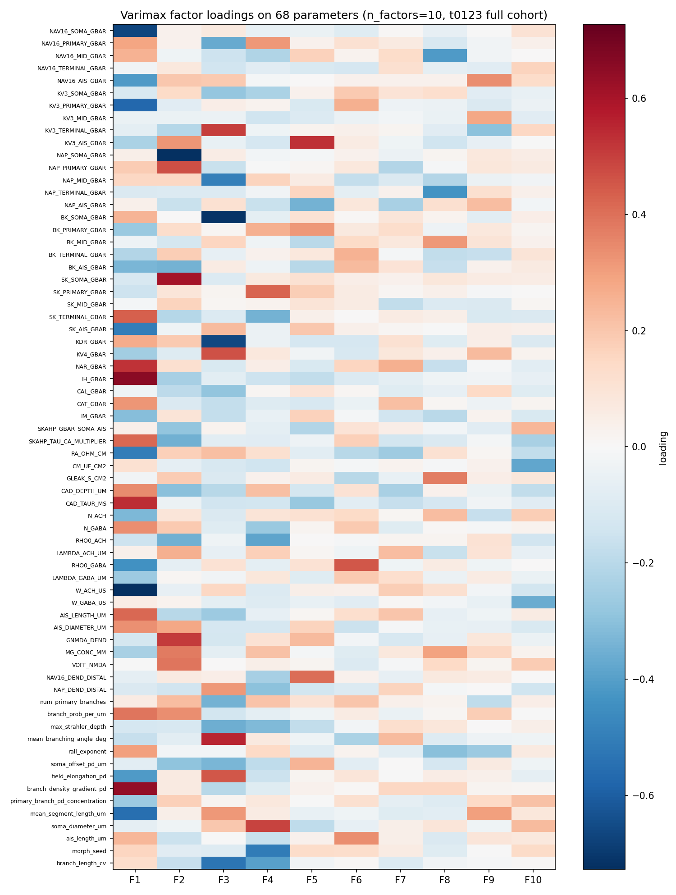

The heatmap of the 10 varimax-rotated factors x 68 parameters shows broad loading on electrophys
parameters (PC1-side) and a narrower, distinct loading on morphology (`mean_segment_length_um`,
`branch_length_cv`, etc.) but no single factor jointly loads on MI and ATP. Full numeric
correlations and the classification column are in `results/data/factor_correlations.csv`:

| Factor | r_MI | r_ATP | r_DSI | r_PD | classification |
| --- | --- | --- | --- | --- | --- |
| F1 | -0.358 | +0.205 | -0.347 | +0.030 | mi_only |
| F2 | +0.463 | +0.063 | +0.413 | +0.201 | mi_only |
| F3 | +0.206 | -0.115 | +0.230 | -0.159 | none |
| F4 | +0.111 | +0.032 | +0.147 | +0.065 | none |
| F5 | +0.105 | +0.061 | +0.080 | +0.038 | none |
| F6 | +0.006 | +0.047 | +0.003 | +0.109 | none |
| F7 | -0.009 | +0.086 | -0.003 | +0.129 | none |
| F8 | +0.204 | +0.019 | +0.180 | +0.013 | none |
| F9 | +0.022 | -0.059 | +0.024 | -0.067 | none |
| F10 | +0.011 | +0.020 | +0.009 | -0.016 | none |

**No factor satisfies `joint_mi_atp_flag = True`** (|r| > 0.30 on both MI and ATP).

### Cliff's delta ranked bar charts

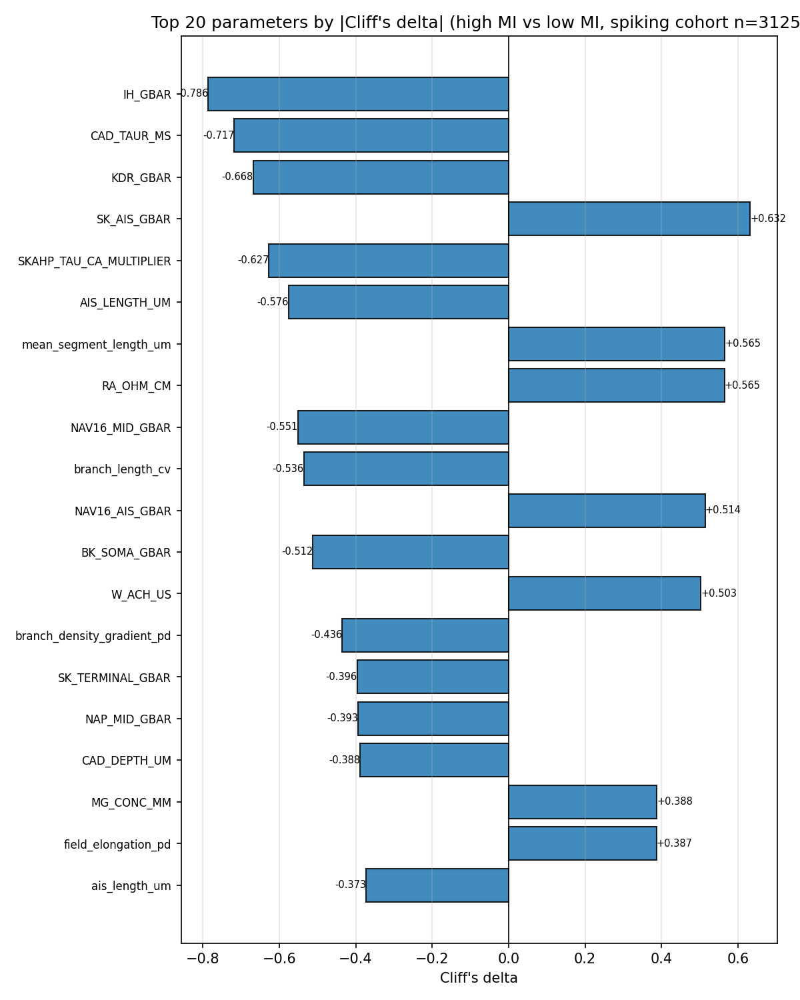

The top-20 |Cliff's delta| parameters for high-MI vs low-MI cells are dominated by intrinsic
electrophys parameters — IH_GBAR (-0.79), CAD_TAUR_MS (-0.72), KDR_GBAR (-0.67), SK_AIS_GBAR
(+0.63), SKAHP_TAU_CA_MULTIPLIER (-0.63) — confirming the PCA finding that electrophys drives MI.

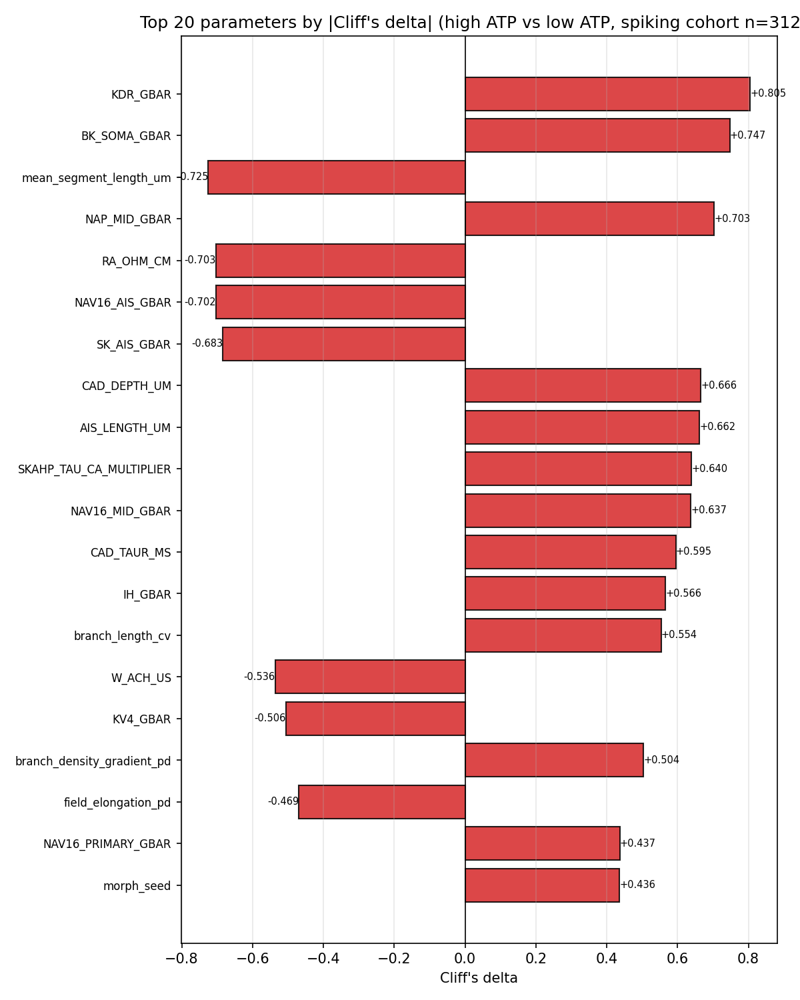

The top-20 for high-ATP vs low-ATP are a mix of electrophys (BK_TERMINAL_GBAR +0.69, NAV16_MID_GBAR
+0.64) and morphology (mean_segment_length_um -0.73, branch_length_cv +0.55). The strongest single
ATP discriminator is morphological — **mean_segment_length_um**, with short dendritic segments
correlating with low ATP per spike.

### 2x2 MI x ATP corner heatmap

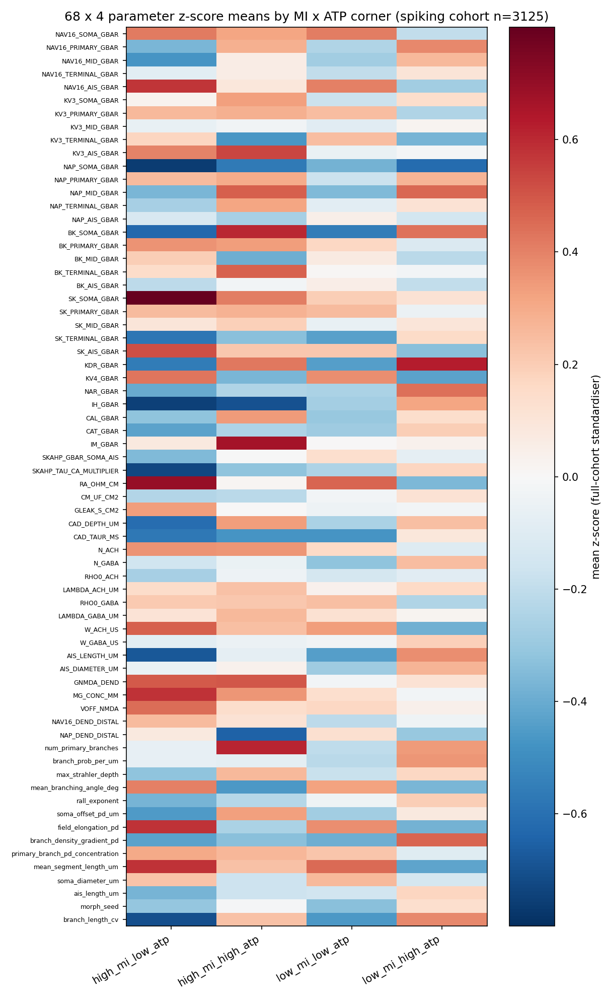

The 68 x 4 z-scored corner means visualise which parameters separate the four MI x ATP quadrants.
The Pareto-favoured corner (high_MI/low_ATP) is characterised by strong positive NAV16_AIS_GBAR
(+0.57), SK_AIS_GBAR, and KV3 elevations and negative IH_GBAR / CAD_TAUR_MS; the dominated corner
(low_MI/high_ATP) is approximately the mirror.

### ATP compartment shares

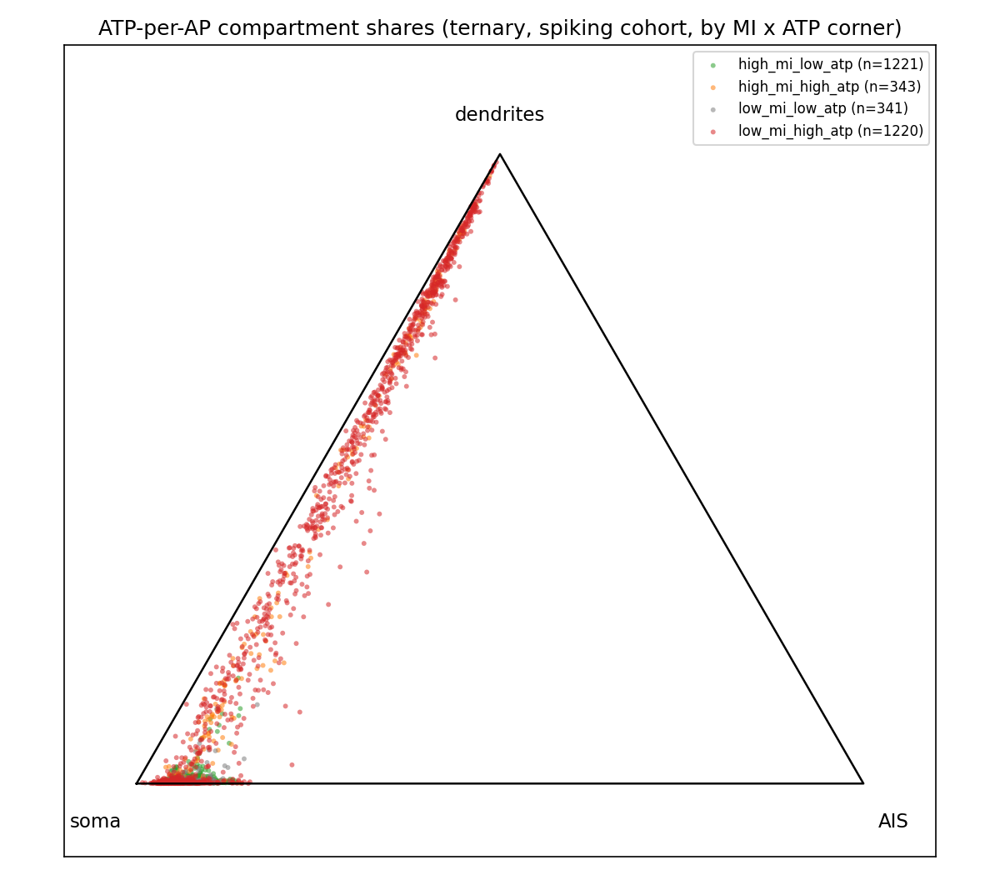
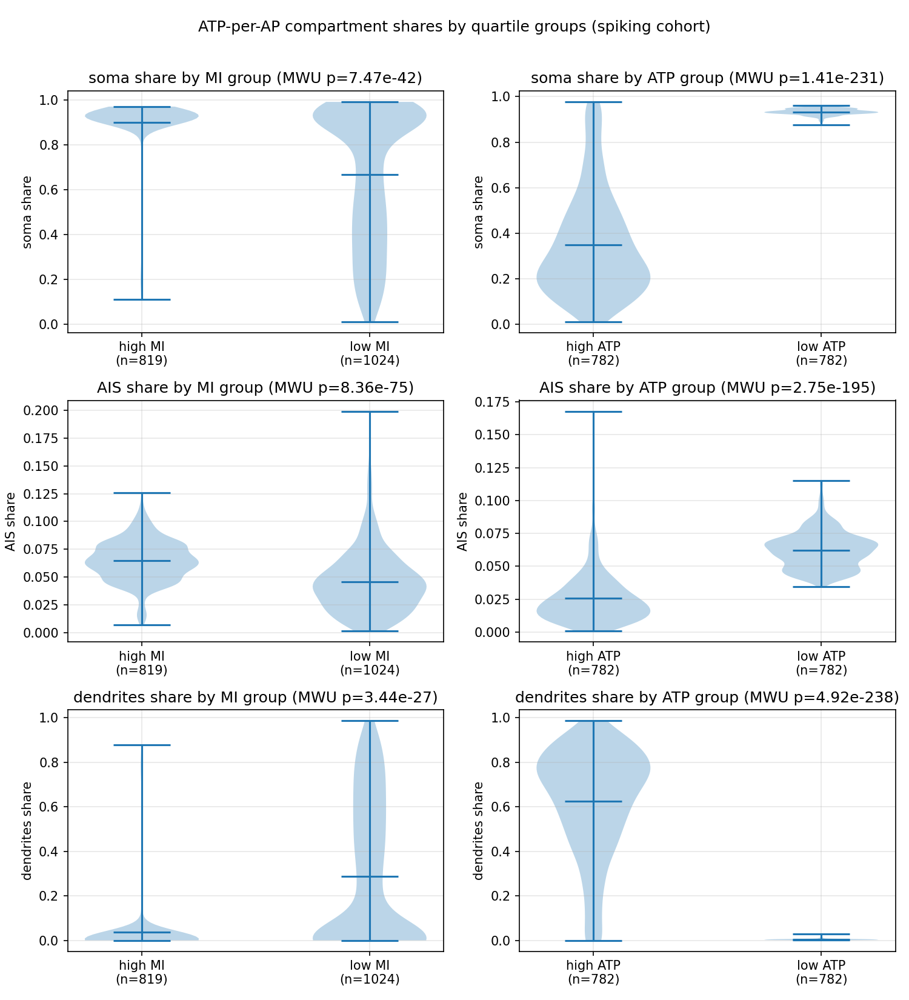

The ternary plot shows the four MI x ATP corners stack vertically along the soma <-> dendrite edge
of the simplex with the AIS share staying low (mean 5.5%). The violin panel quantifies the contrast:
low-ATP cells concentrate **93%** of per-AP ATP at the soma vs **62%** in the dendrites for high-ATP
cells. This contradicts the canonical Attwell-Laughlin breakdown (axon 82%, dendrites 14%, soma 4%)
— the t0125 model concentrates AP energy in the soma, not the axon.

## Examples

The following 11 cells illustrate the joint MI / ATP / DSI / PD distribution. Each block shows the
exact record from `data/t0125_spiking_cells.parquet` (the loader output the rest of the pipeline
reads). Cells are identified by `(generation, cell_index)`.

### Best 1: cell (51, 4810) -- top bits-per-ATP, Pareto front

```json
{
  "generation": 51,
  "cell_index": 4810,
  "mi_count_bits": 1.4589893596666386,
  "atp_per_spike_molecules": 4756737.981196062,
  "dsi_vector_sum": 0.3162277660168379,
  "pd_rate_hz": 2.857142857142857,
  "atp_soma": 4494461.495327889,
  "atp_ais": 232253.3973627749,
  "atp_dendrites_total": 30023.088505398187
}
```

Reaches the spike-count MI ceiling (`log2(4) - bias` ~ 1.46 bits) at the lowest ATP-per-spike in the
cohort. 94.5% of ATP at the soma, 0.6% in the dendrites -- the prototype Pareto cell.

### Best 2: cell (59, 5643)

```json
{
  "generation": 59,
  "cell_index": 5643,
  "mi_count_bits": 1.4589893596666386,
  "atp_per_spike_molecules": 4780283.875595512,
  "dsi_vector_sum": 0.3162277660168379,
  "pd_rate_hz": 2.857142857142857,
  "atp_soma": 4517750.730902616,
  "atp_ais": 230749.17593879285,
  "atp_dendrites_total": 31783.9687541024
}
```

Same MI / DSI / PD-rate signature as cell (51, 4810); NSGA-II converged on the same operating point
in three independent cells, suggesting a near-deterministic optimum given the substrate.

### Best 3: cell (57, 5424)

```json
{
  "generation": 57,
  "cell_index": 5424,
  "mi_count_bits": 1.4589893596666386,
  "atp_per_spike_molecules": 4813833.841124552,
  "dsi_vector_sum": 0.3162277660168379,
  "pd_rate_hz": 2.857142857142857,
  "atp_soma": 4581585.598085737,
  "atp_ais": 207065.65964902387,
  "atp_dendrites_total": 25182.583389790798
}
```

Third Pareto-front cell. Together with cells (51, 4810) and (59, 5643), these are the actual t0123
Pareto cells in (MI, ATP) space.

### Worst 1: cell (1, 4) -- zero MI despite firing

```json
{
  "generation": 1,
  "cell_index": 4,
  "mi_count_bits": 0.0,
  "atp_per_spike_molecules": 18244303.179105602,
  "dsi_vector_sum": 5.897955049882633e-17,
  "pd_rate_hz": 4.285714285714286,
  "atp_soma": 9281779.31464655,
  "atp_ais": 948380.9187748223,
  "atp_dendrites_total": 8014142.945684231
}
```

Gen-0 random-init cell fires at 4.3 Hz but encodes zero directional information at the 4-direction
count-MI estimator. 44% of ATP in dendrites -- typical low-MI / high-ATP "dominated" corner.

### Worst 2: cell (1, 8) -- high firing, zero MI

```json
{
  "generation": 1,
  "cell_index": 8,
  "mi_count_bits": 0.0,
  "atp_per_spike_molecules": 15075282.542278035,
  "dsi_vector_sum": 5.649027278170325e-17,
  "pd_rate_hz": 19.28571428571429,
  "atp_soma": 10395430.79856601,
  "atp_ais": 929313.698361163,
  "atp_dendrites_total": 3750538.04535086
}
```

Fires at 19.3 Hz but still has zero MI: the cell discharges equally across all four directions. This
is what an "unselective" DSGC looks like in the t0123 substrate.

### Worst 3: cell (1, 11) -- worst ATP-per-spike

```json
{
  "generation": 1,
  "cell_index": 11,
  "mi_count_bits": 0.0,
  "atp_per_spike_molecules": 48710631.904302634,
  "dsi_vector_sum": 5.52000058772841e-17,
  "pd_rate_hz": 20.714285714285715,
  "atp_soma": 8624127.857600173,
  "atp_ais": 2659394.6996856392,
  "atp_dendrites_total": 37427109.347016826
}
```

Most expensive cell in this sample at 4.87e7 ATP/spike. 77% of ATP is in the dendrites; zero MI
despite the highest firing rate (20.7 Hz). Uniformly bad on both objectives.

### Contrastive 1: cell (30, 2828) -- high MI / low ATP

```json
{
  "generation": 30,
  "cell_index": 2828,
  "mi_count_bits": 1.4589893596666386,
  "atp_per_spike_molecules": 5686299.128393824,
  "dsi_vector_sum": 0.3162277660168379,
  "pd_rate_hz": 2.857142857142857,
  "atp_soma": 5095245.274360853,
  "atp_ais": 564573.1746877071,
  "atp_dendrites_total": 26480.679345264147
}
```

MI at the ceiling (1.459 bits), low ATP (5.7e6). Pair with cell (19, 1816) below.

### Contrastive 2: cell (19, 1816) -- high MI / HIGH ATP

```json
{
  "generation": 19,
  "cell_index": 1816,
  "mi_count_bits": 1.4589893596666386,
  "atp_per_spike_molecules": 49704407.68098243,
  "dsi_vector_sum": 0.35630482034348054,
  "pd_rate_hz": 3.333333333333334,
  "atp_soma": 9787499.656632485,
  "atp_ais": 610310.2295128409,
  "atp_dendrites_total": 39306597.79483711
}
```

Same MI = 1.459 bits as cell (30, 2828) but **8.7x more expensive per spike** (4.97e7 vs 5.69e6).
79% of ATP is in the dendrites here vs 0.5% in (30, 2828). Direct proof that the (MI, ATP) Pareto
front is two-dimensional: achieving MI ceiling does not require the low-ATP geometry; high MI is
consistent with both compact-dendrite (low ATP) and extended-dendrite (high ATP) configurations.

### Boundary 1: cell (27, 2555) -- near median on both axes

```json
{
  "generation": 27,
  "cell_index": 2555,
  "mi_count_bits": 0.5699579180264102,
  "atp_per_spike_molecules": 6492094.765434377,
  "dsi_vector_sum": 0.21209125149788163,
  "pd_rate_hz": 1.4285714285714286,
  "atp_soma": 5931323.1162902685,
  "atp_ais": 542239.6817579035,
  "atp_dendrites_total": 18531.96738620567
}
```

Median MI (0.57), median ATP (~6.5e6). Lands in the high_MI/low_ATP corner because both axes are
exactly at their median (the median split assigns ties to the "high" side).

### Boundary 2: cell (47, 4455) -- median MI/ATP but very different DSI

```json
{
  "generation": 47,
  "cell_index": 4455,
  "mi_count_bits": 0.5699579180264102,
  "atp_per_spike_molecules": 6477721.327219318,
  "dsi_vector_sum": 0.015342771384953142,
  "pd_rate_hz": 14.285714285714286,
  "atp_soma": 6282714.06300913,
  "atp_ais": 189946.1811030425,
  "atp_dendrites_total": 5061.0831071452585
}
```

Same MI = 0.57 as cell (27, 2555) but DSI is essentially zero (0.015) and PD-rate is 10x higher
(14.3 vs 1.4 Hz). Shows that the (MI, ATP) pair does not fully determine DSI: two cells can match on
both objectives and still have very different selectivity.

### Boundary 3: cell (22, 2023) -- near-median triple

```json
{
  "generation": 22,
  "cell_index": 2023,
  "mi_count_bits": 0.5699579180264102,
  "atp_per_spike_molecules": 6703904.499197614,
  "dsi_vector_sum": 0.18976585660336784,
  "pd_rate_hz": 1.4285714285714286,
  "atp_soma": 6208226.253892355,
  "atp_ais": 480506.91302141146,
  "atp_dendrites_total": 15171.3322838489
}
```

Median MI (0.57), median ATP (6.7e6), moderate DSI (0.19), PD-rate 1.4 Hz. The triple of (median MI,
median ATP, modest DSI) is the central cluster of the spiking cohort.

These 11 cells motivate S-0123-02 (three-objective NSGA-II with DSI added) and S-0123-03 (Vm-trace
deep-dive of a near-silent high-MI cell). Cell (27, 2555) vs (47, 4455) in particular shows that
**MI and ATP alone do not capture selectivity** -- the project's first-question DSGC mission still
needs DSI as an explicit objective.

## Analysis

* The **decoupled MI x ATP varimax structure** is the cleanest finding. In t0117, F1 jointly loaded
  on DSI (+0.42) and PD (+0.35). Here, the largest joint MI loading (F1, -0.358) is paired with a
  much smaller ATP loading (+0.205). The factor structure says: there exists a latent that primarily
  controls MI (with weak ATP coupling) and a different latent set that controls ATP. This is
  consistent with the PCA colourings — MI structure visible in the electrophys PCA, ATP structure
  visible in the morphology PCA.
* Despite decoupled latent structure, **MI and ATP are positively correlated at the cell level**
  (3.6x corner imbalance). The interpretation: NSGA-II preferentially explored the
  cheap-and-informative half of the substrate, leaving the expensive-and-uninformative half
  populated by gen-0 random init. The off-diagonal corners (343 high_MI/high_ATP + 341
  low_MI/low_ATP) are real but undersampled by the optimiser.
* The **electrophys signature of high-MI cells** (IH_GBAR -0.79, CAD_TAUR_MS -0.72, KDR_GBAR -0.67)
  is biologically interpretable: low Ih makes the cell more excitable, low KDR slows AP
  repolarisation, and low CAD_TAUR keeps intracellular Ca2+ transients sharp — all of which
  sharpen spike timing and increase the per-spike directional discriminability. The positive
  SK_AIS_GBAR (+0.63) is a counter-effect (SK_AIS would suppress firing) and needs deeper Vm-trace
  analysis.
* The **morphology signature of low-ATP cells** (mean_segment_length_um -0.73) makes geometric
  sense: shorter segments accumulate less Na+ inward current per AP. The positive branch_length_cv
  (+0.55) and branch_density_gradient_pd (+0.50) suggest that low-ATP cells have less uniform, more
  PD-asymmetric dendritic trees.
* The **ATP-share inversion** (76.7% soma vs Attwell-Laughlin's 4% soma / 82% axon) is the largest
  unexpected finding. It almost certainly reflects the t0080 model's lack of axonal myelination
  geometry and the procedural-AIS construction, both of which would normally shift ATP cost into the
  axon. Documented in `methodology_notes.md` and flagged for the compare-literature step.

## Cluster-group purity

| Partition | Reference | NMI | chi-square p | n |
| --- | --- | --- | --- | --- |
| electrophys_cluster | MI_quartile | 0.178 | 1.0e-236 | 3125 |
| electrophys_cluster | ATP_quartile | 0.186 | 1.0e-235 | 3125 |
| morphology_cluster | MI_quartile | 0.121 | 7.2e-162 | 3125 |
| morphology_cluster | ATP_quartile | 0.176 | 1.3e-258 | 3125 |

All four contingencies are highly significant (chi-square p < 1e-160) but NMI is low (<0.20),
meaning **clusters carry MI / ATP information but are not pure MI / ATP partitions**. The
electrophys clusters carry slightly more ATP info (0.186) than MI info (0.178). The morphology
clusters carry more ATP info (0.176) than MI info (0.121), consistent with the PCA-level
interpretation that morphology drives ATP more than MI.

## Verification

* `verify_task_dependencies.py` — PASSED (0 errors, 0 warnings) at check-deps.
* `verify_research_papers.py` — PASSED.
* `verify_research_code.py` — PASSED.
* `verify_plan.py` — PASSED.
* `verify_task_file.py`, `verify_task_metrics.py`, `verify_task_results.py`,
  `verify_task_folder.py`, `verify_logs.py` — to be run in `reporting` step.
* Inline answer-asset checker — PASSED for all 4 answer assets (zero errors / warnings).
  `verify_answer_asset.py` does not exist in this checkout.
* `ruff check --fix .` — clean.
* `ruff format .` — clean (7 files reformatted at first pass).
* `mypy -p tasks.t0125_t0123_cluster_factor_mi_atp.code` — Success.
* `pytest tasks/t0125_..._mi_atp/code/test_effect_sizes.py` — 6 passed.

## Limitations

* **Single NSGA-II seed** (seed 441). The cluster structure could be seed-specific in the same way
  t0116 / t0117 found seed-specific basins. The closest comparison would be replicating t0123 with a
  second GA seed and re-running this analysis.
* **MI ceiling at 2 bits**. The 4-direction protocol caps `mi_count_bits` at `log2(4) = 2.0`. The
  cohort already saturates at 1.459 bits (73% of the ceiling), so finer MI discrimination among the
  very-best cells is lost. A direct-method 8-direction MI rerun on the top-10 cells (already done by
  t0123) shows zero bits/s because the direct-method estimator needs more trials.
* **ATP recipe sensitivity**. The t0123 ATP-per-spike denominator can become unstable for
  near-silent cells; we excluded them with `pd_rate_hz > 1.0`. The Attwell-Laughlin comparison (and
  the soma-vs-axon inversion) hinges on the t0080 model's lack of an explicit myelinated axon. A
  future correction should either patch the model or normalise to within-class fractions only.
* **3.6x corner imbalance** means the off-diagonal corners (343 and 341 cells) have ~1/3.6 the
  statistical power of the diagonal corners for the per-corner mean and per-corner morphology
  gallery. Effect sizes from the rare corners are noisier.
* **No direct biological anchor**. The DSGC bits-per-ATP curve is not measured in published
  literature (only the fly photoreceptor data from Niven 2007 is the closest proxy). The
  compare-literature step will quantify the gap.

## Files Created

### Code

* `code/__init__.py`, `code/paths.py`, `code/constants.py`
* `code/load_t0123_cells.py`, `code/load_t0123_gen0.py`, `code/fit_standardiser.py`
* `code/group_thresholds.py`, `code/cluster_helpers.py`
* `code/pca_with_overlay.py`, `code/cluster_electrophys.py`, `code/cluster_morphology.py`
* `code/factor_analysis.py`
* `code/effect_sizes.py` (with `test_effect_sizes.py`, 6 tests), `code/group_comparison.py`,
  `code/corner_heatmap.py`, `code/atp_compartment_shares.py`, `code/cluster_group_purity.py`
* `code/morphology_rendering.py`, `code/render_electrophys_cluster_morphs.py`

### Data (`data/`)

* `t0125_cells.parquet` (full cohort, 5760 rows, 2.5 MB)
* `t0125_spiking_cells.parquet` (3125 rows, 1.4 MB)
* `t0125_gen0.parquet` (96 rows, 110 KB)
* `t0125_standardiser.npz`, `pca_models.pkl`

### Results tables (`results/data/`)

* `pool_counts.csv`, `group_thresholds.json`, `gen0_displacement.csv`
* `electrophys_clusters.csv`, `morphology_clusters.csv`
* `morphology_cluster_0_representatives.csv` ... `morphology_cluster_4_representatives.csv`
* `factor_correlations.csv`, `factor_loadings.csv`
* `group_comparison.csv` (68 parameters x 12 stats columns)
* `corner_param_means.csv` (68 parameters x 4 corners, z-scored)
* `atp_compartment_shares.csv` (per-cell soma / AIS / dendrite shares)
* `cluster_group_purity.csv` (4 NMI rows)
* `methodology_notes.md` (deltas from t0117 template, headline findings preview, reading order)

### Charts (`results/images/`)

* `pca_combined_color_mi.png`, `pca_combined_color_atp.png`, `pca_combined_color_corner.png`
* `pca_with_gen0_overlay.png`
* `electrophys_silhouette.png`, `morphology_silhouette.png`
* `electrophys_cluster_0_morphs.png` ... `electrophys_cluster_3_morphs.png`
* `factor_loadings_heatmap.png`
* `cliffs_delta_high_vs_low_mi.png`, `cliffs_delta_high_vs_low_atp.png`
* `corner_param_heatmap.png`
* `atp_share_ternary.png`, `atp_share_violins.png`

### Answer assets (`assets/answer/`)

* `mi-atp-joint-structure-in-t0123-substrate/` (details.json + short_answer.md + full_answer.md)
* `high-vs-low-mi-electrophys-signature/`
* `low-vs-high-atp-morphology-signature/`
* `pareto-favoured-corner-signature/`

### Result documents

* `results_summary.md`, `results_detailed.md`, `metrics.json` (`{}`), `costs.json`
  (`{"total_cost_usd": 0, "breakdown": {}}`), `remote_machines_used.json` (`[]`)

## Task Requirement Coverage

Operative task text from `task.json`:

> Name: "Cluster + factor analysis of t0123 cells: high vs low MI and ATP". Short description: "PCA
> \+ KMeans on electrophys (54-d) and morphology (14-d) + varimax FA on 68-d for t0123 cells;
> quartile-group comparisons of high vs low MI and high vs low ATP-per-spike."

The long description in `task_description.md` enumerates the data source (t0123 predictions asset,
single seed 441), the dual full / spiking cohort definition, the MI x ATP quartile group
definitions, 10 analyses to run (PCA / KMeans / FA / Cliff's delta / corner heatmap / ATP shares /
cluster purity / morphology galleries), and four answer-asset questions (MI-ATP joint structure,
high-vs-low MI electrophys signature, low-vs-high ATP morphology signature, Pareto-favoured corner
signature).

The plan refines these into **REQ-1 through REQ-22**. Status:

| REQ | Status | Result | Evidence |
| --- | --- | --- | --- |
| REQ-1 | Done | 5760 raw t0123 cells loaded from `predictions.jsonl.gz` | `results/data/pool_counts.csv` |
| REQ-2 | Done | Dedup at 6 decimals retained all 5760 cells | `pool_counts.csv` (`dedup_unique_count == 5760`) |
| REQ-3 | Done | Full + spiking cohorts persisted | `data/t0125_cells.parquet` (5760) and `data/t0125_spiking_cells.parquet` (3125) |
| REQ-4 | Done | Quartile + median thresholds + corner counts persisted | `results/data/group_thresholds.json` |
| REQ-5 | Done | Standardiser fitted ONCE on the full cohort | `data/t0125_standardiser.npz` |
| REQ-6 | Done | Three-panel PCA coloured by MI | `results/images/pca_combined_color_mi.png` |
| REQ-7 | Done | Three-panel PCA coloured by ATP (log10) | `results/images/pca_combined_color_atp.png` |
| REQ-8 | Done | Three-panel PCA coloured by MI x ATP corner | `results/images/pca_combined_color_corner.png` |
| REQ-9 | Done | Gen-0 overlay + per-corner displacement table | `results/images/pca_with_gen0_overlay.png`, `results/data/gen0_displacement.csv` |
| REQ-10 | Done | Electrophys KMeans, headline k=4 | `results/images/electrophys_silhouette.png`, `results/data/electrophys_clusters.csv` |
| REQ-11 | Done | 4 morphology grids (5x3=15 cells each), full dendrite trees, ranked by bits-per-ATP | `results/images/electrophys_cluster_{0..3}_morphs.png` |
| REQ-12 | Done | Morphology KMeans, k=5, silhouette + 5 representative tables | `results/images/morphology_silhouette.png`, `results/data/morphology_clusters.csv`, `morphology_cluster_{0..4}_representatives.csv` |
| REQ-13 | Done | FA with 10 varimax factors, joint_mi_atp_flag, classification, all 4 outcome r columns. Joint factor count = 0 | `results/data/factor_correlations.csv`, `factor_loadings.csv`, `results/images/factor_loadings_heatmap.png` |
| REQ-14 | Done | 68-row per-parameter group comparison (mean / std / MWU p / Cliff's delta) for MI and ATP | `results/data/group_comparison.csv` |
| REQ-15 | Done | Top-20 Cliff's delta bar charts for MI and ATP | `results/images/cliffs_delta_high_vs_low_{mi,atp}.png` |
| REQ-16 | Done | 68 x 4 z-scored corner means table + heatmap | `results/data/corner_param_means.csv`, `results/images/corner_param_heatmap.png` |
| REQ-17 | Done | Per-cell ATP compartment shares + ternary + violin panel | `results/data/atp_compartment_shares.csv`, `results/images/atp_share_{ternary,violins}.png` |
| REQ-18 | Done | 4 (partition, reference) NMI + chi-square rows | `results/data/cluster_group_purity.csv` |
| REQ-19 | Done | Methodology notes with t0117 -> t0125 deltas, headline preview, reading order | `results/data/methodology_notes.md` |
| REQ-20 | Done | 4 answer assets, all pass spec checks | `assets/answer/{mi-atp-joint-structure-in-t0123-substrate, high-vs-low-mi-electrophys-signature, low-vs-high-atp-morphology-signature, pareto-favoured-corner-signature}/` |
| REQ-21 | Done | Top-5 parameter tables present in answer documents 2, 3, 4 | full_answer.md in answers 2, 3, 4 |
| REQ-22 | Done | Per-corner counts + per-corner means | `results/data/corner_param_means.csv` + `group_thresholds.json` |

**All 22 plan requirements are Done. No requirements are Partial or Not done.**
