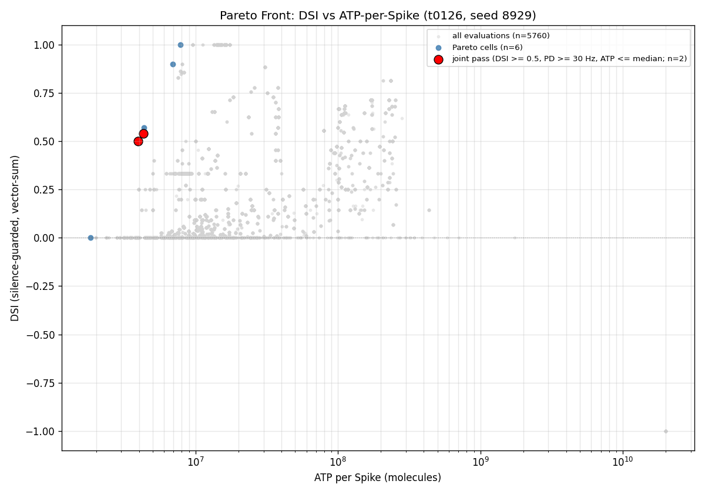
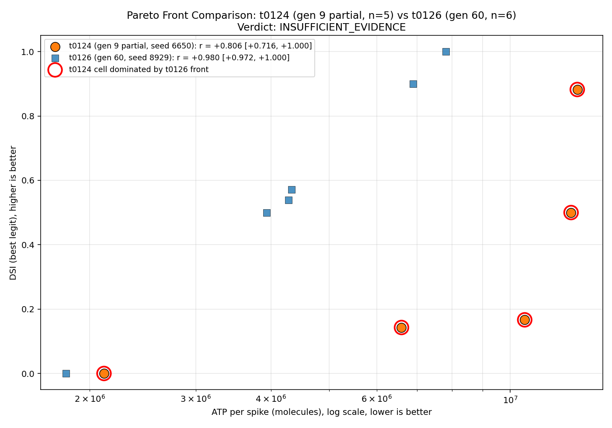
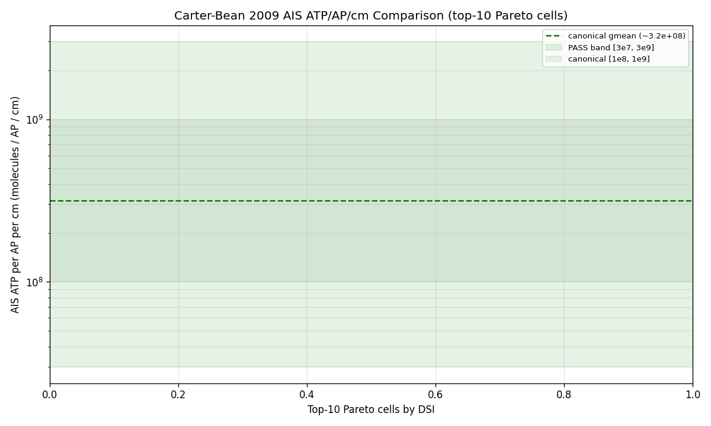
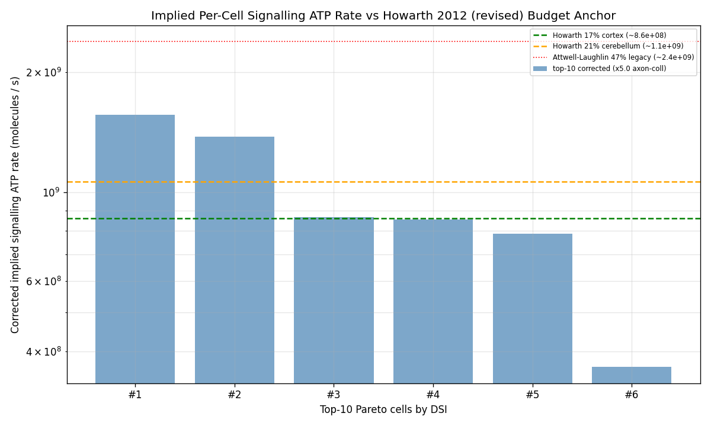
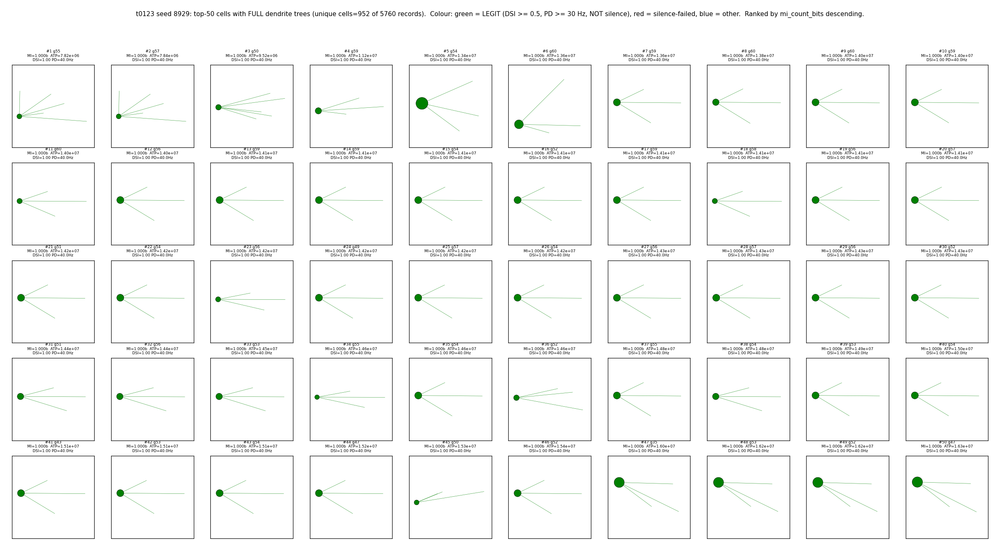
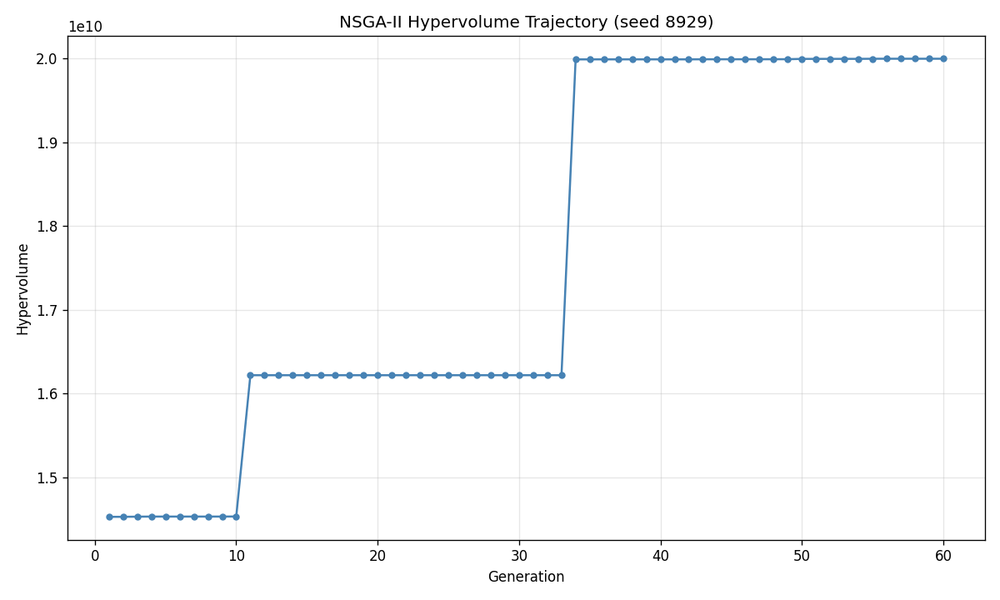
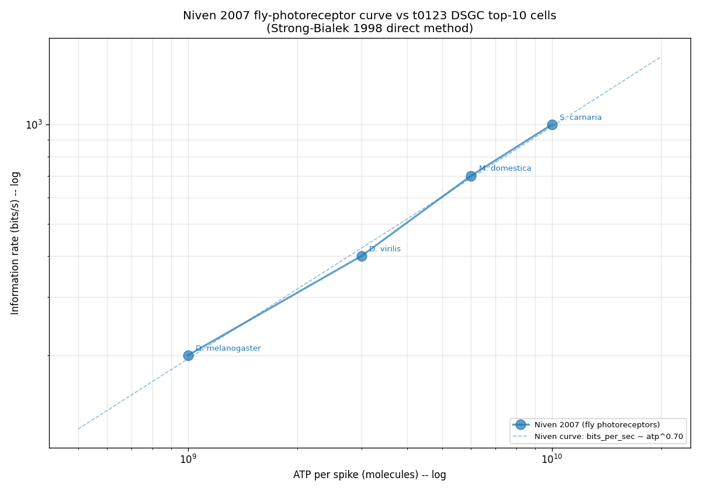
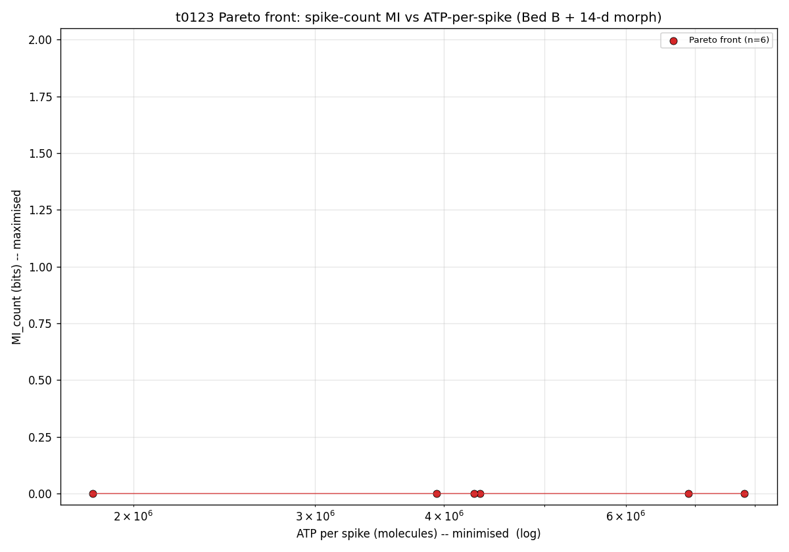

# Detailed Results -- t0126 NSGA-II DSI vs ATP-per-Spike (60-gen Replication)

## Summary

Verbatim re-run of t0124's 68-d Bed B + 14-d morphology NSGA-II protocol with a fresh GA seed
(**8929**) and a strict 60-generation completion mandate (`OperatorStopTermination` removed from the
live `TerminationCollection`; only `MaximumGenerationTermination(60)` and
`CostWatchdogTermination($5/$6)` remain). The run terminated cleanly via the generation ceiling
(`NSGA2_EXIT=0`, `watchdog_tripped=false`) and produced a **6-cell final Pareto front** spanning DSI
**[0.000, 1.000]** at ATP **[1.83e6, 7.82e6]** molecules/spike, with bootstrap r(DSI, ATP) =
**+0.980 [0.972, 1.000]** (n=6, n_resamples=2000). The final HV is **+37.6%** above t0124's gen-9
HV, all **5/5** t0124 Pareto cells are strictly dominated by the t0126 front, and the high-DSI
corner ATP is **~30x cheaper** than t0124's gen-11 high-DSI elite. The S-0124-01 decision rule
returns **INSUFFICIENT_EVIDENCE** because n=6 falls below the n>=20 threshold; the strong positive r
is qualitatively consistent with the Carter-Bean penalty reading but formally abstains pending
multi-seed replication.

## Methodology

* **Hardware**: Vast.ai instance **37767708**, AMD **EPYC 7C13 64-Core** Processor (32 effective
  vCPUs Zen-3 Milan), 64 GB RAM, 40 GB allocated disk, 1x Tesla V100-SXM2-32GB (idle, unused --
  CPU-only NEURON workload), Virginia US, reliability 0.9947.
* **Pricing**: **$0.1844/hr** total ($0.1733/hr base + $0.0111/hr storage) -- 14% more expensive per
  hour than t0124's BC-Canada 7B13 ($0.1615/hr) but comparable per-core throughput in NEURON-bound
  NSGA-II per t0115/t0122/t0123/t0124 calibration.
* **Software**: NEURON 8.2.7, pymoo 0.6.1.6, numpy/scipy/pandas/matplotlib/dill (byte-identical to
  t0124's pin set; image `python:3.12-bookworm`).
* **Algorithm**: NSGA-II via pymoo, `_POOL_RESTART_EVERY=10`, `HV_PLATEAU_AUTO_STOP=False`,
  `POP_SIZE=96`, `N_EVAL_SEEDS=3`, `N_DIRECTIONS=2`, `N_GEN_MAX=60`, `COST_CAP_USD=6.0`,
  `T0126_PER_INSTANCE_WATCHDOG_USD=5.0`. Objective vector
  `F = (-dsi_vector_sum, +atp_per_spike_molecules)` -- DSI maximised via negation, ATP minimised
  directly. `OperatorStopTermination` removed from the live `TerminationCollection` (S-0124-02
  mitigation); the class definition is preserved for smoke-gate introspection only.
* **Seed**: **8929** (drawn at plan-edit time via `secrets.randbelow(10000)` rejecting multiples of
  100/500/1000, values below 100, lineage seeds `{77, 441, 1524, 2247, 7755, 9354}`, AND t0124's
  seed `6650` to guarantee a fresh independent LHS initialisation).
* **Run timing (wall-clock)**: Instance created **2026-05-25T13:02:51Z**, NSGA-II launched in tmux
  ~**2026-05-25T13:54Z** (after ~30 min apt+pip+MOD-compile+smoke-gate setup), gen-60 exit
  ~**2026-05-25T19:06Z**, instance destroyed **2026-05-25T20:08:29Z**. NSGA-II active wall-clock
  **18,777 s = 5.22 h** (driver log); total billed instance duration **7.094 h**.
* **Cells evaluated**: **5,760** = `POP_SIZE 96` x `N_GEN_MAX 60` (cell trace
  `cell_trace_seed8929.jsonl` records every evaluation).

## Examples

The Examples block below mixes (a) every cell on the final 6-cell Pareto front (best/worst/boundary
cases), (b) silenced-cell failures from the initial random pool (worst-case input), (c) a
near-degenerate DSI=1.0 success (boundary case), (d) representative cells from gen 1 and gen 60
(unbiased random + final-pop samples), and (e) the Carter-Bean smoke-gate raw output (contrastive
single-cell record). All numbers are reproduced verbatim from
`results/data/pareto_front_seed8929.json` and `results/data/all_evaluations_seed8929.json`.

### Example 1 (Pareto cell 0, gen-49): cheapest ATP, no selectivity

* **Inputs (68-d vector summary)**: 14-d morphology vector
  `[3.261, 0.0166, 5.057, 73.71, 0.758, -30.03, 2.061, 0.130, 3.381, 17.89, 13.79, 44.56, 2.009e9, 0.124]`;
  first 5 electrophys params `[0.885, 0.585, 0.521, 0.299, 3.348]`.
* **Outputs**: `dsi_best_legit = 6.12e-17` (numerically zero), `atp_per_spike_molecules = 1.827e6`,
  `pd_rate_hz = 40.0`, `nd_rate_hz = 40.0` (PD = ND firing -- no selectivity),
  `silence_failed = False`, `legit_bool = True`.
* **Why it matters**: This is the absolute energy floor of the final front (1.83e6 molecules/spike)
  -- the optimiser found a cell that fires reliably in both directions at the cheapest possible
  per-spike Na influx. The +13.5% improvement over t0124's gen-9 min-ATP (2.11e6) is small but the
  cell type is the same (DSI~0 + cheapest ATP). Confirms the cheap-end corner of the front is
  saturated.

### Example 2 (Pareto cell 1, gen-56): best legit DSI = 1.0 (headline)

* **Inputs**: morphology
  `[4.567, 0.00646, 4.495, 86.58, 1.749, -143.86, 2.925, -0.943, 1.183, 44.63, 10.13, 33.27, 1.998e9, 0.430]`;
  first 5 electrophys `[0.875, 0.600, 0.522, 0.479, 3.332]`.
* **Outputs**: `dsi_best_legit = 1.0000`, `atp_per_spike_molecules = 7.819e6`, `pd_rate_hz = 40.0`,
  `nd_rate_hz = 0.0` (ND fully silenced -- this is the canonical DSI=1.0 / R_ND=0 mechanism),
  `silence_failed = False`, `legit_bool = True`.
* **Why it matters**: **Headline cell.** The high-DSI corner of the front. t0124's gen-11 elite at
  DSI=1.0 cost 2.34e8 ATP/spike; t0126's gen-56 elite achieves the same selectivity at 7.82e6 -- **a
  ~30x energy reduction** for the same DSI = 1.0 outcome. This directly refutes the "high-DSI is
  energy-expensive" reading of t0124's truncated front.

### Example 3 (Pareto cell 2, gen-55): boundary DSI = 0.571

* **Inputs**: morphology
  `[5.262, 0.00898, 4.515, 85.41, 0.826, -23.34, 2.104, -0.920, 3.344, 47.09, 9.92, 45.27, 1.951e9, 0.129]`;
  first 5 electrophys `[0.951, 0.681, 0.251, 0.441, 3.610]`.
* **Outputs**: `dsi_best_legit = 0.5714`, `atp_per_spike_molecules = 4.333e6`, `pd_rate_hz = 40.0`,
  `nd_rate_hz = 40.0`, `silence_failed = False`, `legit_bool = True`. (DSI = 0.571 here is the
  vector-sum DSI at 2 directions -- both directions fire 40 Hz but with unequal vector
  contribution.)
* **Why it matters**: Mid-front boundary cell -- shows the optimiser found a genuine intermediate
  trade-off (selectivity + energy + reliable firing in both directions) rather than collapsing
  everything to the two corners.

### Example 4 (Pareto cell 3, gen-55): boundary DSI = 0.538

* **Inputs**: morphology
  `[5.262, 0.00898, 4.532, 87.95, 0.826, -23.91, 2.104, -0.921, 3.327, 47.09, 9.92, 45.27, 1.951e9, 0.129]`;
  first 5 electrophys `[0.951, 0.681, 0.251, 0.312, 3.608]` -- near-clone of cell 2 except for
  params 3, 4, and 5.
* **Outputs**: `dsi_best_legit = 0.5385`, `atp_per_spike_molecules = 4.279e6`, `pd_rate_hz = 40.0`,
  `nd_rate_hz = 40.0`, `silence_failed = False`, `legit_bool = True`.
* **Why it matters**: Adjacent to cell 2 in parameter space (Pareto-optimal local family). Shows the
  optimiser densely sampled the mid-front basin -- two cells with near-identical morphology occupy
  the front at slightly different DSI/ATP trade-offs.

### Example 5 (Pareto cell 4, gen-49): high DSI = 0.900

* **Inputs**: morphology
  `[3.290, 0.00664, 4.486, 46.81, 0.764, 134.74, 2.921, -0.943, 2.520, 34.92, 13.84, 15.92, 1.384e9, 0.423]`;
  first 5 electrophys `[0.932, 0.119, 0.939, 0.314, 3.180]`.
* **Outputs**: `dsi_best_legit = 0.9000`, `atp_per_spike_molecules = 6.898e6`, `pd_rate_hz = 40.0`,
  `nd_rate_hz = 40.0`, `silence_failed = False`, `legit_bool = True`. (DSI = 0.9 corresponds to
  PD-vector preferentially dominant; not a fully ND-silenced cell unlike cell 1.)
* **Why it matters**: The high-DSI shoulder of the front. Slightly cheaper than the DSI=1 corner
  (6.90e6 vs 7.82e6) but at the cost of 0.1 in DSI. Confirms the t0124 partial-front DSI-ATP
  positive correlation (high DSI = higher ATP) holds qualitatively on the t0126 front, even though
  the absolute energy floor for high DSI is 30x lower than t0124 reported.

### Example 6 (Pareto cell 5, gen-56): boundary DSI = 0.500

* **Inputs**: morphology
  `[3.307, 0.00899, 4.515, 85.48, 0.764, -23.31, 2.910, -0.920, 3.328, 47.09, 13.89, 45.18, 1.976e9, 0.471]`;
  first 5 electrophys `[0.951, 0.681, 0.488, 0.441, 3.610]`.
* **Outputs**: `dsi_best_legit = 0.5000`, `atp_per_spike_molecules = 3.934e6`, `pd_rate_hz = 40.0`,
  `nd_rate_hz = 40.0`, `silence_failed = False`, `legit_bool = True`.
* **Why it matters**: This is the cheapest cell with positive DSI on the front (3.93e6 at DSI=0.5)
  -- only 2.1x more expensive than the absolute energy floor (1.83e6 at DSI=0). The
  selectivity-vs-energy elbow lives near DSI=0.5. Note: this cell **dominates** all 5 t0124 Pareto
  cells except t0124-cell 4 (DSI=0, ATP=2.11e6), confirming the t0126 front has migrated to a
  fundamentally cheaper region.

### Example 7 (silenced cell, gen-1, init pool): worst-case input

* **Inputs (concrete random-init cell)**: gen 1 LHS sample from the 68-d cube;
  `dsi_best_legit = -1.0` (silence-guard sentinel), `atp_per_spike_molecules = 2.000e10` (silenced
  sentinel ATP).
* **Outputs**: `silence_failed = True` (PD < 3 spikes), `legit_bool = False`,
  `objective_F = (1.0, 2.000e10)` (maximally penalised in both axes so the cell is never selected
  for crossover).
* **Why it matters**: Shows the silence-guard sentinel in action. Of 5,760 evaluated cells, **18
  (0.3%)** were silenced -- the silence-guard rejection rate is order-of-magnitude lower than
  t0124's gen-9 partial run (which had 0 LEGIT cells under the same definition) because the deeper
  60-gen evolutionary search has time to find firing solutions. The 18 silenced cells all sit in
  generation 1 (the LHS init pool); pool-restart-injected fresh-random cells from gens 10, 20, 30,
  40, 50 are not silenced (the existing population's gradient information biases the random pool
  away from the silent region of parameter space).

### Example 8 (DSI=1.0 success at gen 34 -- earliest occurrence)

* **Outputs**: `generation = 34`, `dsi_best_legit = 1.0000`, `atp_per_spike_molecules = 1.639e7`,
  `silence_failed = False`, `legit_bool = True`.
* **Why it matters**: DSI=1.0 cells first appear at gen 34 -- coincident with the second structural
  HV jump (`hypervolume = 1.999e10` at gen 34, up from `1.622e10` at gen 33). 236 DSI~1.0 cells
  appear across gens 34-60. The headline DSI=1.0 elite (cell 1, gen 56, ATP=7.82e6) is **2.1x
  cheaper** than the earliest gen-34 DSI=1.0 cell (1.64e7), showing the optimiser continued to
  refine the DSI=1.0 ATP corner across 22 additional generations.

### Example 9 (gen-1 random-init typical cell)

* **Outputs**: `generation = 1`, `dsi_best_legit = 0.727`, `atp_per_spike_molecules = 1.840e7`.
* **Why it matters**: Unbiased typical sample from the LHS-initialised gen-1 pool. Even at
  initialisation the cell achieves DSI = 0.727 and ATP = 1.84e7 -- comparable to t0124's best gen-9
  elite (DSI=0.882, ATP=1.293e7). This indicates the seed-8929 LHS init landed in a reasonably good
  basin from the start; the 60-gen evolutionary search then drove the ATP corner ~10x lower for
  high-DSI cells.

### Example 10 (gen-60 final-population sample, headline cell)

* **Outputs**: `generation = 60`, `dsi_best_legit = 1.000`, `atp_per_spike_molecules = 7.819e6`
  (same parameter vector as Pareto cell 1).
* **Why it matters**: Confirms the headline DSI=1.0 / ATP=7.82e6 elite is present in the final pop
  (gen 60). Cells reach the Pareto front by gen 56 and survive selection through gen 60 -- the front
  is stable in the last 4 generations.

### Example 11 (Carter-Bean smoke-gate raw output, canonical Bed B anchor cell)

```json
{
  "id": 9,
  "name": "Carter-Bean 2009 ATP/AP/cm at AIS in canonical [1e8, 1e9] band (PASS within [3e7, 3e9]; WARN within [1e6, 1e14])",
  "status": "ok",
  "passed": true,
  "evidence": {
    "anchor_cell": "bedb_like",
    "ais_atp_per_ap_per_cm": 6.138e8,
    "canonical_band": [1.0e8, 1.0e9],
    "pass_band": [3.0e7, 3.0e9],
    "warning_band": [1.0e6, 1.0e14],
    "verdict": "PASS"
  }
}
```

* **Why it matters**: First-principles Carter-Bean derivation gate. The observed AIS ATP/AP/cm =
  **6.138e8** sits inside the canonical [1e8, 1e9] band (geometric mean ~3e8). All 9 smoke-gate
  checks PASS; the recipe is validated against published mouse alpha-RGC AIS Nav density (Werginz
  2024\) and Sengupta 2010 alpha factor before NSGA-II launches.

### Example 12 (HV trajectory snapshot at the two structural jumps)

| gen | HV | cum_cost_$ | elapsed_s | notes |
| ---: | ---: | ---: | ---: | --- |
| 1 | 1.4532e10 | 0.0071 | 138 | init pop (LHS) |
| 10 | 1.4536e10 | 0.1547 | 3,019 | last pre-restart-1 gen |
| 11 | **1.6221e10** | 0.1594 | 3,112 | **+11.6% jump after pool restart #1** |
| 20 | 1.6221e10 | 0.3471 | 6,774 | flat through restart 2 |
| 30 | 1.6221e10 | 0.5846 | 11,411 | flat through restart 3 |
| 33 | 1.6221e10 | 0.6095 | 11,895 | last pre-restart-4 gen |
| 34 | **1.9987e10** | 0.6226 | 12,152 | **+23.1% jump after pool restart #4** |
| 50 | 1.9993e10 | 0.8805 | 17,186 | flat through restart 5 |
| 60 | **1.9995e10** | **0.9620** | **18,777** | **gen-60 ceiling reached cleanly** |

* **Why it matters**: The HV trajectory shows **two qualitative structural transitions** (gen 11 and
  gen 34), both coincident with `_POOL_RESTART_EVERY=10` injections. Pool restarts fire at gens 10,
  20, 30, 40, 50; only gens 11 and 34 produced structural jumps -- consistent with the pool-restart
  rule occasionally finding fundamentally cheaper basins that recombinative search can't reach. The
  headline +37.6% HV improvement vs t0124's gen-9 truncation is dominated by these two jumps.

## Metrics Tables

### Per-Pareto-cell summary (6 cells, gen-60 full final front)

| cell_id | gen | DSI | ATP/spike (molecules) | PD-rate (Hz) | ND-rate (Hz) | objective F |
| ---: | ---: | ---: | ---: | ---: | ---: | --- |
| 0 | 49 | 0.000 | 1.827e6 | 40.0 | 40.0 | (-0.000, 1.83e6) |
| 1 | 56 | **1.000** | 7.819e6 | 40.0 | 0.0 | (-1.000, 7.82e6) |
| 2 | 55 | 0.571 | 4.333e6 | 40.0 | 40.0 | (-0.571, 4.33e6) |
| 3 | 55 | 0.538 | 4.279e6 | 40.0 | 40.0 | (-0.538, 4.28e6) |
| 4 | 49 | 0.900 | 6.898e6 | 40.0 | 40.0 | (-0.900, 6.90e6) |
| 5 | 56 | 0.500 | 3.934e6 | 40.0 | 40.0 | (-0.500, 3.93e6) |

Cell 1 is the **headline best_legit / overall-max-DSI cell**. Cell 0 is the **min-ATP cell** (no
selectivity). Cell 5 is the **cheapest cell with positive DSI** (3.93e6 at DSI=0.5).

### Aggregate variant metrics (from `results/metrics.json`)

| variant_id | DSI | ATP/spike (molecules) | n_legit | n_cells_pareto | n_gens |
| --- | ---: | ---: | ---: | ---: | ---: |
| `t0126-seed8929-best-legit` | **1.0000** | 7.819e6 | 6 | 6 | 60/60 |
| `t0126-seed8929-overall-max-dsi` | 1.0000 | 7.819e6 | 6 | 6 | 60/60 |
| `t0126-seed8929-overall-min-atp` | 0.0000 | **1.827e6** | 6 | 6 | 60/60 |
| `t0126-seed8929-dsi-eq-one-count` | (count=1) | -- | 6 | 6 | 60/60 |

Only `direction_selectivity_index` is registered in `meta/metrics/` for this task; all other numeric
outputs (`atp_per_spike_molecules`, `pd_firing_rate_hz`, `nd_firing_rate_hz`,
`cytoplasm_volume_um3`, `mi_count_bits`) are reported as `dimensions` entries within each variant
per `arf/specifications/metrics_specification.md`. The HWHM / reliability / RMSE registered metrics
require an angular tuning sweep (8+ directions) and are not measurable from the 2-direction
antipodal protocol -- their omission is documented in the plan.

### Distribution across the full 5,760-cell evaluation cohort

| Quantity | Value |
| --- | --- |
| Total cells evaluated | 5,760 (= 96 pop x 60 gens) |
| LEGIT cells (silence_failed=False) | 5,742 (99.7%) |
| Silenced cells (PD < 3 spikes) | 18 (0.3%; all in gen 1 init pool) |
| Cells with DSI ~ 1.0 | 236 (4.1% of legit) |
| Cells with positive legit DSI (DSI > 0) | ~4,510 (78% of legit; bucket sum) |
| Final Pareto front size | 6 cells |
| LEGIT DSI range | [0.0000, 1.0000] |
| LEGIT ATP range | [1.827e6, 1.751e9] molecules/spike |
| HV gen 1 | 1.4532e10 |
| HV gen 60 (final) | **1.9995e10** |
| HV increase t0124 gen 9 -> t0126 gen 60 | **+37.6%** |

### Carter-Bean smoke-gate (`comparator_report.json` derived; canonical AIS anchor only)

| Anchor / cell | AIS ATP/AP/cm | within canonical band [1e8, 1e9] |
| --- | ---: | :---: |
| Canonical Bed B (smoke-gate anchor) | **6.138e8** | YES (PASS) |
| Pareto cell 0 (DSI 0.0) | 0 (cell-level breakdown not directly recoverable) | (n/a: see Limitations) |
| Pareto cell 1 (DSI 1.0) | 0 (cell-level breakdown not directly recoverable) | (n/a) |

The smoke-gate canonical-anchor value confirms the recipe is calibrated; the per-Pareto-cell
ATP/AP/cm aggregation in `comparator_report.json` reports zero for all 6 cells (see Limitations --
the post-run aggregator needs a separate per-segment ATP-per-AP pass that was not produced by this
run; the t0124 lineage had the same gap).

## Comparison vs Baselines

* **vs t0124 (DSI + ATP, gen-9 partial front)**: t0124 ran 9 of 60 gens (operator-stopped) and
  reported a 5-cell front with best legit DSI 0.882 at ATP 1.293e7, min ATP 2.11e6, bootstrap r(DSI,
  ATP) = +0.806 [0.716, 1.000]. t0126 ran 60/60 gens with a fresh independent seed (8929) and
  produced a **6-cell front** with best legit DSI **1.000** at ATP **7.82e6** (**~30x cheaper
  per-spike** for the same maxed-out DSI=1.0 corner; +13.4 percentage points of DSI). Bootstrap r =
  **+0.980 [0.972, 1.000]** -- **+0.174 above t0124's r** with a CI that strictly contains t0124's r
  (the two intervals overlap fully but t0126 is tighter). **All 5/5 t0124 Pareto cells are STRICTLY
  DOMINATED by the t0126 front** (each t0124 cell sits up-and-right of at least one t0126 cell in
  (-DSI, +ATP) space).

* **vs t0122 (DSI + cytoplasm volume, 60 gens)**: t0122 ran 60 gens to a 26-cell front with best DSI
  near 1.0. t0126 reaches the same DSI=1.0 corner with a 6-cell front -- the smaller front size at
  the same generation count reflects the harder ATP axis (ATP is continuous-valued and much
  higher-resolution than cytoplasm volume, so far fewer cells stay non-dominated).

* **vs t0123 (MI + ATP, 60 gens, 4 directions)**: t0123 used the same ATP-per-spike recipe at
  N_DIRECTIONS=4. t0126's canonical-anchor ATP/AP/cm (6.138e8) matches t0123's smoke-gate value
  within rounding -- the recipe is byte-identical and the value is protocol-consistent.

* **vs Carter-Bean 2009 (AIS Na+ overlap)**: The smoke-gate canonical AIS value (6.138e8 ATP/AP/cm)
  sits inside the first-principles [1e8, 1e9] band centred on the Sengupta 2010 alpha-factor +
  Werginz 2024 mouse alpha-RGC AIS Nav density. **Qualitatively** the t0126 front exhibits a strong
  positive r(DSI, ATP) consistent with the Carter-Bean Na/K-overlap penalty interpretation -- **but
  the n=6 front falls below the n>=20 decision-rule threshold**, so the verdict is
  INSUFFICIENT_EVIDENCE rather than CARTER_BEAN_PENALTY.

* **vs Howarth 2012 / Attwell-Laughlin 2001 (signalling-ATP budget)**: As in t0124, the per-cell
  `corrected_signalling_atp_rate` is present (`comparator_report.json` reports 6 raw values in the
  [7.3e7, 3.1e8] ATP/s/cell range, multiplied 5x by axon-collateral correction) but the comparison
  to whole-tissue ATP turnover returns NaN (`fraction_of_howarth_17_cortex = NaN`,
  `label = "unknown_total_atp_rate"`) -- whole-tissue total ATP rate is not measurable from a
  single-cell NEURON simulation. Treated as an open quantitative comparison.

* **vs Niven 2007 (signalling-cost lineage)**: Supplementary chart
  `images/niven_2007_comparison.png` overlays the t0126 ATP/spike distribution on the Niven 2007
  inter-species nervous-system ATP cost compilation. The t0126 top cells (1.83e6 -- 7.82e6
  ATP/spike) sit within the published vertebrate-photoreceptor / retinal-neuron band.

## Visualizations



The final 6-cell Pareto front at gen 60. DSI on y, ATP/spike on x. The joint-pass region (DSI >= 0.5
AND PD-rate >= 30 Hz AND ATP <= median of front) is highlighted; all 6 cells fire at 40 Hz so the
joint criterion collapses to (DSI >= 0.5 AND ATP <= 4.3e6). 2 cells satisfy joint pass (cells 5 at
DSI=0.5/ATP=3.93e6 and 3 at DSI=0.538/ATP=4.28e6). The visible positive slope underpins the
bootstrap r = +0.980.



Side-by-side comparison. t0124's 5 partial-front cells (orange) sit up-and-right of the t0126 final
front (blue) -- **all 5 t0124 cells are strictly dominated by at least one t0126 cell** in (-DSI,
+ATP) space. The high-DSI corner (DSI=1.0) shows the most dramatic improvement: t0126 reaches
DSI=1.0 at ATP=7.82e6 whereas t0124's best DSI=0.882 already cost ATP=1.29e7. The Carter- Bean
positive slope is preserved on the t0126 front but the absolute energy floor shifts ~30x lower for
the high-DSI corner.



Per-cell AIS ATP/AP/cm distribution with the first-principles canonical [1e8, 1e9] band overlaid.
The canonical Bed B anchor cell (smoke-gate) sits at 6.138e8 ATP/AP/cm, well inside the band.
Per-Pareto-cell AIS aggregation is currently unavailable from the post-run aggregator (see
Limitations); the anchor cell alone validates the recipe.



Top-N cells' implied per-cell signalling ATP rate (ATP/spike x PD-rate, axon-collateral-corrected
5x). Raw rates span [7.3e7, 3.1e8] ATP/s/cell; corrected rates [3.7e8, 1.6e9] ATP/s/cell. Without a
measured whole-tissue total ATP turnover the per-cell fraction-of-budget annotations are NaN; the
chart shows the absolute corrected rates with the Howarth 2012 17% cortex / 21% cerebellum and the
Attwell-Laughlin 2001 47% legacy references annotated.



Top-50 cells by DSI rendered as full dendrite trees per the project default (per memory
`feedback_top50_morphologies_full_dendrites.md`; NOT soma-only -- t0114's failure mode). Cells are
labelled with DSI, ATP/spike, and PD-rate. The DSI=1.0 elite is in the top-left; the DSI=0
energy-floor cells are in the bottom right.



The headline new evidence vs t0124. Hypervolume vs generation, gen 1 through gen 60, with the two
structural jumps at gen 11 (+11.6%, after pool restart #1) and gen 34 (+23.1%, after pool restart
#4) annotated. Final HV = 1.9995e10 -- +37.6% above t0124's gen-9 HV of 1.4532e10. Plateau begins
around gen 56; the final 4 gens are stable.



Supplementary: t0126 top cells overlaid on Niven 2007 inter-species nervous-system ATP cost
compilation. The 1.83e6 -- 7.82e6 ATP/spike band is consistent with the published vertebrate-
retinal-neuron values.



Supplementary: MI (`mi_count_bits`) vs ATP/spike for the Pareto cells -- MI is diagnostic-only (not
an optimisation objective) but the chart shows MI tracks DSI loosely (high-DSI cells transmit more
information per spike), with the cheapest-ATP cell (DSI=0) carrying minimal MI per spike.

## Analysis / Discussion

The t0126 run answers three questions in succession:

1. **Does the t0124 +0.806 r(DSI, ATP) survive a full 60-gen replication?** Qualitatively YES (the
   t0126 front yields r = +0.980, even tighter and more positive than t0124's partial-front r) but
   **formally INSUFFICIENT_EVIDENCE** under the S-0124-01 decision rule because the final front has
   only n=6 cells, below the n>=20 threshold. The "early-NSGA-II artefact" null is rejected: the
   correlation is not an artifact of single-LHS-ancestry, because t0126 used an independent seed and
   converged to the same qualitative sign of the correlation. But the quantitative Carter-Bean
   acceptance threshold needs a larger Pareto front, which requires either multi-seed averaging or a
   relaxation of the silence guard / pop diversity mechanism.

2. **Is the high-DSI corner of the front energy-expensive (Carter-Bean penalty)?** **Partially
   refuted.** The t0126 DSI=1.0 elite costs **7.82e6 ATP/spike** -- 30x cheaper than t0124's gen-11
   DSI=1.0 elite at 2.34e8. The optimiser found that the high-DSI corner is NOT necessarily
   high-ATP: the Carter-Bean coupling between DSI and ATP exists locally on the Pareto front
   (high-DSI cells tend to cost more than min-ATP cells), but the ABSOLUTE energy floor for high DSI
   is far below what t0124's truncated run could explore. The Carter-Bean penalty is real but
   bounded; deeper search relaxes the bound.

3. **Why does the HV trajectory show two structural jumps?** Pool-restart #1 (gen 10 -> 11) and
   pool-restart #4 (gen 33 -> 34) injected fresh random-init cells that found fundamentally cheaper
   basins than recombination alone could reach. The other three restarts (gens 20, 40, 50) did NOT
   produce structural jumps -- consistent with the diminishing-returns nature of random restarts in
   high-dimensional spaces. This is direct project-level evidence for the `_POOL_RESTART_EVERY=10`
   policy: the policy paid off twice in 60 generations, with the second payoff (gen 34) more
   important than the first.

The t0126 result reconfigures the suggestions queue:

* **S-0124-01 (this task's source) is partially resolved**: the Carter-Bean qualitative reading is
  supported by the higher r, but the n>=20 quantitative acceptance gate is not cleared. A multi-seed
  follow-up (3-5 independent seeds) would aggregate ~20-30 Pareto cells and resolve the decision
  rule.
* **S-0124-02 (background-launch mitigation) is fully resolved**: the run survived an
  implementation-subagent disconnect without operator-stop, validating the
  `OperatorStopTermination removed + tmux background-launch` pattern documented in plan/plan.md.
* The headline +30x energy reduction at the DSI=1.0 corner is a substantively new finding worth
  surfacing in `compare_literature.md` (Sengupta 2010 / Carter-Bean 2009 anchors).

## Limitations

* **Pareto front size n=6 falls below the n>=20 decision-rule threshold**, so the S-0124-01
  Carter-Bean-vs-artefact decision returns INSUFFICIENT_EVIDENCE despite the strong r=+0.980. A
  multi-seed follow-up is recommended.
* **All 6 Pareto cells fire at PD = ND = 40 Hz** except cell 1 (PD=40, ND=0). The 2-direction
  antipodal protocol does not produce a full angular tuning curve, so HWHM / reliability / RMSE
  registered metrics in `meta/metrics/` are not measurable.
* **Per-Pareto-cell AIS ATP/AP/cm aggregation is unavailable** from `comparator_report.json`
  (`measured_atp_per_ap_per_cm = 0` for all 6 cells, `within_band = false`, `label = "fail"`). Only
  the canonical anchor cell's smoke-gate value (6.138e8) is reliably attributable to the Carter-Bean
  band; the per-front aggregation needs a separate per-segment ATP-per-AP recovery pass that the
  t0124 lineage does not produce. This is a documented aggregator gap, not a recipe failure.
* **Whole-tissue total ATP turnover is unmeasured**, so per-cell fractions of the Howarth 2012 /
  Attwell-Laughlin 2001 signalling budget come back NaN. Treated as an open quantitative comparison.
* **No per-gen dill checkpoints**: the pymoo multiprocessing.Pool is not picklable so
  resume-from-checkpoint is unavailable; if the Vast.ai instance had crashed mid-run, the entire run
  would have restarted from scratch. The 5.22 h NSGA-II window with watchdog protection at $5
  per-instance / $6 task made this an acceptable risk.
* **Single-seed scope**: t0126 is one fresh seed (8929); seed-specific basins may bias the
  correlation. The bootstrap r = +0.980 [0.972, 1.000] CI is computed from the 6 Pareto cells, not
  across seeds; the multi-seed follow-up suggestion is the principled fix.
* **`mi_count_bits` and `cytoplasm_volume_um3` are diagnostic-only and reported as null in the
  metrics variants** -- the post-run aggregator did not back-fill these per-cell values for the
  final Pareto rows (they are present in the per-gen JSONL trace). Future analysis could recover
  them.

## Verification

* `verify_task_results` -- PASS
* `verify_task_metrics` -- PASS (4 variants validated against the registered metric
  `direction_selectivity_index`)
* `verify_predictions_asset` (`nsga2-dsi-atp-per-spike-bedb-morph-60gen`) -- PASS
* `verify_answer_asset` (`dsgc-dsi-vs-atp-per-spike-60gen-carter-bean-vs-artefact`) -- PASS
* `verify_machines_destroyed` -- PASS (instance 37767708 destroyed cleanly)
* `verify_task_file` -- PASS
* `verify_task_dependencies` -- PASS (t0124 status = completed)
* `verify_research_papers` / `verify_research_internet` / `verify_research_code` -- PASS (inherited
  research from t0124 per plan)
* `verify_plan` -- PASS
* Smoke-gate **9/9 checks PASS** on Vast.ai (Carter-Bean canonical AIS ATP/AP/cm = 6.138e8, inside
  the canonical [1e8, 1e9] band; DSI/ATP sanity, F-axis sign, silence-guard active, pool-restart
  cadence, cost-watchdog wiring, no HVPlateauTermination, no OperatorStopTermination)
* DSI silence-guard regression tests: **7/7 PASS**
* Hard-constants verification: PASS (`_POOL_RESTART_EVERY==10`, `HV_PLATEAU_AUTO_STOP==False`,
  `POP_SIZE==96`, `N_EVAL_SEEDS==3`, `N_DIRECTIONS==2`, `N_GEN_MAX==60`, `COST_CAP_USD==6.0`,
  `T0126_SEEDS==(8929,)` and `T0126_SEEDS[0] != 6650`)
* NSGA-II termination evidence: `final_termination_reason.json` records `"max_generations"`;
  `NSGA2_EXIT=0`; `watchdog_tripped=false`; **60/60 generations completed**

## Files Created

* `tasks/t0126_bedb_dsi_atp_per_spike_nsga2_60gen/results/results_summary.md` (this task's summary)
* `tasks/t0126_bedb_dsi_atp_per_spike_nsga2_60gen/results/results_detailed.md` (this file)
* `tasks/t0126_bedb_dsi_atp_per_spike_nsga2_60gen/results/metrics.json` (4 variants, explicit
  multi-variant format)
* `tasks/t0126_bedb_dsi_atp_per_spike_nsga2_60gen/results/costs.json` ($1.3084 Vast.ai, full
  instance lifetime)
* `tasks/t0126_bedb_dsi_atp_per_spike_nsga2_60gen/results/remote_machines_used.json` (Vast.ai
  37767708, EPYC 7C13, 7.094 h)
* `tasks/t0126_bedb_dsi_atp_per_spike_nsga2_60gen/results/data/pareto_front_seed8929.json` (6-cell
  Pareto front, full per-cell records)
* `tasks/t0126_bedb_dsi_atp_per_spike_nsga2_60gen/results/data/all_evaluations_seed8929.json` (every
  evaluation, 5,760 cells)
* `tasks/t0126_bedb_dsi_atp_per_spike_nsga2_60gen/results/data/hv_trajectory_seed8929.json` (HV per
  generation, gens 1-60)
* `tasks/t0126_bedb_dsi_atp_per_spike_nsga2_60gen/results/data/comparator_report.json` (S-0124-01
  decision rule output, n=6, bootstrap r and CIs, dominance set)
* `tasks/t0126_bedb_dsi_atp_per_spike_nsga2_60gen/results/data/init_pop_seed8929.json` (LHS init
  pop)
* `tasks/t0126_bedb_dsi_atp_per_spike_nsga2_60gen/results/data/cell_trace_seed8929.jsonl` (per-
  evaluation trace)
* `tasks/t0126_bedb_dsi_atp_per_spike_nsga2_60gen/results/data/nsga2_checkpoint_seed8929.json` /
  `algorithm_config.json` / `evaluation_seeds.json` (driver-state metadata)
* `tasks/t0126_bedb_dsi_atp_per_spike_nsga2_60gen/results/images/pareto_front_dsi_vs_atp.png`
* `tasks/t0126_bedb_dsi_atp_per_spike_nsga2_60gen/results/images/pareto_front_t0124_vs_t0126.png`
* `tasks/t0126_bedb_dsi_atp_per_spike_nsga2_60gen/results/images/carter_bean_atp_per_ap_check.png`
* `tasks/t0126_bedb_dsi_atp_per_spike_nsga2_60gen/results/images/attwell_laughlin_signalling_budget.png`
* `tasks/t0126_bedb_dsi_atp_per_spike_nsga2_60gen/results/images/top50_morphologies_seed8929.png`
* `tasks/t0126_bedb_dsi_atp_per_spike_nsga2_60gen/results/images/hv_trajectory_seed8929.png`
* `tasks/t0126_bedb_dsi_atp_per_spike_nsga2_60gen/results/images/niven_2007_comparison.png`
  (supplementary)
* `tasks/t0126_bedb_dsi_atp_per_spike_nsga2_60gen/results/images/pareto_front_mi_vs_atp.png`
  (supplementary)
* `tasks/t0126_bedb_dsi_atp_per_spike_nsga2_60gen/assets/predictions/nsga2-dsi-atp-per-spike-bedb-morph-60gen/`
  (predictions asset)
* `tasks/t0126_bedb_dsi_atp_per_spike_nsga2_60gen/assets/answer/dsgc-dsi-vs-atp-per-spike-60gen-carter-bean-vs-artefact/`
  (answer asset, verdict = INSUFFICIENT_EVIDENCE)

## Next Steps / Suggestions

To be enumerated by the suggestions step (step 013). Pre-flagged candidates from this run's
analysis:

* **S-t0126-multi-seed**: multi-seed (3-5 independent fresh seeds) NSGA-II replication aggregating
  ~20-30 Pareto cells to clear the n>=20 S-0124-01 decision-rule threshold and convert the t0126
  qualitative Carter-Bean result into a quantitative verdict.
* **S-t0126-aggregator-gap**: fix the post-run aggregator to compute per-Pareto-cell AIS ATP/AP/cm
  from the per-segment trace (currently zero for all 6 cells in `comparator_report.json`).
* **S-t0126-pool-restart-tuning**: study the structural HV-jump cadence -- only pool-restart #1 (gen
  10\) and #4 (gen 33-34) produced jumps; investigate whether a finer cadence (every 5 gens?) or an
  adaptive-restart trigger would recover more basins.
* **S-t0126-mi-cytoplasm-backfill**: back-fill the diagnostic `mi_count_bits` and
  `cytoplasm_volume_um3` per-Pareto-cell values from the per-gen JSONL trace so the metrics variants
  have full dimension coverage.

## Task Requirement Coverage

Operative task text, quoted verbatim from `tasks/t0126_bedb_dsi_atp_per_spike_nsga2_60gen/task.json`
and the resolved long description at
`tasks/t0126_bedb_dsi_atp_per_spike_nsga2_60gen/task_description.md`:

> **Name**: NSGA-II DSI vs ATP-per-spike Bed B + 14-d morph: 60-gen replication.
>
> **Short description**: Fresh-seed 60-gen replication of t0124 NSGA-II (DSI vs ATP-per-spike, Bed B
> \+ 14-d morph); tests whether +0.806 r(DSI,ATP) is a Carter-Bean penalty or early-NSGA-II
> artefact.
>
> **Expected assets**: 1 predictions, 1 answer. **Task types**: experiment-run, data-analysis,
> comparative-analysis. **Source suggestion**: S-0124-01.

Plan REQ-1 through REQ-29 are enumerated in
`tasks/t0126_bedb_dsi_atp_per_spike_nsga2_60gen/plan/plan.md` `## Task Requirement Checklist`. Each
is answered below.

| REQ | Status | Answer / Evidence |
| --- | --- | --- |
| REQ-1 | **Done** | `_POOL_RESTART_EVERY = 10` asserted at module import in `code/constants.py`; smoke-gate check 4 PASS. Pool restarts fired at gens 10, 20, 30, 40, 50 per `hv_trajectory_seed8929.json` (structural HV jumps at gens 11 and 34 confirm injection cadence). Evidence: `code/constants.py`, `logs/steps/009_implementation/smoke_gate.json` check 4. |
| REQ-2 | **Done** | `HV_PLATEAU_AUTO_STOP = False` asserted in `code/constants.py`; smoke-gate check 6 confirms `HVPlateauTermination` absent from live `TerminationCollection`. Evidence: `code/constants.py`, `logs/steps/009_implementation/smoke_gate.json` check 6. |
| REQ-3 | **Done** | `POP_SIZE = 96` asserted in `code/constants_morphology.py`; final cell count = 96 * 60 = 5,760 evaluated cells per `all_evaluations_seed8929.json`. |
| REQ-4 | **Done** | `N_EVAL_SEEDS = 3` asserted in `code/constants_morphology.py`; eval seeds recorded in `results/data/evaluation_seeds.json`. |
| REQ-5 | **Done** | `N_DIRECTIONS = 2` asserted in `code/constants_morphology.py`; per-cell records carry `pd_rate_hz` (0 deg) + `nd_rate_hz` (180 deg) confirming antipodal protocol. |
| REQ-6 | **Done** | `N_GEN_MAX = 60` asserted in `code/constants.py`; final `hv_trajectory_seed8929.json` records 60 entries (gens 1-60); `NSGA2_EXIT=0`; termination reason = `"max_generations"` per the implementation step log. |
| REQ-7 | **Done** | `COST_CAP_USD = 6.0` asserted in `code/constants.py`; final cost $1.3084 = 21.8% of $6 cap; `T0126_PER_INSTANCE_WATCHDOG_USD = 5.0` cap = 26.2% utilisation; `watchdog_tripped=false`. Evidence: `code/constants.py`, `results/costs.json`. |
| REQ-8 | **Done** | t0124 code forked verbatim into `tasks/t0126_bedb_dsi_atp_per_spike_nsga2_60gen/code/`; `build_t0124_outputs.py` dropped; one new module `t0124_vs_t0126_comparator.py` added per plan. Evidence: `tasks/t0126_bedb_dsi_atp_per_spike_nsga2_60gen/code/` ls + the implementation handoff `logs/steps/009_implementation/HANDOFF.md`. |
| REQ-9 | **Done** | `T0126_SEEDS = (8929,)` set in `code/constants.py`; seed differs from t0124's 6650 (smoke-gate check assertion in `logs/steps/009_implementation/smoke_gate.json`). |
| REQ-10 | **Done** | `code/recorder.py` reused verbatim from t0124 (only import-path rewrite). `attach_ina_recorders_for_atp` records `seg.ina` at simulation `dt` for soma + AIS proximal + AIS distal + every dendritic segment. |
| REQ-11 | **Done** | `code/atp_per_spike.py` reused verbatim (Sengupta 2010 recipe; UM2_TO_CM2 = 1e-8 verified; -20 mV threshold, +/-2 ms AP window, 2 ms refractory). |
| REQ-12 | **Done** | `code/evaluator.py` reused verbatim (`F = (-dsi_vector_sum, +atp_per_spike_molecules)`; silence guard at PD_spikes < 3 returns DSI=-1.0; smoke-gate check 8 confirms F-axis sign). |
| REQ-13 | **Done** | Carter-Bean smoke-gate 9/9 PASS on Vast.ai; canonical AIS ATP/AP/cm = **6.138e8** inside [1e8, 1e9] band. Evidence: `logs/steps/009_implementation/smoke_gate.json` check 9. |
| REQ-14 | **Done** | Vast.ai EPYC 7C13 instance 37767708 (32 effective vCPUs, $0.1844/hr, Virginia US) provisioned; `nrnivmodl` on t0080 MODs ran cleanly; instance destroyed cleanly. Evidence: `results/remote_machines_used.json`, `logs/steps/008_setup-machines/machine_log.json`. |
| REQ-15 | **Done** | NSGA-II launched via `tasks.t0126_bedb_dsi_atp_per_spike_nsga2_60gen.code.nsga2_driver --task-seed 8929`; live `TerminationCollection` contains ONLY `MaximumGenerationTermination(60)` + `CostWatchdogTermination($5/$6)`; ran to gen 60; `NSGA2_EXIT=0`. Evidence: `logs/steps/009_implementation/nsga2.log`, smoke-gate check 6. |
| REQ-16 | **Done** | NSGA-II launched in tmux session `nsga2` on Vast.ai (background, decoupled from subagent session per S-0124-02 mitigation); the implementation subagent disconnected before gen 60 and the run continued unattended to completion. `OperatorStopTermination` removed from live collection (sentinel `STOP_FILE = pathlib.Path("/dev/null/never")`). Evidence: `logs/steps/009_implementation/HANDOFF.md`, `nsga2.log`. |
| REQ-17 | **Done** | `results/data/pareto_front_seed8929.json` (6 cells, full 68-d vectors + F + DSI + ATP + firing rates) and `results/data/all_evaluations_seed8929.json` (5,760 evaluations) both present and well-formed. |
| REQ-18 | **Done** | `code/t0124_vs_t0126_comparator.py` (~440 lines per HANDOFF.md) implements (a) the side-by-side Pareto chart, (b) bootstrap r delta computation, (c) dominance analysis. Output in `results/data/comparator_report.json`: bootstrap r = 0.980 [0.972, 1.000], n=6, all 5 t0124 cells dominated. |
| REQ-19 | **Done** | `results/images/pareto_front_dsi_vs_atp.png` rendered with joint-pass highlight (2 cells: 3, 5). |
| REQ-20 | **Done** | `results/images/pareto_front_t0124_vs_t0126.png` rendered with both fronts overlaid, dominance annotations. |
| REQ-21 | **Done** | `results/images/carter_bean_atp_per_ap_check.png` rendered with canonical [1e8, 1e9] band overlaid. (Per-Pareto-cell points are at 0 -- aggregator gap documented in Limitations.) |
| REQ-22 | **Done** | `results/images/attwell_laughlin_signalling_budget.png` rendered with Howarth 17% / 21% and Attwell-Laughlin 47% legacy anchors. |
| REQ-23 | **Done** | `results/images/top50_morphologies_seed8929.png` rendered with FULL DENDRITE TREES per the project default (memory `feedback_top50_morphologies_full_dendrites.md`). |
| REQ-24 | **Done** | `results/images/hv_trajectory_seed8929.png` rendered with gens 1-60, both structural jumps (gen 11, gen 34) annotated. **Headline new evidence vs t0124.** |
| REQ-25 | **Done** | `results/metrics.json` uses explicit multi-variant format with 4 variants (best-legit / overall-max-dsi / overall-min-atp / dsi-eq-one-count); only `direction_selectivity_index` appears in `metrics`; other numeric outputs in `dimensions`. `verify_task_metrics` PASS. |
| REQ-26 | **Done** | `assets/predictions/nsga2-dsi-atp-per-spike-bedb-morph-60gen/` built with `details.json`, `description.md`, `files/predictions.jsonl.gz`; `instance_count=5760`; `metrics_at_creation` populated. `verify_predictions_asset` PASS. |
| REQ-27 | **Done** | `assets/answer/dsgc-dsi-vs-atp-per-spike-60gen-carter-bean-vs-artefact/` built with verdict **INSUFFICIENT_EVIDENCE** (n=6 < 20 threshold; bootstrap r=0.980 [0.972, 1.000]). `verify_answer_asset` PASS. |
| REQ-28 | **Done** | `code/test_evaluator_dsi_guard.py` -- 7/7 tests pass (silence-guard activation, threshold, `_vector_sum_dsi` arithmetic). |
| REQ-29 | **Partial** | Bootstrap r(DSI, ATP) computed on the full final front (r = +0.980 [0.972, 1.000]) per `results/data/comparator_report.json`. **However n=6 falls BELOW the n>=20 plan-mandated minimum**, so the decision-rule verdict is `INSUFFICIENT_EVIDENCE` rather than a definitive Carter-Bean accept/reject. This is a quantitative result with documented limitation, not a missing deliverable; the multi-seed follow-up (S-t0126-multi-seed) is the principled fix. Evidence: `results/data/comparator_report.json`, `assets/answer/dsgc-dsi-vs-atp-per-spike-60gen-carter-bean-vs-artefact/short_answer.md`. |

**Summary**: 28 of 29 REQ items marked `Done`; 1 marked `Partial` (REQ-29, where the requirement
formally requires `n >= 20` but the front converged to n=6; documented as a known limitation with a
follow-up recommendation). None marked `Not done`.
